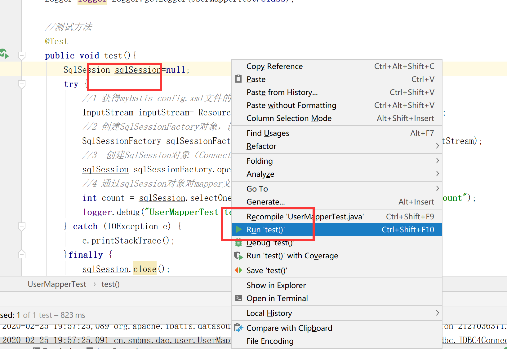
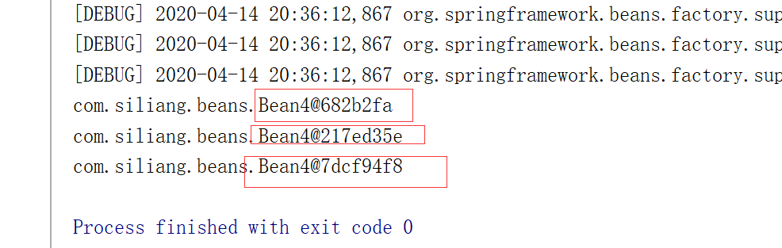

[TOC]


# 第一节  ssm框架的学习

## 准备工作

**观看视频**

链接：https://pan.baidu.com/s/1FnWsukDeepfsB2QE1k3oIg 
提取码：ckxd

### 1 下载并安装Typora软件

**下载路径**

链接：https://pan.baidu.com/s/1H7ZS0HhkS0hLry5qmTsotg 
提取码：1nz9

**目的**  ：该软件用于打开md格式的文件

**安装过程**


**示范**

# 标题1

## 标题2

### 标题3


写程序代码  ``` 然后按回车

```html
<html>
    <head>
        <title></title>
    </head>
    <body>
        
    </body>
</html>
```

java代码

```java
public class Student{
    public int stuNo;
    public String stuName;
    //构造器 一般方法 
    
}
```

插入图片（重点）

如何设置路径

加粗

**字体加粗**文本内容

**字体加粗**


| q'q  | q'q  |      |
| ---- | ---- | ---- |
| q'q  |      |      |
| q'q  |      |      |
|      |      |      |


1. 一
2. 二
3. 三

官网

https://www.typora.io/


### 2 下载并安装Idea软件

**观看视频**

链接：https://pan.baidu.com/s/1FutK2Hqi77sjxHlYMLmNHQ 
提取码：mhat

链接：https://pan.baidu.com/s/1VrWChW8vrBmOBBR-dGQ2iw 
提取码：4c0j

**编程软件的介绍**

myeclipse   教学 学校使用 企业不用

eclipse   很多企业，尤其传统企业在使用，比较稳定，比较笨重

​				修改或者编辑代码之后，需要保存ctrl+s

idea   大型企业，最近比较流行，智能化的提示，支持丰富的插件，可以进行前端开发和后端开发

​			最近几年非常受到程序员的追捧的软件。缺点：不是太稳定

​            修改或者编辑代码之后，不需要按ctrl+s进行保存，它自动保存		

**课后作业**（不用上交）

​	比较eclipse和idea的优缺点？


**安装包和破解方法 下载路径**

链接：https://pan.baidu.com/s/1o-hwgJnsAEIVaZDT1ZuRSQ 
提取码：6vak 
复制这段内容后打开百度网盘手机App，操作更方便哦

**目的**

用于Java编程的软件

**安装过程**

参考文档

https://jingyan.baidu.com/article/a24b33cd3a981119fe002b96.html


**破解过程**

云盘链接中提供《破解文档》，按照文档步骤操作

## 框架概述

**观看视频**

链接：https://pan.baidu.com/s/1RJYLjG_krIPHNJmV4M1URQ 
提取码：nhuz

### **知识准备**

1、java基础和html 、css  js jquery 

2、jsp servlet tomcat  等web方面的知识

​		使用jsp、servlet、jdbc等技术实现web项目（非框架）

3、熟悉mvc思想

m model  模型层，包含dao子层、service子层；

​					dao层进行数据库的访问操作

​					sevice层进行业务逻辑处理												

v view   视图层，jsp技术，用于和用户进行交互

c control  控制层，servlet层实现，对用户的请求进行处理

**优点**（非mvc思想的项目进行比较）

分层：实现分工，很有条理性，便于后期维护

逻辑清晰，定点解决问题

**缺点**

数据库访问层：sql语句和java语言混合在一起，希望它们进行分开（解耦，低耦合）。

前端请求层：一个请求对象一组servlet和servlet-map。

其他缺点，后续补充（和框架项目进行对比）

### 框架初认识

本学期ssm框架

​	1 spring  、springmvc、mybatis框架组成

​	2 该框架也是建立在mvc思想上设计的

​	3  m 模型层：mybatis实现于数据库的交互、和service层进行业务逻辑处理 。

​		v  试图层：jsp技术

​		c  控制层： springmvc框架代替servlet技术，进行对用户请求的处理。

​	4  spring是一个生态，springmvc是它的子模块

## 学习Mybatis

**观看视频**

链接：https://pan.baidu.com/s/1VQaeqxVsulzPFaicpV1SiA 
提取码：tf64

### 概念知识

1、mybatis的前身是ibatis，这个框架是处理和数据库的一个交互行为，这个也是开源的框架。

2、官方网站，里面有大量mybatis的学习资料

​      https://mybatis.org/mybatis-3/

3、核心技术：orm技术，是指对象和映射一一对应的关系

​		数据库中表，一张表对应一个对象，表内的字段对应对象的属性

4、基于sql'语句的，简单易学，同时是sql语句和java代码进行分离，解耦的	作用

### 示例示范

**观看视频（本节课最后一个视频）**

链接：https://pan.baidu.com/s/1XUVJx-W6wN3P78Yt09W-aA 
提取码：3kqk

利用提供的素材（超市管理系统），进行演示。

#### **需求**

​	统计用户表中的记录数

#### 实现步骤

##### 1、设计数据库

​	注意每张表之间关系：逻辑外键关联

​	逻辑外键外联：从逻辑上是主从关系，但是并没有在数据库进行设置


​	

##### 2、根据上述设计在数据库中生成实际表

​		1 将下述sql语句复制到sqlyog中

​		2 每一条sql语句执行运行

​		3 刷新目录（勿忘）

```sql
CREATE DATABASE `smbms` ;

USE `smbms`;

/*Table structure for table `smbms_address` */

DROP TABLE IF EXISTS `smbms_address`;

CREATE TABLE `smbms_address` (
  `id` BIGINT(20) NOT NULL AUTO_INCREMENT COMMENT '主键ID',
  `contact` VARCHAR(15) COLLATE utf8_unicode_ci DEFAULT NULL COMMENT '联系人姓名',
  `addressDesc` VARCHAR(50) COLLATE utf8_unicode_ci DEFAULT NULL COMMENT '收货地址明细',
  `postCode` VARCHAR(15) COLLATE utf8_unicode_ci DEFAULT NULL COMMENT '邮编',
  `tel` VARCHAR(20) COLLATE utf8_unicode_ci DEFAULT NULL COMMENT '联系人电话',
  `createdBy` BIGINT(20) DEFAULT NULL COMMENT '创建者',
  `creationDate` DATETIME DEFAULT NULL COMMENT '创建时间',
  `modifyBy` BIGINT(20) DEFAULT NULL COMMENT '修改者',
  `modifyDate` DATETIME DEFAULT NULL COMMENT '修改时间',
  `userId` BIGINT(20) DEFAULT NULL COMMENT '用户ID',
  PRIMARY KEY (`id`)
) ENGINE=INNODB AUTO_INCREMENT=7 DEFAULT CHARSET=utf8 COLLATE=utf8_unicode_ci;

/*Data for the table `smbms_address` */

INSERT  INTO `smbms_address`(`id`,`contact`,`addressDesc`,`postCode`,`tel`,`createdBy`,`creationDate`,`modifyBy`,`modifyDate`,`userId`) VALUES (1,'王丽','北京市东城区东交民巷44号','100010','13678789999',1,'2016-04-13 00:00:00',NULL,NULL,1),(2,'张红丽','北京市海淀区丹棱街3号','100000','18567672312',1,'2016-04-13 00:00:00',NULL,NULL,1),(3,'任志强','北京市东城区美术馆后街23号','100021','13387906742',1,'2016-04-13 00:00:00',NULL,NULL,1),(4,'曹颖','北京市朝阳区朝阳门南大街14号','100053','13568902323',1,'2016-04-13 00:00:00',NULL,NULL,2),(5,'李慧','北京市西城区三里河路南三巷3号','100032','18032356666',1,'2016-04-13 00:00:00',NULL,NULL,3),(6,'王国强','北京市顺义区高丽营镇金马工业区18号','100061','13787882222',1,'2016-04-13 00:00:00',NULL,NULL,3);

/*Table structure for table `smbms_bill` */

DROP TABLE IF EXISTS `smbms_bill`;

CREATE TABLE `smbms_bill` (
  `id` BIGINT(20) NOT NULL AUTO_INCREMENT COMMENT '主键ID',
  `billCode` VARCHAR(20) COLLATE utf8_unicode_ci DEFAULT NULL COMMENT '账单编码',
  `productName` VARCHAR(20) COLLATE utf8_unicode_ci DEFAULT NULL COMMENT '商品名称',
  `productDesc` VARCHAR(50) COLLATE utf8_unicode_ci DEFAULT NULL COMMENT '商品描述',
  `productUnit` VARCHAR(10) COLLATE utf8_unicode_ci DEFAULT NULL COMMENT '商品单位',
  `productCount` DECIMAL(20,2) DEFAULT NULL COMMENT '商品数量',
  `totalPrice` DECIMAL(20,2) DEFAULT NULL COMMENT '商品总额',
  `isPayment` INT(10) DEFAULT NULL COMMENT '是否支付（1：未支付 2：已支付）',
  `createdBy` BIGINT(20) DEFAULT NULL COMMENT '创建者（userId）',
  `creationDate` DATETIME DEFAULT NULL COMMENT '创建时间',
  `modifyBy` BIGINT(20) DEFAULT NULL COMMENT '更新者（userId）',
  `modifyDate` DATETIME DEFAULT NULL COMMENT '更新时间',
  `providerId` BIGINT(20) DEFAULT NULL COMMENT '供应商ID',
  PRIMARY KEY (`id`)
) ENGINE=INNODB AUTO_INCREMENT=19 DEFAULT CHARSET=utf8 COLLATE=utf8_unicode_ci;

/*Data for the table `smbms_bill` */

INSERT  INTO `smbms_bill`(`id`,`billCode`,`productName`,`productDesc`,`productUnit`,`productCount`,`totalPrice`,`isPayment`,`createdBy`,`creationDate`,`modifyBy`,`modifyDate`,`providerId`) VALUES (1,'BILL2016_001','洗发水、护发素','日用品-洗发、护发','瓶','500.00','25000.00',2,1,'2014-12-14 13:02:03',NULL,NULL,13),(2,'BILL2016_002','香皂、肥皂、药皂','日用品-皂类','块','1000.00','10000.00',2,1,'2016-03-23 04:20:40',NULL,NULL,13),(3,'BILL2016_003','大豆油','食品-食用油','斤','300.00','5890.00',2,1,'2014-12-14 13:02:03',NULL,NULL,6),(4,'BILL2016_004','橄榄油','食品-进口食用油','斤','200.00','9800.00',2,1,'2013-10-10 03:12:13',NULL,NULL,7),(5,'BILL2016_005','洗洁精','日用品-厨房清洁','瓶','500.00','7000.00',2,1,'2014-12-14 13:02:03',NULL,NULL,9),(6,'BILL2016_006','美国大杏仁','食品-坚果','袋','300.00','5000.00',2,1,'2016-04-14 06:08:09',NULL,NULL,4),(7,'BILL2016_007','沐浴液、精油','日用品-沐浴类','瓶','500.00','23000.00',1,1,'2016-07-22 10:10:22',NULL,NULL,14),(8,'BILL2016_008','不锈钢盘碗','日用品-厨房用具','个','600.00','6000.00',2,1,'2016-04-14 05:12:13',NULL,NULL,14),(9,'BILL2016_009','塑料杯','日用品-杯子','个','350.00','1750.00',2,1,'2016-02-04 11:40:20',NULL,NULL,14),(10,'BILL2016_010','豆瓣酱','食品-调料','瓶','200.00','2000.00',2,1,'2013-10-29 05:07:03',NULL,NULL,8),(11,'BILL2016_011','海之蓝','饮料-国酒','瓶','50.00','10000.00',1,1,'2016-04-14 16:16:00',NULL,NULL,1),(12,'BILL2016_012','芝华士','饮料-洋酒','瓶','20.00','6000.00',1,1,'2016-09-09 17:00:00',NULL,NULL,1),(13,'BILL2016_013','长城红葡萄酒','饮料-红酒','瓶','60.00','800.00',2,1,'2016-11-14 15:23:00',NULL,NULL,1),(14,'BILL2016_014','泰国香米','食品-大米','斤','400.00','5000.00',2,1,'2016-10-09 15:20:00',NULL,NULL,3),(15,'BILL2016_015','东北大米','食品-大米','斤','600.00','4000.00',2,1,'2016-11-14 14:00:00',NULL,NULL,3),(16,'BILL2016_016','可口可乐','饮料','瓶','2000.00','6000.00',2,1,'2012-03-27 13:03:01',NULL,NULL,2),(17,'BILL2016_017','脉动','饮料','瓶','1500.00','4500.00',2,1,'2016-05-10 12:00:00',NULL,NULL,2),(18,'BILL2016_018','哇哈哈','饮料','瓶','2000.00','4000.00',2,1,'2015-11-24 15:12:03',NULL,NULL,2);

/*Table structure for table `smbms_provider` */

DROP TABLE IF EXISTS `smbms_provider`;

CREATE TABLE `smbms_provider` (
  `id` BIGINT(20) NOT NULL AUTO_INCREMENT COMMENT '主键ID',
  `proCode` VARCHAR(20) COLLATE utf8_unicode_ci DEFAULT NULL COMMENT '供应商编码',
  `proName` VARCHAR(20) COLLATE utf8_unicode_ci DEFAULT NULL COMMENT '供应商名称',
  `proDesc` VARCHAR(50) COLLATE utf8_unicode_ci DEFAULT NULL COMMENT '供应商详细描述',
  `proContact` VARCHAR(20) COLLATE utf8_unicode_ci DEFAULT NULL COMMENT '供应商联系人',
  `proPhone` VARCHAR(20) COLLATE utf8_unicode_ci DEFAULT NULL COMMENT '联系电话',
  `proAddress` VARCHAR(50) COLLATE utf8_unicode_ci DEFAULT NULL COMMENT '地址',
  `proFax` VARCHAR(20) COLLATE utf8_unicode_ci DEFAULT NULL COMMENT '传真',
  `createdBy` BIGINT(20) DEFAULT NULL COMMENT '创建者（userId）',
  `creationDate` DATETIME DEFAULT NULL COMMENT '创建时间',
  `modifyDate` DATETIME DEFAULT NULL COMMENT '更新时间',
  `modifyBy` BIGINT(20) DEFAULT NULL COMMENT '更新者（userId）',
  PRIMARY KEY (`id`)
) ENGINE=INNODB AUTO_INCREMENT=16 DEFAULT CHARSET=utf8 COLLATE=utf8_unicode_ci;

/*Data for the table `smbms_provider` */

INSERT  INTO `smbms_provider`(`id`,`proCode`,`proName`,`proDesc`,`proContact`,`proPhone`,`proAddress`,`proFax`,`createdBy`,`creationDate`,`modifyDate`,`modifyBy`) VALUES (1,'BJ_GYS001','北京三木堂商贸有限公司','长期合作伙伴，主营产品:茅台、五粮液、郎酒、酒鬼酒、泸州老窖、赖茅酒、法国红酒等','张国强','13566667777','北京市丰台区育芳园北路','010-58858787',1,'2013-03-21 16:52:07',NULL,NULL),(2,'HB_GYS001','石家庄帅益食品贸易有限公司','长期合作伙伴，主营产品:饮料、水饮料、植物蛋白饮料、休闲食品、果汁饮料、功能饮料等','王军','13309094212','河北省石家庄新华区','0311-67738876',1,'2016-04-13 04:20:40',NULL,NULL),(3,'GZ_GYS001','深圳市泰香米业有限公司','初次合作伙伴，主营产品：良记金轮米,龙轮香米等','郑程瀚','13402013312','广东省深圳市福田区深南大道6006华丰大厦','0755-67776212',1,'2014-03-21 16:56:07',NULL,NULL),(4,'GZ_GYS002','深圳市喜来客商贸有限公司','长期合作伙伴，主营产品：坚果炒货.果脯蜜饯.天然花茶.营养豆豆.特色美食.进口食品.海味零食.肉脯肉','林妮','18599897645','广东省深圳市福龙工业区B2栋3楼西','0755-67772341',1,'2013-03-22 16:52:07',NULL,NULL),(5,'JS_GYS001','兴化佳美调味品厂','长期合作伙伴，主营产品：天然香辛料、鸡精、复合调味料','徐国洋','13754444221','江苏省兴化市林湖工业区','0523-21299098',1,'2015-11-22 16:52:07',NULL,NULL),(6,'BJ_GYS002','北京纳福尔食用油有限公司','长期合作伙伴，主营产品：山茶油、大豆油、花生油、橄榄油等','马莺','13422235678','北京市朝阳区珠江帝景1号楼','010-588634233',1,'2012-03-21 17:52:07',NULL,NULL),(7,'BJ_GYS003','北京国粮食用油有限公司','初次合作伙伴，主营产品：花生油、大豆油、小磨油等','王驰','13344441135','北京大兴青云店开发区','010-588134111',1,'2016-04-13 00:00:00',NULL,NULL),(8,'ZJ_GYS001','慈溪市广和绿色食品厂','长期合作伙伴，主营产品：豆瓣酱、黄豆酱、甜面酱，辣椒，大蒜等农产品','薛圣丹','18099953223','浙江省宁波市慈溪周巷小安村','0574-34449090',1,'2013-11-21 06:02:07',NULL,NULL),(9,'GX_GYS001','优百商贸有限公司','长期合作伙伴，主营产品：日化产品','李立国','13323566543','广西南宁市秀厢大道42-1号','0771-98861134',1,'2013-03-21 19:52:07',NULL,NULL),(10,'JS_GYS002','南京火头军信息技术有限公司','长期合作伙伴，主营产品：不锈钢厨具等','陈女士','13098992113','江苏省南京市浦口区浦口大道1号新城总部大厦A座903室','025-86223345',1,'2013-03-25 16:52:07',NULL,NULL),(11,'GZ_GYS003','广州市白云区美星五金制品厂','长期合作伙伴，主营产品：海绵床垫、坐垫、靠垫、海绵枕头、头枕等','梁天','13562276775','广州市白云区钟落潭镇福龙路20号','020-85542231',1,'2016-12-21 06:12:17',NULL,NULL),(12,'BJ_GYS004','北京隆盛日化科技','长期合作伙伴，主营产品：日化环保清洗剂，家居洗涤专卖、洗涤用品网、墙体除霉剂、墙面霉菌清除剂等','孙欣','13689865678','北京市大兴区旧宫','010-35576786',1,'2014-11-21 12:51:11',NULL,NULL),(13,'SD_GYS001','山东豪克华光联合发展有限公司','长期合作伙伴，主营产品：洗衣皂、洗衣粉、洗衣液、洗洁精、消杀类、香皂等','吴洪转','13245468787','山东济阳济北工业区仁和街21号','0531-53362445',1,'2015-01-28 10:52:07',NULL,NULL),(14,'JS_GYS003','无锡喜源坤商行','长期合作伙伴，主营产品：日化品批销','周一清','18567674532','江苏无锡盛岸西路','0510-32274422',1,'2016-04-23 11:11:11',NULL,NULL),(15,'ZJ_GYS002','乐摆日用品厂','长期合作伙伴，主营产品：各种中、高档塑料杯，塑料乐扣水杯（密封杯）、保鲜杯（保鲜盒）、广告杯、礼品杯','王世杰','13212331567','浙江省金华市义乌市义东路','0579-34452321',1,'2016-08-22 10:01:30',NULL,NULL);

/*Table structure for table `smbms_role` */

DROP TABLE IF EXISTS `smbms_role`;

CREATE TABLE `smbms_role` (
  `id` BIGINT(20) NOT NULL AUTO_INCREMENT COMMENT '主键ID',
  `roleCode` VARCHAR(15) COLLATE utf8_unicode_ci DEFAULT NULL COMMENT '角色编码',
  `roleName` VARCHAR(15) COLLATE utf8_unicode_ci DEFAULT NULL COMMENT '角色名称',
  `createdBy` BIGINT(20) DEFAULT NULL COMMENT '创建者',
  `creationDate` DATETIME DEFAULT NULL COMMENT '创建时间',
  `modifyBy` BIGINT(20) DEFAULT NULL COMMENT '修改者',
  `modifyDate` DATETIME DEFAULT NULL COMMENT '修改时间',
  PRIMARY KEY (`id`)
) ENGINE=INNODB AUTO_INCREMENT=4 DEFAULT CHARSET=utf8 COLLATE=utf8_unicode_ci;

/*Data for the table `smbms_role` */

INSERT  INTO `smbms_role`(`id`,`roleCode`,`roleName`,`createdBy`,`creationDate`,`modifyBy`,`modifyDate`) VALUES (1,'SMBMS_ADMIN','系统管理员',1,'2016-04-13 00:00:00',NULL,NULL),(2,'SMBMS_MANAGER','经理',1,'2016-04-13 00:00:00',NULL,NULL),(3,'SMBMS_EMPLOYEE','普通员工',1,'2016-04-13 00:00:00',NULL,NULL);

/*Table structure for table `smbms_user` */

DROP TABLE IF EXISTS `smbms_user`;

CREATE TABLE `smbms_user` (
  `id` BIGINT(20) NOT NULL AUTO_INCREMENT COMMENT '主键ID',
  `userCode` VARCHAR(15) COLLATE utf8_unicode_ci DEFAULT NULL COMMENT '用户编码',
  `userName` VARCHAR(15) COLLATE utf8_unicode_ci DEFAULT NULL COMMENT '用户名称',
  `userPassword` VARCHAR(15) COLLATE utf8_unicode_ci DEFAULT NULL COMMENT '用户密码',
  `gender` INT(10) DEFAULT NULL COMMENT '性别（1:女、 2:男）',
  `birthday` DATE DEFAULT NULL COMMENT '出生日期',
  `phone` VARCHAR(15) COLLATE utf8_unicode_ci DEFAULT NULL COMMENT '手机',
  `address` VARCHAR(30) COLLATE utf8_unicode_ci DEFAULT NULL COMMENT '地址',
  `userRole` BIGINT(20) DEFAULT NULL COMMENT '用户角色（取自角色表-角色id）',
  `createdBy` BIGINT(20) DEFAULT NULL COMMENT '创建者（userId）',
  `creationDate` DATETIME DEFAULT NULL COMMENT '创建时间',
  `modifyBy` BIGINT(20) DEFAULT NULL COMMENT '更新者（userId）',
  `modifyDate` DATETIME DEFAULT NULL COMMENT '更新时间',
  PRIMARY KEY (`id`)
) ENGINE=INNODB AUTO_INCREMENT=16 DEFAULT CHARSET=utf8 COLLATE=utf8_unicode_ci;

insert  into `smbms_user`(`id`,`userCode`,`userName`,`userPassword`,`gender`,`birthday`,`phone`,`address`,`userRole`,`createdBy`,`creationDate`,`modifyBy`,`modifyDate`) values (1,'admin','系统管理员','1234567',1,'1983-10-10','13688889999','北京市海淀区成府路207号',1,1,'2013-03-21 16:52:07',NULL,NULL),(2,'liming','李明','0000000',2,'1983-12-10','13688884457','北京市东城区前门东大街9号',2,1,'2014-12-31 19:52:09',NULL,NULL),(5,'hanlubiao','韩路彪','0000000',2,'1984-06-05','18567542321','北京市朝阳区北辰中心12号',2,1,'2014-12-31 19:52:09',NULL,NULL),(6,'zhanghua','张华','0000000',1,'1983-06-15','13544561111','北京市海淀区学院路61号',3,1,'2013-02-11 10:51:17',NULL,NULL),(7,'wangyang','王洋','0000000',2,'1982-12-31','13444561124','北京市海淀区西二旗辉煌国际16层',3,1,'2014-06-11 19:09:07',NULL,NULL),(8,'zhaoyan','赵燕','0000000',1,'1986-03-07','18098764545','北京市海淀区回龙观小区10号楼',3,1,'2016-04-21 13:54:07',NULL,NULL),(10,'sunlei','孙磊','0000000',2,'1981-01-04','13387676765','北京市朝阳区管庄新月小区12楼',3,1,'2015-05-06 10:52:07',NULL,NULL),(11,'sunxing','孙兴','0000000',2,'1978-03-12','13367890900','北京市朝阳区建国门南大街10号',3,1,'2016-11-09 16:51:17',NULL,NULL),(12,'zhangchen','张晨','0000000',1,'1986-03-28','18098765434','朝阳区管庄路口北柏林爱乐三期13号楼',3,1,'2016-08-09 05:52:37',1,'2016-04-14 14:15:36'),(13,'dengchao','邓超','0000000',2,'1981-11-04','13689674534','北京市海淀区北航家属院10号楼',3,1,'2016-07-11 08:02:47',NULL,NULL),(14,'yangguo','杨过','0000000',2,'1980-01-01','13388886623','北京市朝阳区北苑家园茉莉园20号楼',3,1,'2015-02-01 03:52:07',NULL,NULL),(15,'zhaomin','赵敏','0000000',1,'1987-12-04','18099897657','北京市昌平区天通苑3区12号楼',2,1,'2015-09-12 12:02:12',NULL,NULL);


```

##### 3、创建web项目，使用mybatis对数据库进行访问


**注意目录结构**


**创建test文件夹，并mark一下**


**创建resource文件夹，并mark一下啊**


**创建lib文件夹，并添加jar包**


​			servlet-api.jar和jsp-api.jar是支持jsp技术的

​			junit是用于测试的jar包

​			log4j是用于日志生产的jar包

​			mybatis.jar是支持mybatis框架的jar包

​			mysql-connector-java.jar是用于项目和数据库的连接

##### 4、配置tomcat服务器

​	


**启动tomcat服务器**


# **第二次课程：观看视频**

链接：https://pan.baidu.com/s/1DQ_FDNSpP8DpbvYrv2x3Ww 
提取码：e9c4 
视频名称：6—mybatis示例

##### 5 、连接数据库的配置

​	

```
driver=com.mysql.jdbc.Driver
# url的注意点： 不要用空格；不要出现中文的？;
# 使用unicode编码格式
# 字符集设置utf-8
url=jdbc:mysql://127.0.0.1:3306/smbms?useUnicode=true&characterEncoding=utf-8
user=root
password=root
```

##### 6、配置log4j的配置文件


```
log4j.rootLogger=DEBUG,CONSOLE,file
#log4j.rootLogger=ERROR,ROLLING_FILE
log4j.logger.cn.smbms.dao=debug
log4j.logger.com.ibatis=debug 
log4j.logger.com.ibatis.common.jdbc.SimpleDataSource=debug 
log4j.logger.com.ibatis.common.jdbc.ScriptRunner=debug 
log4j.logger.com.ibatis.sqlmap.engine.impl.SqlMapClientDelegate=debug 
log4j.logger.java.sql.Connection=debug 
log4j.logger.java.sql.Statement=debug 
log4j.logger.java.sql.PreparedStatement=debug 
log4j.logger.java.sql.ResultSet=debug 
log4j.logger.org.tuckey.web.filters.urlrewrite.UrlRewriteFilter=debug

######################################################################################
# Console Appender  \u65e5\u5fd7\u5728\u63a7\u5236\u8f93\u51fa\u914d\u7f6e
######################################################################################
log4j.appender.CONSOLE=org.apache.log4j.ConsoleAppender
log4j.appender.Threshold=error
log4j.appender.CONSOLE.Target=System.out
log4j.appender.CONSOLE.layout=org.apache.log4j.PatternLayout
log4j.appender.CONSOLE.layout.ConversionPattern= [%p] %d %c - %m%n


######################################################################################
# DailyRolling File  \u6bcf\u5929\u4ea7\u751f\u4e00\u4e2a\u65e5\u5fd7\u6587\u4ef6\uff0c\u6587\u4ef6\u540d\u683c\u5f0f:log2009-09-11
######################################################################################
log4j.appender.file=org.apache.log4j.DailyRollingFileAppender
log4j.appender.file.DatePattern=yyyy-MM-dd
log4j.appender.file.File=log.log
log4j.appender.file.Append=true
log4j.appender.file.Threshold=error
log4j.appender.file.layout=org.apache.log4j.PatternLayout
log4j.appender.file.layout.ConversionPattern=%d{yyyy-M-d HH:mm:ss}%x[%5p](%F:%L) %m%n


log4j.logger.com.opensymphony.xwork2=error  
```

##### 7、配置mybatis的配置文件（重点）

​		**复制头文件**

```
<?xml version="1.0" encoding="UTF-8" ?>
<!DOCTYPE configuration
PUBLIC "-//mybatis.org//DTD Config 3.0//EN"
"http://mybatis.org/dtd/mybatis-3-config.dtd">

```

​	**编写配置文件**

```
<!--通过mybatis配置文件实现与数据库的连接-->
<configuration>
    <!--引入database.properties文件-->
    <properties resource="database.properties"/>
    <!--配置mybatis的log实现log4j-->
    <settings>
        <setting name="logImpl" value="LOG4J"/>
    </settings>
    <environments default="development">
        <environment id="development">
            <!--配置事务管理，采用jdbc的事务管理-->
            <transactionManager type="JDBC"></transactionManager>
            <!--使用mybatis自带的数据源pooled类型-->
            <dataSource type="POOLED">
                <property name="driver" value="${driver1}"/>
                <property name="url" value="${url8}"/>
                <property name="username" value="${user}"/>
                <property name="password" value="${password}"/>
            </dataSource>
        </environment>

    </environments>

    <!--将mapper文件加入到配置文件中，后续补充-->
    <mappers>
        <mapper resource=""/>
    </mappers>
</configuration>
```

##### 8、补充src内的java类


**编写实体类**

建议：

​	实体类的类名可以不和表明一致，但是属性名建议和表中的字段保持一致。

​	同时，设计表字段时，要遵循驼峰命名法

```
package cn.smbms.pojo;

import java.util.Date;

public class User {
    private Integer id; //id 
    private String userCode; //用户编码
    private String userName; //用户名称
    private String userPassword; //用户密码
    private Integer gender;  //性别
    private Date birthday;  //出生日期
    private String phone;   //电话
    private String address; //地址
    private Integer userRole;    //用户角色
    private Integer createdBy;   //创建者
    private Date creationDate; //创建时间
    private Integer modifyBy;     //更新者
    private Date modifyDate;   //更新时间

    public Integer getId() {
        return id;
    }
    public void setId(Integer id) {
        this.id = id;
    }
    public String getUserCode() {
        return userCode;
    }
    public void setUserCode(String userCode) {
        this.userCode = userCode;
    }
    public String getUserName() {
        return userName;
    }
    public void setUserName(String userName) {
        this.userName = userName;
    }
    public String getUserPassword() {
        return userPassword;
    }
    public void setUserPassword(String userPassword) {
        this.userPassword = userPassword;
    }
    public Integer getGender() {
        return gender;
    }
    public void setGender(Integer gender) {
        this.gender = gender;
    }
    public Date getBirthday() {
        return birthday;
    }
    public void setBirthday(Date birthday) {
        this.birthday = birthday;
    }
    public String getPhone() {
        return phone;
    }
    public void setPhone(String phone) {
        this.phone = phone;
    }
    public String getAddress() {
        return address;
    }
    public void setAddress(String address) {
        this.address = address;
    }
    public Integer getUserRole() {
        return userRole;
    }
    public void setUserRole(Integer userRole) {
        this.userRole = userRole;
    }
    public Integer getCreatedBy() {
        return createdBy;
    }
    public void setCreatedBy(Integer createdBy) {
        this.createdBy = createdBy;
    }
    public Date getCreationDate() {
        return creationDate;
    }
    public void setCreationDate(Date creationDate) {
        this.creationDate = creationDate;
    }
    public Integer getModifyBy() {
        return modifyBy;
    }
    public void setModifyBy(Integer modifyBy) {
        this.modifyBy = modifyBy;
    }
    public Date getModifyDate() {
        return modifyDate;
    }
    public void setModifyDate(Date modifyDate) {
        this.modifyDate = modifyDate;
    }
}

```

**编写dao层中接口**


```java
package cn.smbms.dao.user;

public interface UserMapper {
    //需求是：统计用户表中的记录数
    // select count(1) as count from smbms_user ;
    public int count();

}
```

**创建对应UserMapper的mapper文件**

注意点： xml文件的名字和接口的名字要保持一致


添加头文件

```xml
<?xml version="1.0" encoding="UTF-8" ?>
<!DOCTYPE mapper
PUBLIC "-//mybatis.org//DTD Mapper 3.0//EN"
"http://mybatis.org/dtd/mybatis-3-mapper.dtd">

```

##### 9 编写sql语句


```
<!--namespace 命名空间 ：填写 对应此xml'文件的接口名-->
<mapper namespace="cn.smbms.dao.user.UserMapper">
    <!--进行查询操作-->
    <!--id 填写接口中的方法名  resultType 填写 返回类型-->
    <select id="count" resultType="int">
        select count(1) as count from smbms_user
    </select>
</mapper>
```

##### 10 添加mapper文件路径到mybatis-config.xml中

通过右击UserMapper.xml，选择copy relative path，复制粘贴到mybatis-config.xml中


##### 11 编写测试类

**创建测试文件夹**


   **mark测试文件夹**


**创建java类文件**


编写具体测试方法

```java
import org.apache.ibatis.io.Resources;
import org.apache.ibatis.session.SqlSession;
import org.apache.ibatis.session.SqlSessionFactory;
import org.apache.ibatis.session.SqlSessionFactoryBuilder;
import org.apache.log4j.Logger;
import org.junit.Test;

import java.io.IOException;
import java.io.InputStream;

public class UserMapperTest {

//创建日志对象
    Logger logger=Logger.getLogger(UserMapperTest.class);

    //测试方法
    @Test
    public void test(){
        SqlSession sqlSession=null;
        try {
            //1 获得mybatis-config.xml文件的输入流
            InputStream inputStream= Resources.getResourceAsStream("mybatis-config.xml");
            //2 创建SqlSessionFactory对象，读取上述流
            SqlSessionFactory sqlSessionFactory=new SqlSessionFactoryBuilder().build(inputStream);
            //3  创建SqlSession对象（Connection）
            sqlSession=sqlSessionFactory.openSession();
            //4 通过sqlSession对象对mapper文件对应的接口进行方法的读取 全路径+方法名
            int count = sqlSession.selectOne("cn.smbms.dao.user.UserMapper.count");
            logger.debug("UserMapperTest test count:"+count);
        } catch (IOException e) {
            e.printStackTrace();
        }finally {
            sqlSession.close();
        }

    }

}
```

##### 12 测试运行



## 作业

编写程序，查询订单表中的记录数，并能够成功运行。

# 第3次课程：

## 需求：编写MybatisUtil类

**好处**

测试数据库中的信息的时候，如果每次都要创建SqlSessionFactory对象，那么对系统的内耗就是巨大，所以设计一个工具类，使SqlSessionFactory只创建一次。

每当测试时候，直接使用工具类，就变得非常的高效。

### MyBatisUtil工具类

```java
package cn.smbms.utils;

import org.apache.ibatis.io.Resources;
import org.apache.ibatis.session.SqlSession;
import org.apache.ibatis.session.SqlSessionFactory;
import org.apache.ibatis.session.SqlSessionFactoryBuilder;

import java.io.IOException;
import java.io.InputStream;

public class MyBatisUtil {

    private static SqlSessionFactory sqlSessionFactory;

    //创建sqlSessionFactory，只创建一次
    static {//在静态代码下，sqlSessionFactory只创建一次
        try {
            InputStream inputStream= Resources.getResourceAsStream("mybatis-config.xml");
            sqlSessionFactory=new SqlSessionFactoryBuilder().build(inputStream);
        } catch (IOException e) {
            e.printStackTrace();
        }


    }

    //创建sqlSession的方法
    public static SqlSession createSqlSession(){
        return sqlSessionFactory.openSession(false);//true为事务的自动提交
    }


    //关闭sqlSession的方法
    public static  void closeSqlSession(SqlSession sqlSession){
        if(sqlSession!=null){
            sqlSession.close();
        }
    }


}

```

### 目录结构


### 测试类

```java

import cn.smbms.utils.MyBatisUtil;
import org.apache.ibatis.io.Resources;
import org.apache.ibatis.session.SqlSession;
import org.apache.ibatis.session.SqlSessionFactory;
import org.apache.ibatis.session.SqlSessionFactoryBuilder;
import org.apache.log4j.Logger;
import org.junit.Test;

import java.io.IOException;
import java.io.InputStream;

public class UserMapperTest {

//创建日志对象
    Logger logger=Logger.getLogger(UserMapperTest.class);

    //测试方法
    @Test
    public void test1(){
        SqlSession sqlSession=null;
        try {
            //1 获得mybatis-config.xml文件的输入流
            InputStream inputStream= Resources.getResourceAsStream("mybatis-config.xml");
            //2 创建SqlSessionFactory对象，读取上述流
            SqlSessionFactory sqlSessionFactory=new SqlSessionFactoryBuilder().build(inputStream);
            //3  创建SqlSession对象（Connection）
            sqlSession=sqlSessionFactory.openSession();
            //4 通过sqlSession对象对mapper文件对应的接口进行方法的读取 全路径+方法名
            int count = sqlSession.selectOne("cn.smbms.dao.user.UserMapper.count");
            logger.debug("UserMapperTest test1 count:"+count);
        } catch (IOException e) {
            e.printStackTrace();
        }finally {
            sqlSession.close();
        }

    }

    @Test
    public void test2(){
        //通过MyBatisUtil公共类，进行测试
        SqlSession sqlSession = MyBatisUtil.createSqlSession();
        int count = sqlSession.selectOne("cn.smbms.dao.user.UserMapper.count");
        logger.debug("UserMapperTest test2 count:"+count);
        MyBatisUtil.closeSqlSession(sqlSession);
    }


}

```

## 需求：实现对用户列表的查询功能

### UserMapper接口中编写查询方法


### UserMapper.xml文件中编写sql语句


### 编写测试类


```java
    @Test
    public void testGetUserList(){
        //通过MyBatisUtil公共类，进行测试
        SqlSession sqlSession=MyBatisUtil.createSqlSession();
        List<User> userList=new ArrayList<>();
        //方法一
      //  userList=sqlSession.selectList("cn.smbms.dao.user.UserMapper.getUserList");

        //方法二：
        userList=sqlSession.getMapper(UserMapper.class).getUserList();

        MyBatisUtil.closeSqlSession(sqlSession);
        //对集合进行遍历
        for(User u:userList){
            logger.debug(u.getId()+u.getAddress()+u.getBirthday());
        }

    }
```

## 需求：properties元素配置使用-如何不使用datebase.properties文件连接数据库

**如何不使用datebase.properties文件连接数据库**

### 在mybatis-config.xml中编写

**在xml文件中，&要改成如图，不然会报错**


## 需求：给实体类起别名


## 需求：根据用户名称查询用户列表(模糊查询)

### 编写查询接口


### 编写xml中的sql语句


```xml
    <!--根据用户名称查询用户列表(模糊查询) 五-->
    <select id="getUserListByUserName" resultType="User" parameterType="string">
        select * from smbms_user where userName like CONCAT('%',#{userName},'%')
    </select>
```

### 测试


```java
 @Test
    public void testGetUserListByUserName(){
        SqlSession sqlSession = MyBatisUtil.createSqlSession();
        List<User> userList=new ArrayList<>();
        userList=sqlSession.getMapper(UserMapper.class).getUserListByUserName("李");
        MyBatisUtil.closeSqlSession(sqlSession);
        for(User u:userList){
            logger.debug(u.getId()+u.getAddress()+u.getUserName());
        }
    }

```

## 需求：查询用户列表（用户名和用户角色）-封装对象User入参

**参数个数为2个的时候，我们就要封装对象入参**

### 编写查询（2个参数）接口


### 编写xml文件（映射文件）中sql语句


```xml
    <!--查询用户列表（用户名userName和用户角色userRole)-封装对象入参-->
    <select id="getUserListByUser" resultType="User" parameterType="User">
        select  * from smbms_user where userName like CONCAT('%',#{userName},'%') and userRole=#{userRole}

    </select>
```

编写测试类


# 作业

1、编写MyBatiseUtil工具类

2、实现对bill表中所有的记录详情的查询

3、配置properties元素（不使用datebase.properties文件）

4、给实体类起别名

5、根据产品名称（productName），查询所有订单列表信息（使用模糊查询）

6、根据产品名称（productName）和订单编号（billCode），查询所有订单列表信息（使用模糊查询和封装对象入参方式）

**参考bill表**


# 第4 次课311

## 需求：查询用户列表（用户名userName和用户角色userRole）-封装成Map入参

map:key -value

### 在接口中编写方法

```java
    //查询用户列表（用户名userName和用户角色userRole）-封装成Map入参
    public List<User> getUserListByMap(Map<String,String> userMap);
```

### 在映射文件中编写查询sql语句

```java
    <!--查询用户列表（用户名userName和用户角色userRole）-封装成Map入参-->
    <select id="getUserListByMap" resultType="User" parameterType="Map">
        select * from smbms_user where userName like CONCAT('%',#{key1},'%') and userRole=#{key2}
    </select>
```

### 编写测试类

```java
 @Test
    public void testGetUserListByMap(){
        SqlSession sqlSession = MyBatisUtil.createSqlSession();
        Map<String,String> userMap=new HashMap<>();
        //key-value 003-张三同学
        userMap.put("key1","李");
        userMap.put("key2","2");
        List<User> userList = sqlSession.getMapper(UserMapper.class).getUserListByMap(userMap);
        for(User u:userList){
            logger.debug(u.getId()+u.getUserName()+u.getUserRole());
        }
    }
```


## 需求：通过userName和userRole，查询用户信息（包含角色名称）-使用resultMap

### 在实体类中添加属性user Role Name

```java
    private String  userRoleName; //新添加的属性，属性名称和查询结果表中的字段名不一致
    //setter和getter方法,一定要记得写

	
    public String getUserRoleName() {
        return userRoleName;
    }

    public void setUserRoleName(String userRoleName) {
        this.userRoleName = userRoleName;
    }
```

### 在接口中编写方法

```java
  //通过userName和userRole，查询用户信息（包含角色名称）
    public List<User> getUserListInclRoleName(User user);
```

### 在sql映射文件中编写sql查询语句

```java
    <!--通过userName和userRole，查询用户信息（包含角色名称）-->
    <select id="getUserListInclRoleName" parameterType="User"  resultMap="rmId">
        select u.*,r.roleName
        from smbms_user u,smbms_role r
        where u.userName like CONCAT('%',#{userName},'%') and u.userRole=#{userRole}
        and u.userRole =r.id
    </select>

    <resultMap id="rmId" type="User">
        <!--将查询结果表中字段和实体类的属性名称一一对应-->
        <result property="userRoleName" column="roleName"/>
    </resultMap>
```

### 编写测试类

```java
    @Test
    public void testGetUserListInclRoleName(){
        SqlSession sqlSession = MyBatisUtil.createSqlSession();
        User user=new User();
        user.setUserName("李");
        user.setUserRole(2);
        List<User> userList = sqlSession.getMapper(UserMapper.class).getUserListInclRoleName(user);
        MyBatisUtil.closeSqlSession(sqlSession);
        for(User u:userList){
            logger.debug(u.getId()+u.getUserName()+u.getUserRole()+u.getUserRoleName());
        }

    }
```


## 需求：实现用户表的增加操作

### 编写接口中的方法

```java
    //实现用户表的增加操作
    public int add(User user);
```

### 编写sql语句

```java
    <!--实现用户表的增加操作-->
     <insert id="add" parameterType="User">
         insert into smbms_user(userCode,userName,userPassword,gender,birthday,phone,address,userRole,createdBy,creationDate)
         values(#{userCode},#{userName},#{userPassword},#{gender},#{birthday},#{phone},#{address},#{userRole},#{createdBy},#{creationDate})
     </insert>
```

### 编写测试类

```java
@Test
    public void testAdd(){
        SqlSession sqlSession = MyBatisUtil.createSqlSession();
        User user=new User();
        user.setUserCode("ww");
        user.setUserName("微微");
        user.setUserPassword("123456");
        user.setGender(1);
        //生日
        Date birthDate= null;
       try {
            birthDate = new SimpleDateFormat("yyyy-MM-dd").parse("1990-10-10");
        } catch (ParseException e) {
            e.printStackTrace();
        }
        user.setBirthday(birthDate);
        user.setPhone("13612345678");
        user.setAddress("上海市");
        user.setUserRole(2);
        user.setCreatedBy(1);
        user.setCreationDate(new Date());//创建日期就是当前日期

        int count = sqlSession.getMapper(UserMapper.class).add(user);

        //手工的进行数据库事务提交，因为MyBatisUtil里面设置成openSession(false)
        sqlSession.commit();


        MyBatisUtil.closeSqlSession(sqlSession);
        if(count>0){
            logger.debug("count"+count);
            logger.debug("add success");
        }else {
            logger.debug("add fail");
        }
    }

```


# 课后作业

1、查询用户列表（用户名userName和用户角色userRole）-封装成Map入参

2、实现订单表的增加操作

# 第5次课0318

## 需求：修改用户表信息

### 编写接口中的方法

```java
    //修改用户信息
    public int modify(User user);

```


### 编写sql映射文件中sql语句

```xml
    <!--修改用户信息-->
    <update id="modify" parameterType="User">
        update smbms_user
        set userCode=#{userCode},userName=#{userName},userPassword=#{userPassword},gender=#{gender},
        birthday=#{birthday},phone=#{phone},address=#{address},userRole=#{userRole},modifyBy=#{modifyBy}，
        modifyDate=#{modifyDate}
        where id=#{id}
    </update>
```


### 编写测试类并测试

```java
//修改用户信息的测试
    /*userCode=#{userCode},userName=#{userName},userPassword=#{userPassword},gender=#{gender},
        birthday=#{birthday},phone=#{phone},address=#{address},userRole=#{userRole},modifyBy=#{modifyBy}，
        modifyDate=#{modifyDate}
        where id=#{id}
    * */
    @Test
    public void testModify(){
        SqlSession sqlSession = MyBatisUtil.createSqlSession();
        User user=new User();
        //对user 进行赋值（修改）
        user.setId(29);
        user.setUserCode("siliang");
        user.setUserName("四两数字先生2");
        user.setUserPassword("123423343");
        user.setGender(2);
        Date birthDate= null;
        try {
            birthDate = new SimpleDateFormat("yyyy-MM-dd").parse("2000-1-1");
        } catch (ParseException e) {
            e.printStackTrace();
        }
        user.setBirthday(birthDate);
        user.setPhone("12333333333");
        user.setAddress("南京市解放路3号");
        user.setUserRole(2);
        user.setModifyBy(1);
        //当前时间
        user.setModifyDate(new Date());


        int count = sqlSession.getMapper(UserMapper.class).modify(user);

        //数据库事务提交（修改操作、增加操作、删除操作）
        sqlSession.commit();

        MyBatisUtil.closeSqlSession(sqlSession);


        if(count>0){
            logger.debug("modify success");
        }else {
            logger.debug("modify failure");
        }
    }

```

## 需求：修改当前用户的密码-使用@Param注解

### 编写接口中的方法

```java
    // 修改当前用户的密码-@Param
    //不使用将2个参数封装到User中，使用@Param注解
    public int  updatePassword(@Param("xiaogou") Integer id, @Param("xiaomao") String password);

```

### 编写sql语句

```xml
    <!--修改当前用户的密码-@Param-->
    <update id="updatePassword">
        update smbms_user set userPassword=#{xiaomao} where id=#{xiaogou}
    </update>
```

### 测试

```java
    @Test
    public void testUpdatePassword(){
        SqlSession sqlSession = MyBatisUtil.createSqlSession();
        Integer id=31;
        String password="0000";
        int count = sqlSession.getMapper(UserMapper.class).updatePassword(id, password);
        //事务提交
        sqlSession.commit();
        MyBatisUtil.closeSqlSession(sqlSession);

        if(count>0){
            logger.debug("update success");
        }else{
            logger.debug("update failure");
        }
    }

```

## 需求：根据id删除用户信息

### 编写接口中的删除方法

```java
   //根据id删除用户信息, 建议添加@Param注解，虽然不加也能运行正常
    public int deleteUserById(@Param("zhoujielun") Integer id);
```

### 编写映射文件中的sql语句

```xml
    <!--根据id删除用户信息-->
    <delete id="deleteUserById" parameterType="Integer">
        delete from smbms_user where id=#{zhoujielun}
    </delete>
```

### 测试

```java
  @Test
    public  void testDeleteUserById(){
        SqlSession sqlSession = MyBatisUtil.createSqlSession();
        Integer id=34;
        int count = sqlSession.getMapper(UserMapper.class).deleteUserById(id);
        sqlSession.commit();
        MyBatisUtil.closeSqlSession(sqlSession);
        if(count>0){
            logger.debug("delete success");
        }else {
            logger.debug("delete failure");
        }

    }
```


## 需求：根据角色表中id获取用户列表（包含角色表字段：id,roleCode,roleName）

### **分析**

存在连表查询，最终形成连接表；需要在User表中添加id，roleCode,roleName,故在User实体类中添加Role实体类


### 编写Role实体类，在pojo中

```java
package cn.smbms.pojo;

import java.util.Date;

public class Role {
	
	private Integer id;   //id
	private String roleCode; //角色编码
	private String roleName; //角色名称
	private Integer createdBy; //创建者
	private Date creationDate; //创建时间
	private Integer modifyBy; //更新者
	private Date modifyDate;//更新时间
	
	public Integer getId() {
		return id;
	}
	public void setId(Integer id) {
		this.id = id;
	}
	public String getRoleCode() {
		return roleCode;
	}
	public void setRoleCode(String roleCode) {
		this.roleCode = roleCode;
	}
	public String getRoleName() {
		return roleName;
	}
	public void setRoleName(String roleName) {
		this.roleName = roleName;
	}
	public Integer getCreatedBy() {
		return createdBy;
	}
	public void setCreatedBy(Integer createdBy) {
		this.createdBy = createdBy;
	}
	public Date getCreationDate() {
		return creationDate;
	}
	public void setCreationDate(Date creationDate) {
		this.creationDate = creationDate;
	}
	public Integer getModifyBy() {
		return modifyBy;
	}
	public void setModifyBy(Integer modifyBy) {
		this.modifyBy = modifyBy;
	}
	public Date getModifyDate() {
		return modifyDate;
	}
	public void setModifyDate(Date modifyDate) {
		this.modifyDate = modifyDate;
	}
	
}

```

### 在User实体类中，添加属性Role，并且添加setter和getter方法

```java
    private  Role role;  //Role是一个实体类，本身对应一张表
    //添加setter和getter方法
    public Role getRole() {
        return role;
    }

    public void setRole(Role role) {
        this.role = role;
    }
```


### 在接口中编写方法

```java
    //根据角色表中id获取用户列表（包含角色表字段：id,roleCode,roleName）
    public List<User> getUserListByRoleId(@Param("roleId") Integer roleId);
```

### 在映射文件中编写sql语句

```xml
 <!--根据角色表中id获取用户列表（包含角色表字段：id,roleCode,roleName）-->
    <select id="getUserListByRoleId" parameterType="Integer" resultMap="fanbingbing">
        SELECT u.*,r.id AS r_id,r.roleCode,r.`roleName`
        FROM smbms_user u,smbms_role r
        WHERE r.id=#{roleId}
        AND u.`userRole`=r.`id`;
    </select>

    <resultMap id="fanbingbing" type="User">
        <!--此处属性名和字段名一致的时候，需要写-->
        <!--在控制台想要输出哪些属性，这里就要映射哪些属性-->
        <!--<id property="id" column="id"/>-->
        <result property="id" column="id"/>
        <result property="userCode" column="userCode"/>
        <result property="userName" column="userName"/>
        <result property="userPassword" column="userPassword"/>
        <association property="role" javaType="Role">
            <result property="id" column="r_id"/>
            <result property="roleCode" column="roleCode"/>
            <result property="roleName" column="roleName"/>
        </association>
    </resultMap>


```

### 测试

```java
 @Test
    public void testGetUserListByRoleId(){
        SqlSession sqlSession = MyBatisUtil.createSqlSession();
        Integer roleId=3;
        List<User> userList = sqlSession.getMapper(UserMapper.class).getUserListByRoleId(roleId);
        sqlSession.commit();
        MyBatisUtil.closeSqlSession(sqlSession);

        for(User u:userList){
            logger.debug(u.getId()+u.getUserCode()+u.getUserName()+u.getUserPassword()+
                    u.getRole().getRoleCode()+u.getRole().getRoleName()+u.getRole().getId());
        }
    }
```


# 课后作业

需求：根据角色表中id获取用户列表（包含用户表字段：birthday,phone,address；包含角色表字段：id,roleCode,roleName，createdBy）

# 第6次课

## association的另外一种写法(使用了resultMap)

```xml
    <!--根据角色表中id获取用户列表（包含角色表字段：id,roleCode,roleName）-->
    <select id="getUserListByRoleId" parameterType="Integer" resultMap="fanbingbing">
        SELECT u.*,r.id AS r_id,r.roleCode,r.`roleName`
        FROM smbms_user u,smbms_role r
        WHERE r.id=#{roleId}
        AND u.`userRole`=r.`id`;
    </select>

    <resultMap id="fanbingbing" type="User">
        <!--此处属性名和字段名一致的时候，需要写-->
        <!--在控制台想要输出哪些属性，这里就要映射哪些属性-->
        <!--<id property="id" column="id"/>-->
        <result property="id" column="id"/>
        <result property="userCode" column="userCode"/>
        <result property="userName" column="userName"/>
        <result property="userPassword" column="userPassword"/>
        <association property="role" javaType="Role" resultMap="abc"/>
  <!--      <association property="role" javaType="Role">
            <result property="id" column="r_id"/>
            <result property="roleCode" column="roleCode"/>
            <result property="roleName" column="roleName"/>
        </association>-->
    </resultMap>
    
        <resultMap id="abc" type="Role">
            <result property="id" column="r_id"/>
            <result property="roleCode" column="roleCode"/>
            <result property="roleName" column="roleName"/>
        </resultMap>
```

## 需求-通过用户id获取指定用户的地址列表（user表-address表 一对多情况）

### 1-Address实体类

```java
package cn.smbms.pojo;

import java.util.Date;

/**
 * @Author: 四两数字先生（公众号/CSDN）
 */
public class Address {
    private Integer id;				//主键ID
    private String postCode; 	//邮编
    private String contact;		//联系人
    private String addressDesc;	//地址
    private String tel;			//联系电话
    private Integer createdBy; 		//创建者
    private Date creationDate; 	//创建时间
    private Integer modifyBy; 		//更新者
    private Date modifyDate;	//更新时间
    private Integer userId;			//用户ID

    public Integer getUserId() {
        return userId;
    }
    public void setUserId(Integer userId) {
        this.userId = userId;
    }
    public Integer getId() {
        return id;
    }
    public void setId(Integer id) {
        this.id = id;
    }
    public String getPostCode() {
        return postCode;
    }
    public void setPostCode(String postCode) {
        this.postCode = postCode;
    }
    public String getContact() {
        return contact;
    }
    public void setContact(String contact) {
        this.contact = contact;
    }
    public String getAddressDesc() {
        return addressDesc;
    }
    public void setAddressDesc(String addressDesc) {
        this.addressDesc = addressDesc;
    }
    public String getTel() {
        return tel;
    }
    public void setTel(String tel) {
        this.tel = tel;
    }
    public Integer getCreatedBy() {
        return createdBy;
    }
    public void setCreatedBy(Integer createdBy) {
        this.createdBy = createdBy;
    }
    public Date getCreationDate() {
        return creationDate;
    }
    public void setCreationDate(Date creationDate) {
        this.creationDate = creationDate;
    }
    public Integer getModifyBy() {
        return modifyBy;
    }
    public void setModifyBy(Integer modifyBy) {
        this.modifyBy = modifyBy;
    }
    public Date getModifyDate() {
        return modifyDate;
    }
    public void setModifyDate(Date modifyDate) {
        this.modifyDate = modifyDate;
    }

}

```

### 2-在User类中添加属性List<Address>,编写setter和getter方法

```java
    //一对多
    private List<Address>  addressList;//用户地址列表

    public List<Address> getAddressList() {
        return addressList;
    }

    public void setAddressList(List<Address> addressList) {
        this.addressList = addressList;
    }
```

### 3-UserMapper中编写接口

```java
    //通过用户id获取指定用户的地址列表
    public List<User> getAddressListByUserId(@Param("id") Integer userId);
```

### 4-UserMapper.xml中编写sql语句

```xml
<!--通过用户id获取指定用户的地址列表-->
    <select id="getAddressListByUserId" parameterType="Integer" resultMap="addressMap">
        select u.*,a.id as a_id,a.postCode,a.contact,a.addressDesc,a.tel
        from smbms_user u,smbms_address a
        where u.id=a.userId
        and u.id=#{id}
    </select>

    <resultMap id="addressMap" type="User">
        <result property="id" column="id"/>
        <result property="userCode" column="userCode"/>
        <result property="userName" column="userName"/>
        <collection property="addressList" ofType="Address">
            <id property="id" column="a_id"/>
            <result property="postCode" column="postCode"/>
            <result property="contact" column="contact"/>
            <result property="addressDesc" column="addressDesc"/>
            <result property="tel" column="tel"/>
        </collection>
    </resultMap>
```

### 5-测试类

```java
 @Test
    public void testGetAddressListByUserId(){
        SqlSession sqlSession = MyBatisUtil.createSqlSession();
        List<User> userList = sqlSession.getMapper(UserMapper.class).getAddressListByUserId(1);
        sqlSession.commit();
        MyBatisUtil.closeSqlSession(sqlSession);

        for(User u:userList){
            logger.debug(u.getId()+u.getUserName()+u.getUserCode());
            for(Address a:u.getAddressList()){
                logger.debug(a.getId()+a.getPostCode()+a.getContact()+a.getAddressDesc()+a.getTel());
            }
        }


    }
```


### collection的另外一种写法-resultMap

```xml
    <resultMap id="addressMap" type="User">
        <result property="id" column="id"/>
        <result property="userCode" column="userCode"/>
        <result property="userName" column="userName"/>
        <collection property="addressList" ofType="Address" resultMap="address1"/>
        <!--<collection property="addressList" ofType="Address">
            <id property="id" column="a_id"/>
            <result property="postCode" column="postCode"/>
            <result property="contact" column="contact"/>
            <result property="addressDesc" column="addressDesc"/>
            <result property="tel" column="tel"/>
        </collection>-->
    </resultMap>

    <resultMap id="address1" type="Address">
        <id property="id" column="a_id"/>
        <result property="postCode" column="postCode"/>
        <result property="contact" column="contact"/>
        <result property="addressDesc" column="addressDesc"/>
        <result property="tel" column="tel"/>
    </resultMap>
```

## 需求：通过userName和userRole，查询用户信息（包含角色名称）-动态sql(if)

```xml
<!--通过userName和userRole，查询用户信息（包含角色名称）-->
<!--    <select id="getUserListInclRoleName" parameterType="User"  resultMap="xiaomao">
        select u.*,r.roleName
        from smbms_user u,smbms_role r
        where u.userName like CONCAT('%',#{userName},'%') and u.userRole=#{userRole}
        and u.userRole =r.id
    </select>-->

    <!--动态sql：通过userName和userRole，查询用户信息（包含角色名称）-->
        <select id="getUserListInclRoleName" parameterType="User" resultMap="xiaomao">
            select u.*,r.roleName
            from smbms_user u,smbms_role r
            where u.userRole=r.id
            <if test="userName!=null and userName!=''">
                and u.userName like CONCAT('%',#{userName},'%')
            </if>
           <if test="userRole!=null and userRole!=''">
               and u.userRole=#{userRole}
           </if>

        </select>

```

## 需求：查询用户列表（用户名userName和用户角色userRole）-封装成对象入参-动态sql(where+if)

```xml
    <!--查询用户列表（用户名userName和用户角色userRole)-封装对象入参-->
<!--    <select id="getUserListByUser" resultType="User" parameterType="User">
        select  * from smbms_user where userName like CONCAT('%',#{userName},'%') and userRole=#{userRole}
    </select>-->

     <!--动态sql(where+if)：查询用户列表（用户名userName和用户角色userRole)-封装对象入参-->
    <select id="getUserListByUser" resultType="User" parameterType="User">
        select *
        from smbms_user
        <where>
            <if test="userName!=null and userName!=''">
               userName like CONCAT('%',#{userName},'%')
            </if>
            <if test="userRole!=null">
                and userRole=#{userRole}
            </if>
        </where>

    </select>
```

## 需求：修改用户信息-动态sql（set+if）

**重要提示：set中字段至少有一个不为null，不然会报错**

```xm
    <!--修改用户信息-->
<!--    <update id="modify" parameterType="User">
        update smbms_user
        set userCode=#{userCode},userName=#{userName},userPassword=#{userPassword},gender=#{gender},
        birthday=#{birthday},phone=#{phone},address=#{address},userRole=#{userRole},modifyBy=#{modifyBy},
        modifyDate=#{modifyDate}
        where id=#{id}
    </update>-->

    <update id="modify" parameterType="User">
        update smbms_user
        <set>
            <if test="userCode!=null and userCode!=''">userCode=#{userCode},</if>
            <if test="userName!=null and userName!=''">userName=#{userName},</if>
            <if test="userPassword!=null and userPassword!=''">userPassword=#{userPassword},</if>
            <if test="gender!=null and gender!=''">gender=#{gender},</if>
            <if test="birthday!=null and birthday!=''">birthday=#{birthday},</if>
            <if test="phone!=null and phone!=''">phone=#{phone},</if>
            <if test="address!=null and address!=''">address=#{address},</if>
            <if test="userRole !=null and userRole!=''">userRole=#{userRole},</if>
            <if test="modifyBy !=null and modifyBy!=''">modifyBy=#{modifyBy},</if>
            <if test="modifyDate!=null and modifyDate!=''"> modifyDate=#{modifyDate},</if>
        </set>
        where id=#{id}
    </update>

```

## 需求:询用户列表（用户名userName和用户角色userRole)-封装对象入参-动态sql（trim+if）

**比较where+if 和trim+if，哪一个更灵活**

```xml
<!--查询用户列表（用户名userName和用户角色userRole)-封装对象入参-->
<!--    <select id="getUserListByUser" resultType="User" parameterType="User">
        select  * from smbms_user where userName like CONCAT('%',#{userName},'%') and userRole=#{userRole}
    </select>-->

     <!--动态sql(where+if)：查询用户列表（用户名userName和用户角色userRole)-封装对象入参-->
<!--    <select id="getUserListByUser" resultType="User" parameterType="User">
        select *
        from smbms_user
        <where>
            <if test="userName!=null and userName!=''">
               and userName like CONCAT('%',#{userName},'%')
            </if>
            <if test="userRole!=null">
                and userRole=#{userRole}
            </if>
        </where>

    </select>-->

    <!--动态sql(trim+if)：查询用户列表（用户名userName和用户角色userRole)-封装对象入参-->
        <select id="getUserListByUser" resultType="User" parameterType="User">
            select *
            from smbms_user
            <trim prefix="where" prefixOverrides="and|or" >
                <if test="userName!=null and userName!=''">
                    and userName like CONCAT('%',#{userName},'%')
                </if>
                <if test="userRole!=null">
                    and userRole=#{userRole}
                </if>
            </trim>
        </select>
```

## 需求：修改用户信息-动态sql（trim+if）

**set+if ,trim+if比较一下，你更喜欢哪一个**

```xml
 <!--修改用户信息-->
<!--    <update id="modify" parameterType="User">
        update smbms_user
        set userCode=#{userCode},userName=#{userName},userPassword=#{userPassword},gender=#{gender},
        birthday=#{birthday},phone=#{phone},address=#{address},userRole=#{userRole},modifyBy=#{modifyBy},
        modifyDate=#{modifyDate}
        where id=#{id}
    </update>-->

 <!--  &lt;!&ndash;动态sql：set+if 修改用户信息-&ndash;&gt;
        <update id="modify" parameterType="User">
        update smbms_user
        <set>
            <if test="userCode!=null and userCode!=''">userCode=#{userCode},</if>
            <if test="userName!=null and userName!=''">userName=#{userName},</if>
            <if test="userPassword!=null and userPassword!=''">userPassword=#{userPassword},</if>
            <if test="gender!=null and gender!=''">gender=#{gender},</if>
            <if test="birthday!=null and birthday!=''">birthday=#{birthday},</if>
            <if test="phone!=null and phone!=''">phone=#{phone},</if>
            <if test="address!=null and address!=''">address=#{address},</if>
            <if test="userRole !=null and userRole!=''">userRole=#{userRole},</if>
            <if test="modifyBy !=null and modifyBy!=''">modifyBy=#{modifyBy},</if>
            <if test="modifyDate!=null and modifyDate!=''"> modifyDate=#{modifyDate},</if>
        </set>
        where id=#{id}
    </update>-->

    <!--动态sql：trim+if 修改用户信息-->
    <update id="modify" parameterType="User">
        update smbms_user
        <trim prefix="set" suffix="where id=#{id}" suffixOverrides="," >
            <if test="userCode!=null and userCode!=''">userCode=#{userCode},</if>
            <if test="userName!=null and userName!=''">userName=#{userName},</if>
            <if test="userPassword!=null and userPassword!=''">userPassword=#{userPassword},</if>
            <if test="gender!=null and gender!=''">gender=#{gender},</if>
            <if test="birthday!=null and birthday!=''">birthday=#{birthday},</if>
            <if test="phone!=null and phone!=''">phone=#{phone},</if>
            <if test="address!=null and address!=''">address=#{address},</if>
            <if test="userRole !=null and userRole!=''">userRole=#{userRole},</if>
            <if test="modifyBy !=null and modifyBy!=''">modifyBy=#{modifyBy},</if>
            <if test="modifyDate!=null and modifyDate!=''"> modifyDate=#{modifyDate},</if>
        </trim>

    </update>
```

# 课后作业

1、使用动态sql：实现角色列表的查询（根据角色id和角色名称roleName）；

2、使用动态sql：实现修改角色列表信息（根据角色id）；

# 第7次课程331

## 需求：根据用户角色列表，获取该角色列表下用户列表信息-foreach_array

### 1-UserMapper接口

```java
//通过用户角色列表，获得用户角色列表下的，所有用户信息列表
    public List<User> getUserListByUserRoles_foreach_array(Integer[] userRoles);
```

### 2-UserMapper.xml

```xml
    <!--通过用户角色列表，获得用户角色列表下的，所有用户信息列表-->
    <select id="getUserListByUserRoles_foreach_array" resultType="User"  >
        select * from smbms_user where userRole in
        <foreach collection="array" open="(" separator="," close=")" item="userRoles">
            #{userRoles}
        </foreach>

    </select>
```

### 3-测试

```java
  @Test
    public void getUserListByUserRoles_foreach_arrayTest(){
      SqlSession sqlSession = MyBatisUtil.createSqlSession();
      Integer[] userRoles={2,3};
      List<User> userList = sqlSession.getMapper(UserMapper.class).getUserListByUserRoles_foreach_array(userRoles);
      sqlSession.commit();
      MyBatisUtil.closeSqlSession(sqlSession);

      for(User u:userList){
          logger.debug(u.getId()+u.getUserName()+u.getUserCode());
      }
  }
```

## 需求：根据用户角色列表，获取该角色列表下用户列表信息-foreach_list

### 1-UserMapper接口

```java
  //根据用户角色列表，获取该角色列表下用户列表信息-foreach_list
    public List<User> getUserListByUserRoles_foreach_list(List<Integer> userRolesList);
```


### 2-UserMapper.xml

```xml
    <!--根据用户角色列表，获取该角色列表下用户列表信息-foreach_list-->
    <select id="getUserListByUserRoles_foreach_list" resultType="User">
        select * from smbms_user where userRole in
        <foreach collection="list" open="(" separator="," close=")" item="userRoleList">
            #{userRoleList}
        </foreach>
    </select>
```


### 3-测试类

```java
@Test
    public void getUserListByUserRoles_foreach_listTest(){
      SqlSession sqlSession = MyBatisUtil.createSqlSession();
      List<Integer> userRolesList=new ArrayList<Integer>();
      userRolesList.add(2);
      userRolesList.add(3);
      List<User> userList = sqlSession.getMapper(UserMapper.class).getUserListByUserRoles_foreach_list(userRolesList);
      sqlSession.commit();
      MyBatisUtil.closeSqlSession(sqlSession);

      for(User u:userList){
          logger.debug(u.getId()+u.getUserCode()+u.getUserName());
      }

  }
```

## 需求：根据用户角色列表，获取该角色列表下用户列表信息-foreach_map

### 1-UserMapper.java

```java
  //根据用户角色列表，获取该角色列表下用户列表信息-foreach_map
    public List<User> getUserListByUserRoles_foreach_map(Map<String,Object> userRolesMap);

```


### 2-UserMapper.xml

```xml
    <!--根据用户角色列表，获取该角色列表下用户列表信息-foreach_map-->
    <select id="getUserListByUserRoles_foreach_map" resultType="User">
        select * from smbms_user
        where userRole in
        <foreach collection="userRoleListKey" open="(" separator="," close=")" item="userRolesMap">
            #{userRolesMap}
        </foreach>
    </select>
```


### 3-测试

```java
@Test
    public  void getUserListByUserRoles_foreach_mapTest(){
      SqlSession sqlSession = MyBatisUtil.createSqlSession();

      Map<String,Object> userRolesMap=new HashMap<>();
      List<Integer> userRoleList=new ArrayList<>();
      userRoleList.add(2);
      userRoleList.add(3);
      userRolesMap.put("userRoleListKey",userRoleList);

      List<User> userList = sqlSession.getMapper(UserMapper.class).getUserListByUserRoles_foreach_map(userRolesMap);

      sqlSession.commit();

      MyBatisUtil.closeSqlSession(sqlSession);

      for(User u:userList){
          logger.debug(u.getId()+u.getUserCode()+u.getUserName());
      }
  }

```

## 需求-根据用户角色列表和性别(多参数)，获取该角色列表下并指定性别的用户列表信息-foreach_map 

### 1-UserMapper.java

```java
  //根据用户角色列表和性别(多参数)，获取该角色列表下并指定性别的用户列表信息-foreach_map
    public List<User> getUserListByUserRolesAndGender_foreach_map(Map<String,Object> map);

```


### 2-UserMapper.xml

```xml
   <!--根据用户角色列表和性别(多参数)，获取该角色列表下并指定性别的用户列表信息-foreach_map -->
    <select id="getUserListByUserRolesAndGender_foreach_map" resultType="User">
        select * from smbms_user
        where userRole in
        <foreach collection="userRoleListKey" open="(" separator="," close=")" item="userRolesMap">
            #{userRolesMap}
        </foreach>
        and gender =#{genderKey}
    </select>

```


### 3-测试

```java
 @Test
    public void getUserListByUserRolesAndGender_foreach_mapTest(){
      SqlSession sqlSession = MyBatisUtil.createSqlSession();
      Map<String,Object> map=new HashMap<>();
      List<Integer> userRoleList=new ArrayList<>();
      userRoleList.add(2);
      userRoleList.add(3);

      map.put("userRoleListKey",userRoleList);
      map.put("genderKey",2);
      List<User> userList = sqlSession.getMapper(UserMapper.class).getUserListByUserRolesAndGender_foreach_map(map);

      sqlSession.commit();

      MyBatisUtil.closeSqlSession(sqlSession);

      for(User u:userList){
          logger.debug(u.getId()+u.getUserCode()+u.getUserName());
      }
  }
```

## 需求-查询用户列表-choose

### 1-UserMapper.java

```java
 //查询用户列表-choose
    public List<User> getUserList_choose(@Param("userName") String userName,
                                         @Param("userCode") String userCode,
                                         @Param("userRole") Integer userRole,
                                         @Param("creationDate") Date creationDate);
```


### 2-UserMapper.xml

```xml
  <!--查询用户列表-choose-->
     <select id="getUserList_choose" resultType="User">
         select * from smbms_user
         /*where 1=1*/
         <where>
             <choose>
                 <when test="userName!=null and userName!=''">
                     and userName=#{userName}
                 </when>
                 <when test="userCode!=null and userCode!=''">
                     and userCode=#{userCode}
                 </when>
                 <when test="userRole!=null and userRole!=''">
                     and userRole=#{userRole}
                 </when>
                 <otherwise>
                     and YEAR (creationDate)=YEAR (#{creationDate})
                 </otherwise>
             </choose>
         </where>


     </select>
```


### 3-测试

```java
@Test
    public void getUserList_chooseTest(){
      SqlSession sqlSession = MyBatisUtil.createSqlSession();

      String userName=null;
      String userCode=null;
      Integer userRole=null;
      Date creationDate= null;
      try {
          creationDate = new SimpleDateFormat("yyyy-MM-dd hh:mm:ss").parse("2013-02-11 10:51:17");
      } catch (ParseException e) {
          e.printStackTrace();
      }

      List<User> userList = sqlSession.getMapper(UserMapper.class).
              getUserList_choose(userName, userCode, userRole, creationDate);

      sqlSession.commit();
      MyBatisUtil.closeSqlSession(sqlSession);

      for(User u:userList){
          logger.debug(u.getId()+u.getUserCode()+u.getUserName()+u.getCreationDate());

      }
  }

```

# 课后作业

1-根据供应商providerId的列表，查询订单列表（使用数组）；

2-根据供应商providerId的列表，查询订单列表（使用list）；

3-根据供应商providerId的列表，查询订单列表（使用map）；

4-根据供应商providerId的列表和创建人createdBy，查询订单列表（使用数组）；

5-根据billCode,productName,creationDate，查询订单列表（使用choose）；

# 第8次课程0407

## 需求：通过角色id和用户名，模糊查询用户信息列表,包含角色名，分页呈现，创建时间降序排列

### UserMapper.java

```java
    //通过角色id和用户名，模糊查询用户信息列表,包含角色名，分页呈现，创建时间降序排列
    public List<User> getUserListIncludeRoleName_page(@Param("userName") String userName,
                                                      @Param("roleId") Integer roleId,
                                                      @Param("from") Integer from,
                                                      @Param("pageSize") Integer pageSize);
```

### UserMapper.xml

```xml
 <!--通过角色id和用户名，模糊查询用户信息列表,包含角色名，分页呈现，创建时间降序排列-->
    <!--test中的 roleId 是指#{roleId}-->
    <select id="getUserListIncludeRoleName_page" resultMap="userRoleName1">
        SELECT u.*,r.`roleName`
        FROM smbms_user u,smbms_role r
        WHERE u.userRole=r.`id`
        <if test="roleId!=null and roleId!=''">
            AND r.id=#{roleId}
        </if>
         <if test="userName!=null and userName!=''">
             AND u.`userName` LIKE CONCAT('%',#{userName},'%')
         </if>
       ORDER BY creationDate DESC
        LIMIT #{from},#{pageSize}
    </select>

    <resultMap id="userRoleName1" type="User">
        <result property="userRoleName" column="roleName"/>
    </resultMap>


```

### 测试

```java
@Test
    public  void getUserListIncludeRoleName_pageTest(){
       SqlSession sqlSession = MyBatisUtil.createSqlSession();

       String userName="孙";
       Integer roleId=2;
       Integer from=0;
       Integer pageSize=2;
       List<User> userList= sqlSession.getMapper(UserMapper.class).getUserListIncludeRoleName_page(userName, roleId, from, pageSize);

       sqlSession.commit();
       MyBatisUtil.closeSqlSession(sqlSession);

       for(User u:userList){
           logger.debug(u.getId()+u.getUserCode()+u.getUserName()+u.getCreationDate()+u.getUserRoleName());

       }

   }
```

## Spring框架

Spring框架是什么？

**2大核心技术**

控制反转和依赖注入

面向切面编程

## 控制反转

**定义**

控制权：没有使用框架的时候，创建对象的控制权是交给java代码的；现在使用了框架spring，那么创建对象的控制权反转给spring容器（xml文件）。

使用控制反转的好处：解耦

### 1-引入jar包

4个核心jar包

spring-context

spring-beans

spring-core

spring-expression

1个依赖包

commons-logging

### 2-创建一个spring的配置文件-applicationContext.xml

**头文件**

```xml
<?xml version="1.0" encoding="UTF-8"?>
<beans xmlns="http://www.springframework.org/schema/beans"
       xmlns:xsi="http://www.w3.org/2001/XMLSchema-instance"
       xmlns:context="http://www.springframework.org/schema/context"
       xsi:schemaLocation="http://www.springframework.org/schema/beans
       http://www.springframework.org/schema/beans/spring-beans.xsd
       http://www.springframework.org/schema/context
       https://www.springframework.org/schema/context/spring-context.xsd">
    <!--用于spring框架的配置设置-->

</beans>
```

### 3-UserService.java

```java
package cn.smbms.service;

/**
 * @Author: 四两数字先生（公众号/CSDN）
 */
public interface UserService {

    //
    public void speak();
}
```


### 4-UserServiceImpl.java

```java
package cn.smbms.service;

/**
 * @Author: 四两数字先生（公众号/CSDN）
 */
public class UserServiceImpl implements UserService {
    @Override
    public void speak() {
        System.out.println("hello spring");
    }
}
```

### 5-在spring容器中（applicationContext.xml）配置bean

```xml
   <!--新建/创建bean ，等价于创建对象-->
       <bean id="userService" class="cn.smbms.service.UserServiceImpl"/>

```


### 6-测试

```java
import cn.smbms.service.UserService;
import cn.smbms.service.UserServiceImpl;
import org.junit.Test;
import org.springframework.context.ApplicationContext;
import org.springframework.context.support.ClassPathXmlApplicationContext;

/**
 * @Author: 四两数字先生（公众号/CSDN）
 */
public class UserServiceTest {

    @Test
    //通过代码获得对象UserService
    public  void test1(){
        //创建对象
        UserService userService = new UserServiceImpl();
        //调用对象里的方法
        userService.speak();

        //低耦合：如何避免在java代码中实现对象的创建，而是通过配置文件（容器）---spring框架：创建对象
    }

    @Test
    //通过spring容器获得对象UserService
    public  void test2(){
        //获得容器文件
       ApplicationContext applicationContext =
                new ClassPathXmlApplicationContext("applicationContext.xml");

        //获得UserService对象，是通过容器获得，不是通过java代码获得
        UserService userService = (UserService) applicationContext.getBean("userService");

        //调用speak方法
        userService.speak();


    }
}
```

## 依赖注入

**定义**

类中的属性赋值，通过依赖注入的方式，而不是通过new的方式，而是通过spring容器进行赋值。

### 1-UserDao.java

```java
package cn.smbms.dao.user;

/**
 * @Author: 四两数字先生（公众号/CSDN）
 */
public interface UserDao {

    //跳舞的方法
    public void jump();
}

```


### 2-UserDaoImpl.java

```java
package cn.smbms.dao.user;

/**
 * @Author: 四两数字先生（公众号/CSDN）
 */
public class UserDaoImpl implements  UserDao {
    @Override
    public void jump() {
        System.out.println("我在跳舞");
    }
}

```


### 3-UserService.java

```java
package cn.smbms.service;

/**
 * @Author: 四两数字先生（公众号/CSDN）
 */
public interface UserService {

    //跳舞方法
    public void jump();


}
```


### 4-UserServiceImpl.java

```java
package cn.smbms.service;

import cn.smbms.dao.user.UserDao;
import cn.smbms.dao.user.UserDaoImpl;

/**
 * @Author: 四两数字先生（公众号/CSDN）
 */
public class UserServiceImpl implements UserService {
    //userDao依赖注入
    //private UserDao userDao=new UserDaoImpl();
    private UserDao userDao;

    //setter方法进行注入,勿忘
    public  void setUserDao(UserDao userDao){
        this.userDao=userDao;
    }

    @Override
    public void jump() {
        userDao.jump();
    }


}
```


### 5-applicationContext.xml

```xml
    <!--用于spring框架的配置设置-->
    <!--新建/创建bean ，等价于创建对象-->
    <bean id="userService" class="cn.smbms.service.UserServiceImpl">
        <property name="userDao" ref="userDao1"/>
    </bean>

    <!--创建UserDaoImpl对象-->
    <bean id="userDao1" class="cn.smbms.dao.user.UserDaoImpl"/>
```


### 6-测试

```java
    @Test
    public  void jump_springTest(){
        //获得容器文件
       ApplicationContext applicationContext =
                new ClassPathXmlApplicationContext("applicationContext.xml");
        //获得userService对象
        UserService userService =(UserService) applicationContext.getBean("userService");

        userService.jump();
    }
```

## 课后作业

重新创建一个项目，项目名叫person

1-通过控制反转，编写一个调用吃饭方法。

2-通过依赖注入，编写一个调用睡觉的方法。

# 第9次课程0414

# 在spring框架下对象的实例化

## 无参构造器实例化

1-创建bean1类

```java
package com.siliang.beans;

/**
 * @Author: 四两数字先生（公众号/CSDN）
 */
public class Bean1 {
    //默认无参构造器
    

}
```

2-在spring容器中配置

```xml
   <!--创建bean1的对象-->
    <bean  id="bean1" class="com.siliang.beans.Bean1"/>

```

3-测试

```java

import com.siliang.beans.Bean1;
import org.junit.Test;
import org.springframework.context.ApplicationContext;
import org.springframework.context.support.ClassPathXmlApplicationContext;

/**
 * @Author: 四两数字先生（公众号/CSDN）
 */
public class BeanTest {
    @Test
    public void bean1Test(){
        ApplicationContext applicationContext =
                new ClassPathXmlApplicationContext("applicationContext.xml");

        Bean1 bean1 = (Bean1) applicationContext.getBean("bean1");

        System.out.println("bean1-->"+bean1);
    }
}
```

## 静态工厂实例化

1-编写Beans类和静态工厂类Bean2Factory类

```java
public class Bean2 {
}


/**
 * @Author: 四两数字先生（公众号/CSDN）
 */
public class Bean2Factory {

    public static Bean2 createBean2(){
        return new Bean2();
    }
}

```


2-在spring容器中配置bean

```xml
 <!--创建bean2的对象-->
    <bean id="bean2" class="com.siliang.beans.Bean2Factory" factory-method="createBean2"/>
```


3-测试

```java
@Test
    public void bean2Test(){
        ApplicationContext applicationContext =
                new ClassPathXmlApplicationContext("applicationContext.xml");

        Bean2 bean2 = (Bean2) applicationContext.getBean("bean2");

        System.out.println("bean2--->"+bean2);
    }
```

## 工厂实例化

1-编写Bean3和工厂类Bean3Factory类

```java

/**
 * @Author: 四两数字先生（公众号/CSDN）
 */
public class Bean3 {
}

/**
 * @Author: 四两数字先生（公众号/CSDN）
 */
public class Bean3Factory {

    public Bean3 createBean3(){
        return new Bean3();
    }
}

```

2-在spring容器中配置

```xml
    <!--创建bean3Factory对象-->
    <bean id="bean3Factory" class="com.siliang.beans.Bean3Factory"/>

    <!--创建bean3的对象-->
    <bean id="bean3" factory-bean="bean3Factory" factory-method="createBean3"/>

```

3-测试

```java
 @Test
    public  void bean3Test(){
        ApplicationContext applicationContext =
                new ClassPathXmlApplicationContext("applicationContext.xml");

        Bean3 bean3 = (Bean3) applicationContext.getBean("bean3");

        System.out.println("bean3--->"+bean3);
    }
```

## bean的作用域-单例和原型

1-创建bean4

```java

/**
 * @Author: 四两数字先生（公众号/CSDN）
 */
public class Bean4 {
}

```

2-在spring的容器中进行配置

```xml
    <!--创建bean4的对象 
    singleton bean的作用域是：单例 ，单一实例
    prototype bean的作用域是：每创建一次，就生产不同的实例
    -->
    <bean id="bean4" class="com.siliang.beans.Bean4" scope="prototype"/>
```

3-测试

```java
@Test
    public void bean4Test(){
        ApplicationContext applicationContext =
                new ClassPathXmlApplicationContext("applicationContext.xml");
        Bean4 bean4 = (Bean4) applicationContext.getBean("bean4");
        Bean4 bean41 = (Bean4) applicationContext.getBean("bean4");
        Bean4 bean42 = (Bean4) applicationContext.getBean("bean4");

        System.out.println(bean4);
        System.out.println(bean41);
        System.out.println(bean42);
    }
```



## 作用域为单例的bean的生命周期

spring容器管理

1-编写Life类

```java
package com.siliang.beans;

/**
 * @Author: 四两数字先生（公众号/CSDN）
 */
public class Life {

    public Life(){
        System.out.println("Life的无参构造器");
    }

    public void initMethod(){
        System.out.println("我在初始化");
    }

    public  void destroyMethod(){
        System.out.println("我在销毁");
    }


}

```

2-在spring容器中配置

```xml

    <!--创建Life的bean-->
    <bean id="life" class="com.siliang.beans.Life" init-method="initMethod" destroy-method="destroyMethod" scope="singleton"/>

```

3-测试

```java
@Test
    public void lifeTest(){
        ClassPathXmlApplicationContext applicationContext =
                new ClassPathXmlApplicationContext("applicationContext.xml");

        applicationContext.close();
    }
```

# 课后作业

编写静态工厂实例化的例子。

# 第10次课程0422

# aop技术

面向切面编程--》编程思想

面向对象编程

例子：老师--》上课/点名/收发作业--》都做，工作效率不高，精力分散

​          我： 老师--》专注于上课

   代理人：班长--》点名/收发作业

## **基本概念**

连接点

切点

切面

代理人

被代理人

增强方法（前置/后置/环绕/最终）


## 如何通过代码实现aop的编程？

本质：通过代理人/被代理人思想设计

## JDK动态代理--实现implements InvocationHandler

### 1-创建老师接口和实现类

```java
//被代理人：老师
public interface TeacherService {
    //上课
    public void teach();
}
================================================
   public class TeacherServiceImpl implements TeacherService {
    @Override
    public void teach() {
        System.out.println("讲课");
    }
}
 

```

### 2-创建切面类-需要代理的方法

```java
package com.siliang.sevice;

/**
 * @Author: 四两数字先生（公众号/CSDN）
 */
//代理类：老师需要被代理的方法
public class MyAspect {

    //点名
    public void callName(){
        System.out.println("点名");
    }
    //收发作业
    public void collectExerciseBook(){
        System.out.println("收发作业");
    }
    //统计学生个人体温
    public void collectTemp(){
        System.out.println("统计体温");
    }

}

```

### 3-创建类：设置代理规则和创建代理人

```java
package com.siliang.sevice;

import java.lang.reflect.InvocationHandler;
import java.lang.reflect.Method;
import java.lang.reflect.Proxy;

/**
 * @Author: 四两数字先生（公众号/CSDN）
 */
//设计代理的规则：创建代理人；设置增强方式-->jdk动态代理
public class JdkProxy implements InvocationHandler {
    private  TeacherService teacherService;

    //创建代理人
    public Object createProxy(TeacherService teacherService){
        this.teacherService=teacherService;

        ClassLoader classLoader = JdkProxy.class.getClassLoader();
        Class<?>[] interfaces = teacherService.getClass().getInterfaces();

        return Proxy.newProxyInstance(classLoader,interfaces,this);
    }

    //设置增强方式
    public Object invoke(Object proxy, Method method, Object[] args) throws Throwable {
        //上课前点名
        MyAspect myAspect = new MyAspect();
        myAspect.callName();
        //上课
        Object o = method.invoke(teacherService, args);
        //收发作业
        myAspect.collectExerciseBook();
        //下课后点名
        //myAspect.callName();
        return 0;
    }
}

```

### 4-测试

```java
@Test
    public void JdkProxyTest(){
        //创建代理人
        JdkProxy jdkProxy = new JdkProxy();
        TeacherService teacherService = new TeacherServiceImpl();
        Object proxy = jdkProxy.createProxy(teacherService);

        //代理人代表老师-->调用上课方法
        TeacherService master= (TeacherService) proxy;
        master.teach();

    }

```

## cjlib动态代理-实现MethodInterceptor

1-创建老师接口和实现类

```java
public interface TeacherService {

    //上课
    public void teach();
}

----------------------------------------------
public class TeacherServiceImpl implements TeacherService {
    @Override
    public void teach() {
        System.out.println("上课啦");
    }
}    
```


2-创建切面类

```java
//切面类：需要代理的方法
public class MyAspect {

    //点名
    public void callName(){
        System.out.println("点名");
    }

}

```


3-创建类：设置代理规则和代理人

```java
package com.siliang.service.cglibproxy;

import org.springframework.cglib.proxy.Enhancer;
import org.springframework.cglib.proxy.MethodInterceptor;
import org.springframework.cglib.proxy.MethodProxy;

import java.lang.reflect.Method;

/**
 * @Author: 四两数字先生（公众号/CSDN）
 */
public class CglibProxy implements MethodInterceptor {

    //创建代理人
    public  Object createProxy(Object o){
        Enhancer enhancer = new Enhancer();
        enhancer.setSuperclass(o.getClass());
        enhancer.setCallback(this);
        return enhancer.create();
    }


    //设置代理的规则
    public Object intercept(Object o, Method method, Object[] objects, MethodProxy methodProxy) throws Throwable {
        MyAspect myAspect = new MyAspect();
        //前置增强
        myAspect.callName();
        //上课
        Object o1 = methodProxy.invokeSuper(o, objects);
        //后置增强
        myAspect.callName();
        return o1;
    }
}

```


4-测试

```java
 @Test
    public void CglibProxyTest(){
        //创建代理人
        CglibProxy cglibProxy = new CglibProxy();
        com.siliang.service.cglibproxy.TeacherService teacherService=new com.siliang.service.cglibproxy.TeacherServiceImpl();

        Object proxy = cglibProxy.createProxy(teacherService);

        //代理人代表老师-->调用上课方法
        com.siliang.service.cglibproxy.TeacherService banzhang= (com.siliang.service.cglibproxy.TeacherService) proxy;
        banzhang.teach();
    }
```

# 课后作业

举例说明，aop编程思想，同时分别使用cglib和jdk两种动态代理方式实现代码编写。

# 第11次课429

# 基于配置文件xml的声明式aspectj技术，实现aop

## 1-导入jar包

spring-aop.jar

aspectjweaver.jar


## 2-编写被代理接口和实现类

```java
public interface TeacherService {
    //上课
    public void teach();

}

/**
 * @Author: 四两数字先生（公众号/CSDN）
 */
public class TeacherServiceImpl implements TeacherService {
    @Override
    public void teach() {
        System.out.println("上课啦");
    }


}

```

## 3-编写切面类

```java
/**
 * @Author: 四两数字先生（公众号/CSDN）
 */
//切面类，需要被代理的方法
public class MyAspect {

    //点名
    public void callName(){
        System.out.println("点名");
    }
}

```

## 4-在xml配置文件中applicationContext.xml配置

```xml
     <!--被代理类，老师-->
    <bean id="teacherService" class="com.siliang.service.xmlaspectj.TeacherServiceImpl"></bean>

    <!--切面类-->
    <bean id="myAspect" class="com.siliang.service.xmlaspectj.MyAspect"></bean>

    <!--aop的编程-->
    <aop:config>
        <aop:aspect ref="myAspect">
            <!--定义切点-->
            <aop:pointcut id="myPointCut" expression="execution(* com.siliang.service.xmlaspectj.*.*(..))"/>
            <aop:before method="callName" pointcut-ref="myPointCut"/>
            <aop:after method="callName" pointcut-ref="myPointCut"/>
        </aop:aspect>
    </aop:config>
```

## 5-测试

```java
 @Test
    public void xmlaspectjTest(){
        ApplicationContext applicationContext =
                new ClassPathXmlApplicationContext("applicationContext.xml");

        com.siliang.service.xmlaspectj.TeacherService teacherService =
                (com.siliang.service.xmlaspectj.TeacherService) applicationContext.getBean("teacherService");

        teacherService.teach();
    }
```

# 基于注解的声明式aspectj，实现aop

## 1-导入jar包

spring-aop.jar

aspectjweaver.jar

## 2-编写老师接口和实现类

```java
public interface TeacherService {
    //上课
    public  void teach();
}

/**
 * @Author: 四两数字先生（公众号/CSDN）
 */
@Repository("teacherService")
public class TeacherServiceImpl implements TeacherService {
    @Override
    public void teach() {
        System.out.println("上课");
    }
}
```

## 3-编写切面类

```java
//切面类
@Aspect
@Component
public class MyAspect {

    //定义一个切点
    @Pointcut("execution(* com.siliang.service.annotationaspectj.*.*(..))")
    public void myPointCut(){}

    //点名
    @Before("myPointCut()")
    public void callName(){
        System.out.println("点名");
    }

    //点名
 /*   @After("myPointCut()")
    public void callName2(){
        System.out.println("点名");
    }*/


}

```

## 4-在配置文件中，使注解生效

```xml
   <!--配置，使注解生效-->
    <context:component-scan base-package="com.siliang.service.annotationaspectj"/>
    <aop:aspectj-autoproxy/>
```

## 5-测试

```java
    @Test
    public void annotationaspectTest(){
        ApplicationContext applicationContext = new ClassPathXmlApplicationContext("applicationContext.xml");
        com.siliang.service.annotationaspectj.TeacherService teacherService= (com.siliang.service.annotationaspectj.TeacherService) applicationContext.getBean("teacherService");
        teacherService.teach();
    }
```

# spring框架直接连接数据库

## 1-导入jar包

mysql-connector-java.jar

spring-jdbc.jar

spring-tx.jar

## 2-在applicationContext.xml中配置

```xml
<!--配置数据源-->
    <bean id="dataSource" class="org.springframework.jdbc.datasource.DriverManagerDataSource">
        <property name="driverClassName" value="com.mysql.jdbc.Driver"/>
        <property name="url" value="jdbc:mysql://127.0.0.1:3306/smbms?useUnicode=true&amp;characterEncoding=utf-8"/>
        <property name="username" value="root"/>
        <property name="password" value="root"/>
    </bean>

    <!--配置jdbc模板-->
    <bean id="jdbcTemplate" class="org.springframework.jdbc.core.JdbcTemplate">
        <property name="dataSource" ref="dataSource"/>
    </bean>
```

## 3-测试

```java
    @Test
    public void myTest(){
        ApplicationContext applicationContext =
                new ClassPathXmlApplicationContext("applicationContext.xml");

        JdbcTemplate jdbcTemplate = (JdbcTemplate) applicationContext.getBean("jdbcTemplate");

        //在库中创建一个表test
        String sql="create table test(id int,username varchar(5))";
        jdbcTemplate.execute(sql);
        System.out.println("创建执行结束");


    }
```

# 课后作业

完成期中考试题目

# 第12次课程0506

# 需求：通过构造器实现依赖注入

## 1-编写实体类

```java
package com.demo.example1.entity;

import java.io.Serializable;

/**
 * @Author: 四两数字先生（公众号/CSDN）
 */
public class User implements Serializable {

    private Integer id;
    private String username;
    private String password;
    private String email;

    public Integer getId() {
        return id;
    }

    public void setId(Integer id) {
        this.id = id;
    }

    public String getUsername() {
        return username;
    }

    public void setUsername(String username) {
        this.username = username;
    }

    public String getPassword() {
        return password;
    }

    public void setPassword(String password) {
        this.password = password;
    }

    public String getEmail() {
        return email;
    }

    public void setEmail(String email) {
        this.email = email;
    }
}

```


## 2-dao层

```java
package com.demo.example1.dao;

import com.demo.example1.entity.User;

/**
 * @Author: 四两数字先生（公众号/CSDN）
 */
public interface UserDao {
    //添加用户到数据库
    public void saveUser(User user);

}

```

```java
package com.demo.example1.dao.impl;

import com.demo.example1.dao.UserDao;
import com.demo.example1.entity.User;

/**
 * @Author: 四两数字先生（公众号/CSDN）
 */
public class UserDaoImpl implements UserDao {
     //默认存在：无参构造器


    //添加用户到数据库
    public void saveUser(User user) {
        System.out.println("已经添加到数据库中");
    }
}

```


## 3-service层

```java
package com.demo.example1.service;

import com.demo.example1.entity.User;

/**
 * @Author: 四两数字先生（公众号/CSDN）
 */
public interface UserService {

    //添加用户到数据库
    public void addNewUser(User user);
}

```

```java
package com.demo.example1.service.impl;

import com.demo.example1.dao.UserDao;
import com.demo.example1.dao.impl.UserDaoImpl;
import com.demo.example1.entity.User;
import com.demo.example1.service.UserService;

/**
 * @Author: 四两数字先生（公众号/CSDN）
 */
public class UserServiceImpl implements UserService{
       //声明接类型的引用，和具体的实现类解耦合
        private UserDao userDao;
        //无参构造器
    public UserServiceImpl(){}
        //通过构造器
    public UserServiceImpl(UserDao userDao){
        this.userDao=userDao;
    }

    //添加用户到数据库
    public void addNewUser(User user) {
        userDao.saveUser(user);
    }
}

```


4-applicationContext.xml

```xml
<?xml version="1.0" encoding="UTF-8"?>
<beans xmlns="http://www.springframework.org/schema/beans"
       xmlns:xsi="http://www.w3.org/2001/XMLSchema-instance"
       xmlns:context="http://www.springframework.org/schema/context"
       xsi:schemaLocation="http://www.springframework.org/schema/beans
       http://www.springframework.org/schema/beans/spring-beans.xsd
       http://www.springframework.org/schema/context
       https://www.springframework.org/schema/context/spring-context.xsd">
    <!--用于spring框架的配置设置-->
      <!--定义 UserDaoImpl对象，并指定id为userDao-->
    <bean id="userDao" class="com.demo.example1.dao.impl.UserDaoImpl"/>

    <!--定义UserServiceImpl对象，并指定id为userService-->
    <bean id="userService" class="com.demo.example1.service.impl.UserServiceImpl">
        <!--通过定义的单参构造器为userService的userDao属性赋值-->
        <constructor-arg>
            <ref bean="userDao"/>
        </constructor-arg>
    </bean>

</beans>
```


5-test

```java

    @Test
    public void addNewUserTest(){
       ApplicationContext applicationContext = new ClassPathXmlApplicationContext("com/demo/example1/applicationContext.xml");
        UserService userService = (UserService) applicationContext.getBean("userService");
        User user=new User();
        user.setId(1);
        user.setUsername("zhangSan");
        user.setPassword("1234");
        user.setEmail("1234@qq.com");
        userService.addNewUser(user);
    }
```

# 需求：通过p命名空间注入直接量

## 1-编写service中的Greet接口和实现类

```java
package com.demo.example2.service;

/**
 * @Author: 四两数字先生（公众号/CSDN）
 */
public interface Greet  {
    //抽象方法
    public void sayGreeting();
}

```

```java
package com.demo.example2.service;

/**
 * @Author: 四两数字先生（公众号/CSDN）
 */
public interface Greet  {
    //抽象方法
    public void sayGreeting();
}

```


## 2-applicationContext.xml

```java
<?xml version="1.0" encoding="UTF-8"?>
<beans xmlns="http://www.springframework.org/schema/beans"
       xmlns:xsi="http://www.w3.org/2001/XMLSchema-instance"
       xmlns:context="http://www.springframework.org/schema/context" xmlns:p="http://www.springframework.org/schema/p"
       xsi:schemaLocation="http://www.springframework.org/schema/beans
       http://www.springframework.org/schema/beans/spring-beans.xsd
       http://www.springframework.org/schema/context
       https://www.springframework.org/schema/context/spring-context.xsd">
    <!--用于spring框架的配置设置-->
       <!--定义Greeting类-->
    <bean id="greeting" class="com.demo.example2.service.Greeting" p:person="zhangsan" p:words="hello world"/>

    <!--定义Greeting-->
    <bean id="greeting2" class="com.demo.example2.service.Greeting" p:person="lisi" p:words="good morning"/>

</beans>
```


## 3-test

```java
@Test
    public void sayGreetingTest(){
        ApplicationContext applicationContext =
                new ClassPathXmlApplicationContext("com/demo/example2/applicationContext.xml");
        Greet greeting = (Greet) applicationContext.getBean("greeting");
        greeting.sayGreeting();

        Greet greeting2 = (Greet) applicationContext.getBean("greeting2");
        greeting2.sayGreeting();
    }
```

# 需求：使用p命名空间注入bean组件

## 1-实体类

```java
package com.demo.example3.entity;

import java.io.Serializable;

/**
 * @Author: 四两数字先生（公众号/CSDN）
 */
public class User implements Serializable {

    private Integer id;
    private String username;
    private String password;
    private String email;

    public Integer getId() {
        return id;
    }

    public void setId(Integer id) {
        this.id = id;
    }

    public String getUsername() {
        return username;
    }

    public void setUsername(String username) {
        this.username = username;
    }

    public String getPassword() {
        return password;
    }

    public void setPassword(String password) {
        this.password = password;
    }

    public String getEmail() {
        return email;
    }

    public void setEmail(String email) {
        this.email = email;
    }
}

```


## 2-dao

```java
package com.demo.example3.dao;

/**
 * @Author: 四两数字先生（公众号/CSDN）
 */
public interface UserDao {

    public void addUser();
}

```

```java
package com.demo.example3.dao.impl;

import com.demo.example3.dao.UserDao;

/**
 * @Author: 四两数字先生（公众号/CSDN）
 */
public class UserDaoImpl implements UserDao {
    @Override
    public void addUser() {
        System.out.println("添加到数据库中");
    }
}

```


## 3-service

```java
package com.demo.example3.service;

import com.demo.example3.entity.User;

/**
 * @Author: 四两数字先生（公众号/CSDN）
 */
public interface UserService {

    public  void addNewUser(User user);
}

```

```java
package com.demo.example3.service.impl;

import com.demo.example3.dao.UserDao;
import com.demo.example3.entity.User;
import com.demo.example3.service.UserService;


/**
 * @Author: 四两数字先生（公众号/CSDN）
 */
public class UserServiceImpl implements UserService {

    //声明接口的类型的引用
    private UserDao userDao;

    //setter和getter方法 ?
    public UserDao getUserDao() {
        return userDao;
    }

    //通过setter给属性对象赋值
    public void setUserDao(UserDao userDao) {
        this.userDao = userDao;
    }


    //调用dao层中的添加用户的方法
    public void addNewUser(User user){
        userDao.addUser();
    }
}

```


## 4-applicationContext.xml

```xml
<?xml version="1.0" encoding="UTF-8"?>
<beans xmlns="http://www.springframework.org/schema/beans"
       xmlns:xsi="http://www.w3.org/2001/XMLSchema-instance"
       xmlns:context="http://www.springframework.org/schema/context" xmlns:p="http://www.springframework.org/schema/p"
       xsi:schemaLocation="http://www.springframework.org/schema/beans
       http://www.springframework.org/schema/beans/spring-beans.xsd
       http://www.springframework.org/schema/context
       https://www.springframework.org/schema/context/spring-context.xsd">
    <!--用于spring框架的配置设置-->
      <!--定义dao层中UserDaoImpl类-->
    <bean id="userDao123" class="com.demo.example3.dao.impl.UserDaoImpl"/>

    <!--定义UserServiceImpl类-->
    <bean id="userService" class="com.demo.example3.service.impl.UserServiceImpl" p:userDao-ref="userDao123"/>
</beans>
```


## 5-test

```java
package com.demo.example3.test;

import com.demo.example3.entity.User;
import com.demo.example3.service.UserService;
import org.junit.Test;
import org.springframework.context.ApplicationContext;
import org.springframework.context.support.ClassPathXmlApplicationContext;

/**
 * @Author: 四两数字先生（公众号/CSDN）
 */
public class MyTest {

    @Test
    public void addUserTest(){
        ApplicationContext applicationContext =
                new ClassPathXmlApplicationContext("com/demo/example3/applicationContext.xml");

        UserService userService = (UserService) applicationContext.getBean("userService");
        User user=new User();

        userService.addNewUser(user);

    }
}

```

# 第13次课程513

## 需求：使用spring框架注解的方式实现依赖注入@Repository,@Service

### 1-编写一个实体类

```java
package com.demo.example4.entity;

import java.io.Serializable;

/**
 * @Author: 四两数字先生（公众号/CSDN）
 */
public class User implements Serializable {
    private  Integer id;//用户id
    private String username;//用户姓名
    private  String password;//用户密码
    private  String email;//用户邮箱

    public Integer getId() {
        return id;
    }

    public void setId(Integer id) {
        this.id = id;
    }

    public String getUsername() {
        return username;
    }

    public void setUsername(String username) {
        this.username = username;
    }

    public String getPassword() {
        return password;
    }

    public void setPassword(String password) {
        this.password = password;
    }

    public String getEmail() {
        return email;
    }

    public void setEmail(String email) {
        this.email = email;
    }
}

```


### 2-创建dao层

```java
package com.demo.example4.dao;

import com.demo.example4.entity.User;

/**
 * @Author: 四两数字先生（公众号/CSDN）
 */
public interface UserDao {
    //将新用户保存到数据库中
    public void save(User user);
}

```

```java
package com.demo.example4.dao.impl;

import com.demo.example4.dao.UserDao;
import com.demo.example4.entity.User;
import org.springframework.stereotype.Repository;
import org.springframework.stereotype.Service;

/**
 * @Author: 四两数字先生（公众号/CSDN）
 */
@Repository("UserDao")
public class UserDaoImpl implements UserDao {


    @Override
    public void save(User user) {
        System.out.println("已经存入数据库中");
    }
}

```


### 3-创建service层

```java
package com.demo.example4.service;

import com.demo.example4.entity.User;

/**
 * @Author: 四两数字先生（公众号/CSDN）
 */
public interface UserService {

    public void addNewUser(User user);
}

```

```java
package com.demo.example4.service.impl;

import com.demo.example4.dao.UserDao;
import com.demo.example4.entity.User;
import com.demo.example4.service.UserService;
import org.springframework.beans.factory.annotation.Autowired;
import org.springframework.beans.factory.annotation.Qualifier;
import org.springframework.stereotype.Service;

/**
 * @Author: 四两数字先生（公众号/CSDN）
 */
@Service("UserService")
public class UserServiceImpl implements UserService {

    //依赖注入：通俗的讲就是给属性赋值
    @Autowired//默认情况下，按照类型进行匹配
    @Qualifier("UserDao")//通过这样，指定那个bean的id
    private UserDao userDao;

    @Override
    public void addNewUser(User user) {
        userDao.save(user);
    }
}

```


### 4-编写spring的配置文件

```xml
 <!--扫描包中注解标注的类-->
    <context:component-scan base-package="com.demo.example4.dao,com.demo.example4.service"/>
```


### 5-测试

```java

    @Test
    public void userTest(){
        ApplicationContext applicationContext=
                new ClassPathXmlApplicationContext("applicationContext.xml");
        UserService userService = (UserService) applicationContext.getBean("UserService");
        User user = new User();
        user.setId(1);
        user.setUsername("zhangsan");
        userService.addNewUser(user);
    }
```

## 需求：通过java标准注解实现依赖注入

### 1-导入2个jar包

javax.annotation.jar

jsr250.jar


### 2-实体类

```java
package com.demo.example5.entity;

import java.io.Serializable;

/**
 * @Author: 四两数字先生（公众号/CSDN）
 */
public class User implements Serializable {
    private Integer id;//用户id
    private  String username;//用户名
    private  String password;//用户密码
    private String email;//用户邮箱

    public Integer getId() {
        return id;
    }

    public void setId(Integer id) {
        this.id = id;
    }

    public String getUsername() {
        return username;
    }

    public void setUsername(String username) {
        this.username = username;
    }

    public String getPassword() {
        return password;
    }

    public void setPassword(String password) {
        this.password = password;
    }

    public String getEmail() {
        return email;
    }

    public void setEmail(String email) {
        this.email = email;
    }
}

```


### 3-dao层

```jav
package com.demo.example5.dao;

import com.demo.example5.entity.User;

/**
 * @Author: 四两数字先生（公众号/CSDN）
 */
public interface UserDao {

    //保存新用户到数据库中
    public void save(User user);
}

```

```java
package com.demo.example5.dao.impl;

import com.demo.example5.dao.UserDao;
import com.demo.example5.entity.User;
import org.springframework.stereotype.Repository;

/**
 * @Author: 四两数字先生（公众号/CSDN）
 */
@Repository("userDao5")
public class UserDaoImpl implements UserDao {
    @Override
    public void save(User user) {
        System.out.println("已经保存到数据库中");
    }
}

```


### 4-service层

```java
package com.demo.example5.service;

import com.demo.example5.entity.User;

/**
 * @Author: 四两数字先生（公众号/CSDN）
 */
public interface UserService {

    //保存新用户到数据库中
    public void addNewUser(User user);
}

```

```java
package com.demo.example5.service.impl;

import com.demo.example5.dao.UserDao;
import com.demo.example5.entity.User;
import com.demo.example5.service.UserService;
import org.springframework.stereotype.Service;

import javax.annotation.Resource;

/**
 * @Author: 四两数字先生（公众号/CSDN）
 */
@Service("UserService5")
public class UserServiceImpl implements UserService {

    //依赖注入dao层
   /* @Resource//默认情况下，按照属性名进行匹配*/
    @Resource(name = "userDao5")//通过name属性对应的属性值进行匹配指定
    public UserDao userDao;

    @Override
    public void addNewUser(User user) {
        userDao.save(user);
    }
}

```


### 5-配置spring容器

```xml
    <!--扫描example5中的包中的注解标注的类-->
    <context:component-scan base-package="com.demo.example5.dao,com.demo.example5.service"/>
```


### 6-测试

```java
    @Test
    public void test1(){
        ApplicationContext applicationContext =
                new ClassPathXmlApplicationContext("applicationContext.xml");
        UserService userService = (UserService) applicationContext.getBean("UserService5");
        User user = new User();
        user.setId(4);
        userService.addNewUser(user);
    }
```

# 课后作业

通过java标准注解，实现用户列表的查询功能。

# 第14次课程520

# 需求：通过使用注解实现日志切面

1-编写实体类

```java
package com.demo.example6.entity;

import java.io.Serializable;

/**
 * @Author: 四两数字先生（公众号/CSDN）
 */
public class User  implements Serializable {

    private  Integer id;//用户的id
    private  String username;//用户名
    private  String password;//用户密码

    public Integer getId() {
        return id;
    }

    public void setId(Integer id) {
        this.id = id;
    }

    public String getUsername() {
        return username;
    }

    public void setUsername(String username) {
        this.username = username;
    }

    public String getPassword() {
        return password;
    }

    public void setPassword(String password) {
        this.password = password;
    }
}

```


2-dao

```java
package com.demo.example6.dao;

import com.demo.example6.entity.User;

/**
 * @Author: 四两数字先生（公众号/CSDN）
 */
public interface UserDao {

    //添加用户
    public void saveUser(User user);
}

```

```java
package com.demo.example6.dao;

import com.demo.example6.entity.User;
import org.springframework.stereotype.Repository;

/**
 * @Author: 四两数字先生（公众号/CSDN）
 */

@Repository
public class UserDaoImpl implements UserDao {

    @Override
    public void saveUser(User user) {

        System.out.println("用户保存到数据库中");

    }
}

```


3-service

```java
package com.demo.example6.service;

import com.demo.example6.entity.User;

/**
 * @Author: 四两数字先生（公众号/CSDN）
 */
public interface UserService {

    //添加用户
    public boolean addUser(User user);

    public void a();
}

```

```java
package com.demo.example6.service;

import com.demo.example6.dao.UserDao;
import com.demo.example6.entity.User;
import org.springframework.stereotype.Service;

import javax.annotation.Resource;


/**
 * @Author: 四两数字先生（公众号/CSDN）
 */

@Service("userService8888")
public class UserServiceImpl implements  UserService {


    //依赖注入,默认情况下，匹配标准是根据属性名userDao
    @Resource
    private UserDao userDao;

    @Override
    public boolean addUser(User user) {

        this.userDao.saveUser(user);

        return true;
    }

    public void a(){
        System.out.println("aaaaaaa");
    }
}

```


4-aop

```java
package com.demo.example6.aop;

import org.aopalliance.intercept.Joinpoint;
import org.apache.log4j.Logger;
import org.aspectj.lang.JoinPoint;
import org.aspectj.lang.annotation.AfterReturning;
import org.aspectj.lang.annotation.Aspect;
import org.aspectj.lang.annotation.Before;
import org.aspectj.lang.annotation.Pointcut;

import java.util.Arrays;

/**
 * @Author: 四两数字先生（公众号/CSDN）
 */
@Aspect
public class UserServiceLogger {

    private static final Logger logger=Logger.getLogger(UserServiceLogger.class);

    //定义切点
    @Pointcut(value = "execution(* com.demo.example6.service.*.*(..))")
    public void myPointcut(){}


    //前置增强
    @Before(value = "myPointcut()")
    public void before(JoinPoint joinPoint){
        logger.info("调用"+joinPoint.getTarget()+"类的"+joinPoint.getSignature().getName()+"方法，入参为："
        + Arrays.toString(joinPoint.getArgs()));
    }

    //后置增强
    @AfterReturning(value = "myPointcut()",returning = "returnValue")
    public void afterReturning(JoinPoint joinPoint,Object returnValue){
        logger.info("调用"+joinPoint.getTarget()+"类的"+joinPoint.getSignature().getName()+"方法，返回值为："+returnValue);
    }


}

```


5-在spring容器中配置

```xml
<?xml version="1.0" encoding="UTF-8"?>
<beans xmlns="http://www.springframework.org/schema/beans"
       xmlns:xsi="http://www.w3.org/2001/XMLSchema-instance"
       xmlns:context="http://www.springframework.org/schema/context"
       xmlns:aop="http://www.springframework.org/schema/aop"
       xsi:schemaLocation="http://www.springframework.org/schema/beans
       http://www.springframework.org/schema/beans/spring-beans.xsd
       http://www.springframework.org/schema/context
       https://www.springframework.org/schema/context/spring-context.xsd http://www.springframework.org/schema/aop http://www.springframework.org/schema/aop/spring-aop.xsd">
    <!--用于spring框架的配置设置-->

    <aop:aspectj-autoproxy/>

    <bean class="com.demo.example6.aop.UserServiceLogger"/>

   <context:component-scan base-package="com.demo.example6.dao,com.demo.example6.service"/>

</beans>
```


6-测试

```java

    @Test
    public void test1(){
        ApplicationContext applicationContext =
                new ClassPathXmlApplicationContext("com/demo/example6/applicationContext.xml");
        UserService userService = (UserService) applicationContext.getBean("userService8888");
        boolean b = userService.addUser(new User());
        System.out.println("b-->"+b);


        userService.a();
    }
```

# 需求：spring和mybatis进行整合

1-导入jar报

commons-dbcp.jar

commons-pool.jar

mybatis-spring.jar


2-datasourc.properties

```prope
driver=com.mysql.jdbc.Driver
# url的注意点： 不要用空格；不要出现中文的？;
# 使用unicode编码格式
# 字符集设置utf-8
url=jdbc:mysql://127.0.0.1:3306/smbms?useUnicode=true&characterEncoding=utf-8
user=root
password=root
```


3-mybatis-config.xml

```xml
<?xml version="1.0" encoding="UTF-8" ?>
<!DOCTYPE configuration
        PUBLIC "-//mybatis.org//DTD Config 3.0//EN"
        "http://mybatis.org/dtd/mybatis-3-config.dtd">
<configuration>
    <!--该文件中可以对mybatis框架进行一些配置设置-->
    <!--给实体类起别名-->
    <typeAliases>
        <package name="com.demo.example7.pojo"/>
    </typeAliases>

</configuration>
```

4-applicationContext-mybatis.xml

```xml
<?xml version="1.0" encoding="UTF-8"?>
<beans xmlns="http://www.springframework.org/schema/beans"
       xmlns:xsi="http://www.w3.org/2001/XMLSchema-instance"
       xmlns:context="http://www.springframework.org/schema/context"
       xsi:schemaLocation="http://www.springframework.org/schema/beans
       http://www.springframework.org/schema/beans/spring-beans.xsd
       http://www.springframework.org/schema/context
       https://www.springframework.org/schema/context/spring-context.xsd">
    <!--用于spring框架的配置设置-->
        <!--连接数据库：4个参数 datasource  sqlsession-->
        <context:property-placeholder location="com/demo/example7/database.properties"/>

    <!--数据源-->
    <bean id="datasource1" class="org.apache.commons.dbcp.BasicDataSource">
        <property name="driverClassName" value="${driver}"/>
        <property name="url" value="${url}"/>
        <property name="username" value="${user}"/>
        <property name="password" value="${password}"/>
    </bean>

    <!--连接对象sqlSession-->
    <bean id="sqlSessionFactory" class="org.mybatis.spring.SqlSessionFactoryBean">
        <property name="dataSource" ref="datasource1"/>
        <!--引入mybatis-config.xml-->
        <property name="configLocation" value="com/demo/example7/mybatis-config.xml"/>
    </bean>

    <!--引入mapper映射文件-->
    <bean class="org.mybatis.spring.mapper.MapperScannerConfigurer">
        <property name="basePackage" value="com.demo.example7.dao"/>
    </bean>

    <!--对组件进行扫描-->
    <context:component-scan base-package="com.demo.example7.service"/>
</beans>
```

5-pojo/dao/service/controller/aop/util等等


6-pojo

```java
package com.demo.example7.pojo;

import java.io.Serializable;
import java.util.Date;

/**
 * @Author: 四两数字先生（公众号/CSDN）
 */
public class User implements Serializable {

   private Integer id;// bigint(20) NOT NULL主键ID
    private String userCode;// varchar(15) NULL用户编码
    private  String userName ;//varchar(15) NULL用户名称
    private String userPassword;// varchar(15) NULL用户密码
    private  Integer gender ;//int(10) NULL性别（1:女、 2:男）
    private Date birthday ;//date NULL出生日期
   private String phone ;//varchar(15) NULL手机
    private String address;// varchar(30) NULL地址
    private Integer userRole ;//bigint(20) NULL用户角色（取自角色表-角色id）
   private Integer createdBy ;//bigint(20) NULL创建者（userId）
    private Date creationDate ;//datetime NULL创建时间
    private Integer modifyBy;// bigint(20) NULL更新者（userId）
    private Date modifyDate ;//datetime NULL更新时间

    public Integer getId() {
        return id;
    }

    public void setId(Integer id) {
        this.id = id;
    }

    public String getUserCode() {
        return userCode;
    }

    public void setUserCode(String userCode) {
        this.userCode = userCode;
    }

    public String getUserName() {
        return userName;
    }

    public void setUserName(String userName) {
        this.userName = userName;
    }

    public String getUserPassword() {
        return userPassword;
    }

    public void setUserPassword(String userPassword) {
        this.userPassword = userPassword;
    }

    public Integer getGender() {
        return gender;
    }

    public void setGender(Integer gender) {
        this.gender = gender;
    }

    public Date getBirthday() {
        return birthday;
    }

    public void setBirthday(Date birthday) {
        this.birthday = birthday;
    }

    public String getPhone() {
        return phone;
    }

    public void setPhone(String phone) {
        this.phone = phone;
    }

    public String getAddress() {
        return address;
    }

    public void setAddress(String address) {
        this.address = address;
    }

    public Integer getUserRole() {
        return userRole;
    }

    public void setUserRole(Integer userRole) {
        this.userRole = userRole;
    }

    public Integer getCreatedBy() {
        return createdBy;
    }

    public void setCreatedBy(Integer createdBy) {
        this.createdBy = createdBy;
    }

    public Date getCreationDate() {
        return creationDate;
    }

    public void setCreationDate(Date creationDate) {
        this.creationDate = creationDate;
    }

    public Integer getModifyBy() {
        return modifyBy;
    }

    public void setModifyBy(Integer modifyBy) {
        this.modifyBy = modifyBy;
    }

    public Date getModifyDate() {
        return modifyDate;
    }

    public void setModifyDate(Date modifyDate) {
        this.modifyDate = modifyDate;
    }
}

```


7-dao

```java
package com.demo.example7.dao;

import org.springframework.stereotype.Repository;

/**
 * @Author: 四两数字先生（公众号/CSDN）
 */

public interface UserMapper {

    //查询用户表中记录数
    public int count();


}

```


```xml
<?xml version="1.0" encoding="UTF-8" ?>
<!DOCTYPE mapper
        PUBLIC "-//mybatis.org//DTD Mapper 3.0//EN"
        "http://mybatis.org/dtd/mybatis-3-mapper.dtd">
<mapper namespace="com.demo.example7.dao.UserMapper">
        <select id="count" resultType="int">
            select count(1) from smbms_user
        </select>
</mapper>
```

8-service

```java
package com.demo.example7.service;

/**
 * @Author: 四两数字先生（公众号/CSDN）
 */
public interface UserService {

    //查询用户数
    public int count();
}

```

```java
package com.demo.example7.service;

import com.demo.example7.dao.UserMapper;
import org.springframework.beans.factory.annotation.Autowired;
import org.springframework.stereotype.Service;

import javax.annotation.Resource;

/**
 * @Author: 四两数字先生（公众号/CSDN）
 */
@Service("userService1234")
public class UserServiceImpl implements UserService {

    //依赖注入
    /*@Autowired*/

    @Resource
    private UserMapper userMapper;

    @Override
    public int count() {
      return   this.userMapper.count();

    }
}

```

9-测试

```java
    @Test
    public void test1(){
        ApplicationContext applicationContext =
                new ClassPathXmlApplicationContext("com/demo/example7/applicationContext-mybatis.xml");
        UserService userService = (UserService) applicationContext.getBean("userService1234");
        int count = userService.count();
        System.out.println("count-->"+count);
    }
```

# 课后作业

搭建spring和mybatis框架，实现查询用户列表功能。

# 第15次课程

## springmvc框架

是spring生态系统中的子框架

负责处理请求和响应的方式发送请求

c/s  b/s 

## 配置tomcat

## 搭建springmvc框架并测试

### 1-导入jar

spring-web.jar

spring-webmvc.jar

支持jsp文件的包

javax.servlet-api.jar

jsp-api.jar

### 2-编写springmvc的配置文件

**文件头文件同spring配置文件**

```xml
<?xml version="1.0" encoding="UTF-8"?>
<beans xmlns="http://www.springframework.org/schema/beans"
       xmlns:xsi="http://www.w3.org/2001/XMLSchema-instance"
       xmlns:mvc="http://www.springframework.org/schema/mvc"
       xmlns:context="http://www.springframework.org/schema/context" xsi:schemaLocation="http://www.springframework.org/schema/beans
       http://www.springframework.org/schema/beans/spring-beans.xsd
       http://www.springframework.org/schema/context
       https://www.springframework.org/schema/context/spring-context.xsd http://www.springframework.org/schema/mvc https://www.springframework.org/schema/mvc/spring-mvc.xsd">
    <!--该文件用于对springmc框架的配置设置-->

     <!--配置视图解析器-->
    <!-- /WEB-INF/jsp/index1.jsp  -->
    <bean class="org.springframework.web.servlet.view.InternalResourceViewResolver">
        <property name="prefix" value="/WEB-INF/jsp/"/>
        <property name="suffix" value=".jsp"/>
    </bean>


    <context:component-scan base-package="com.demo.example7.controller" />

    <mvc:annotation-driven/>


</beans>
```


### 3-编写web.xml文件

```xml
<?xml version="1.0" encoding="UTF-8"?>
<web-app xmlns="http://xmlns.jcp.org/xml/ns/javaee"
         xmlns:xsi="http://www.w3.org/2001/XMLSchema-instance"
         xsi:schemaLocation="http://xmlns.jcp.org/xml/ns/javaee http://xmlns.jcp.org/xml/ns/javaee/web-app_4_0.xsd"
         version="4.0">


    <!--前端控制器，比喻总机-->
    <servlet>
        <servlet-name>springmvc</servlet-name>
        <servlet-class>org.springframework.web.servlet.DispatcherServlet</servlet-class>
        <init-param>
            <param-name>contextConfigLocation</param-name>
            <param-value>classpath:com/demo/example7/springmvc-serlvet.xml</param-value>
        </init-param>
        <!--优先加载-->
        <load-on-startup>1</load-on-startup>
    </servlet>

    <servlet-mapping>
        <servlet-name>springmvc</servlet-name>
        <!--所有的请求都被拦截-->
        <url-pattern>/</url-pattern>
    </servlet-mapping>
</web-app>
```

### 4-编写控制器

```java
package com.demo.example7.controller;

import org.springframework.stereotype.Controller;
import org.springframework.web.bind.annotation.RequestMapping;

/**
 * @Author: 四两数字先生（公众号/CSDN）
 */
@Controller
public class UserController {

    @RequestMapping("/abc")
    public String welcome(){

        return "index1";//逻辑视图名
    }
}

```

### 5-启动tomcat，访问jsp文件

## 请求参数的传递（view-controller）

```java
package com.demo.example7.controller;

import org.springframework.stereotype.Controller;
import org.springframework.web.bind.annotation.RequestMapping;
import org.springframework.web.bind.annotation.RequestMethod;
import org.springframework.web.bind.annotation.RequestParam;

/**
 * @Author: 四两数字先生（公众号/CSDN）
 */
@Controller
@RequestMapping(value = "/user")
public class UserController {

    @RequestMapping(value = "/abc")
    public String welcome(){

        return "index1";//逻辑视图名
    }

    /*view--controller*/
    @RequestMapping(value = "/index.html")
    public String index(String username){
        System.out.println("username--->"+username);
        return "index1";
    }

    @RequestMapping(value = {"index3.html","index4.html","index5.html"})
    public String index3(String username){
        System.out.println("username--->"+username);
        return "index1";
    }


    @RequestMapping(value = "/index2.html",method = RequestMethod.GET)
    public String index2(@RequestParam(value = "username" ,required = false,defaultValue = "lili") String username1){
        System.out.println("username--->"+username1);
        return "index1";
    }

}

```

### 参数传递（controller--view）

```java
package com.demo.example7.controller;

import org.springframework.stereotype.Controller;
import org.springframework.ui.Model;
import org.springframework.web.bind.annotation.RequestMapping;
import org.springframework.web.bind.annotation.RequestMethod;
import org.springframework.web.bind.annotation.RequestParam;
import org.springframework.web.servlet.ModelAndView;

import java.util.Map;

/**
 * @Author: 四两数字先生（公众号/CSDN）
 */
@Controller
@RequestMapping(value = "/user")
public class UserController {

    /*参数传递：controller---》view  --》ModelAndView作为容器*/
    @RequestMapping("/welcome1.html")
    public ModelAndView welcome2(){
        String a="hello world";
        //当作容器
        ModelAndView modelAndView = new ModelAndView();
        modelAndView.addObject("key1",a);
        modelAndView.setViewName("index2");
        return  modelAndView;
    }

    /*参数传递：controller---》view  --》Model作为容器*/
    @RequestMapping("/welcome2.html")
    public String welcome3(String username,Model model){
        //把Model当作一个容器
        model.addAttribute("usernameKey",username);
        return "index2";//逻辑视图名
    }


    @RequestMapping("welcome3.html")
    public String welcome4(Map<String,Object> map){
        map.put("key2","hello springmvc");
        return "index2";//逻辑视图名
    }
}

```

# 课后作业

浏览器发送2个请求参数username和password，controller层接受，并且保存到一个jsp文件中。

# 第16次课程

# **smbms_ssm_gongye**项目

springmvc+spring+mybatis框架做的一个项目：超市管理系统

1-创建web项目

2-配置tomcate服务器

3-创建resources文件夹


4-编写database.properties

```properties
driver=com.mysql.jdbc.Driver
url=jdbc:mysql://127.0.0.1:3306/smbms?useUnicode=true&characterEncoding=utf-8
user=root
password=root
minIdle=45
maxIdle=50
initialSize=5
maxActive=100
maxWait=100
removeAbandonedTimeout=180
removeAbandoned=true
```

5-创建src目录结构


6-配置mybatis容器 --》mybatis-config.xml

```xml
<?xml version="1.0" encoding="UTF-8"?>  
    <!DOCTYPE configuration   
        PUBLIC "-//mybatis.org//DTD Config 3.0//EN"   
        "http://mybatis.org/dtd/mybatis-3-config.dtd">  
<configuration>  
      <settings>  
          <!-- changes from the defaults -->  
          <setting name="lazyLoadingEnabled" value="false" />  
      </settings>  
     <typeAliases>  
         <!--这里给实体类取别名，方便在mapper配置文件中使用--> 
         <package name="cn.smbms.pojo"/>
     </typeAliases> 
</configuration>  
```

7-配置和mybatis已经整合的spring容器--》applicationContext-mybatis.xml

```xml
<?xml version="1.0" encoding="UTF-8"?>  
<beans xmlns="http://www.springframework.org/schema/beans"  
        xmlns:xsi="http://www.w3.org/2001/XMLSchema-instance"  
        xmlns:aop="http://www.springframework.org/schema/aop"  
        xmlns:p="http://www.springframework.org/schema/p"  
        xmlns:tx="http://www.springframework.org/schema/tx"  
        xmlns:context="http://www.springframework.org/schema/context"  
        xsi:schemaLocation="   
            http://www.springframework.org/schema/beans http://www.springframework.org/schema/beans/spring-beans-2.5.xsd   
            http://www.springframework.org/schema/aop http://www.springframework.org/schema/aop/spring-aop-2.5.xsd   
            http://www.springframework.org/schema/tx http://www.springframework.org/schema/tx/spring-tx-2.5.xsd 
            http://www.springframework.org/schema/context 
            http://www.springframework.org/schema/context/spring-context.xsd">  
            
    <context:component-scan base-package="cn.smbms.service"/> 
    <context:component-scan base-package="cn.smbms.dao"/>  
    
    <!-- 读取数据库配置文件 -->
   <context:property-placeholder location="classpath:database.properties"/>
    
    <!-- JNDI获取数据源(使用dbcp连接池) -->  
    <bean id="dataSource" class="org.apache.commons.dbcp.BasicDataSource" destroy-method="close" >
    		<property name="driverClassName" value="${driver}" />  
			<property name="url" value="${url}" />  
			<property name="username" value="${user}" />  
			<property name="password" value="${password}" />
			<property name="initialSize" value="${initialSize}"/>
			<property name="maxActive" value="${maxActive}"/>
			<property name="maxIdle" value="${maxIdle}"/>
			<property name="minIdle" value="${minIdle}"/>
			<property name="maxWait" value="${maxWait}"/>
			<property name="removeAbandonedTimeout" value="${removeAbandonedTimeout}"/>
			<property name="removeAbandoned" value="${removeAbandoned}"/>
			<!-- sql 心跳 -->
			<property name= "testWhileIdle" value="true"/>
			<property name= "testOnBorrow" value="false"/>
			<property name= "testOnReturn" value="false"/>
			<property name= "validationQuery" value="select 1"/>
			<property name= "timeBetweenEvictionRunsMillis" value="60000"/>
			<property name= "numTestsPerEvictionRun" value="${maxActive}"/>
    </bean>
    
    <!-- 事务管理 -->
   	<bean id="transactionManager" class="org.springframework.jdbc.datasource.DataSourceTransactionManager">
   		<property name="dataSource" ref="dataSource"/>
   	</bean> 
   	
   	<!-- 配置mybitas SqlSessionFactoryBean-->
    <bean id="sqlSessionFactory" class="org.mybatis.spring.SqlSessionFactoryBean">
    	<property name="dataSource" ref="dataSource"/>
    	<property name="configLocation" value="classpath:mybatis-config.xml"/>
    </bean>
    
   	<!-- AOP 事务处理 开始 -->    
	<aop:aspectj-autoproxy />
	<aop:config  proxy-target-class="true">
		<aop:pointcut expression="execution(* *cn.smbms.service..*(..))" id="transService"/>
		<aop:advisor pointcut-ref="transService" advice-ref="txAdvice" />
	</aop:config> 
	<tx:advice id="txAdvice" transaction-manager="transactionManager">  
	    <tx:attributes>  
	       <tx:method name="smbms*"  propagation="REQUIRED" rollback-for="Exception"  />
	    </tx:attributes>  
	</tx:advice> 
	<!-- AOP 事务处理 结束 -->
	
    <bean class="org.mybatis.spring.mapper.MapperScannerConfigurer">  
         <property name="basePackage" value="cn.smbms.dao" />  
    </bean>
    
</beans>
```

8-配置springmvc-->springmvc-servelt.xml

```xml
<?xml version="1.0" encoding="UTF-8"?>
<beans xmlns="http://www.springframework.org/schema/beans"
    xmlns:xsi="http://www.w3.org/2001/XMLSchema-instance"
    xmlns:mvc="http://www.springframework.org/schema/mvc"
    xmlns:p="http://www.springframework.org/schema/p"
    xmlns:context="http://www.springframework.org/schema/context"
    xsi:schemaLocation="
        http://www.springframework.org/schema/beans
        http://www.springframework.org/schema/beans/spring-beans.xsd
        http://www.springframework.org/schema/context
        http://www.springframework.org/schema/context/spring-context.xsd
        http://www.springframework.org/schema/mvc
        http://www.springframework.org/schema/mvc/spring-mvc.xsd">
        
	<context:component-scan base-package="cn.smbms.controller"/>
	
	<mvc:annotation-driven>
	 	<mvc:message-converters>
	 		<bean class="org.springframework.http.converter.StringHttpMessageConverter">
	 			<property name="supportedMediaTypes">
	 				<list>
	 					<value>application/json;charset=UTF-8</value>
	 				</list>
	 			</property>
	 		</bean> 
	 		<bean class="com.alibaba.fastjson.support.spring.FastJsonHttpMessageConverter">
	 			<property name="supportedMediaTypes">
	 				<list>
	 					<value>text/html;charset=UTF-8</value>
	 					<value>application/json</value>
	 				</list>
	 			</property>
	 			<property name="features">
	 				<list>
	 				 <!--   Date的日期转换器 -->
					  <value>WriteDateUseDateFormat</value>
					</list>
				</property>
			</bean>
		</mvc:message-converters>
	</mvc:annotation-driven>
	
	<!--如何引入静态资源文件-->
	<mvc:resources location="/statics/" mapping="/statics/**"/>

<!--	<bean class="org.springframework.web.servlet.view.InternalResourceViewResolver">
		<property name="prefix" value="/WEB-INF/jsp/"/>
		<property name="suffix" value=".jsp"/>

	</bean>-->

	<!-- 配置多视图解析器：允许同样的内容数据呈现不同的view -->
	<bean class="org.springframework.web.servlet.view.ContentNegotiatingViewResolver">
		<property name="favorParameter" value="true"/>
		<property name="defaultContentType" value="text/html"/>
		<property name="mediaTypes">
			<map>
				<entry key="html" value="text/html;charset=UTF-8"/>
				<entry key="json" value="application/json;charset=UTF-8"/>
				<entry key="xml" value="application/xml;charset=UTF-8"/>
			</map>
		</property>
		<property name="viewResolvers">
			<list>
				<bean class="org.springframework.web.servlet.view.InternalResourceViewResolver" >
					<property name="prefix" value="/WEB-INF/jsp/"/>
					<property name="suffix" value=".jsp"/>
				</bean>
			</list>
		</property>
	</bean>
	  
	<!-- 配置interceptors -->
	<mvc:interceptors>
		<mvc:interceptor>
			<mvc:mapping path="/sys/**"/>
			<bean class="cn.smbms.interceptor.SysInterceptor"/>
		</mvc:interceptor>
	</mvc:interceptors>
	
	
	<!-- 配置MultipartResolver，用于上传文件，使用spring的CommonsMultipartResolver -->  
	<bean id="multipartResolver" class="org.springframework.web.multipart.commons.CommonsMultipartResolver">
		 <property name="maxUploadSize" value="5000000"/>
		 <property name="defaultEncoding" value="UTF-8"/>
	</bean>
	
	
</beans>   
```

9-配置web.xml

```xml
<?xml version="1.0" encoding="UTF-8"?>
<web-app xmlns="http://xmlns.jcp.org/xml/ns/javaee"
         xmlns:xsi="http://www.w3.org/2001/XMLSchema-instance"
         xsi:schemaLocation="http://xmlns.jcp.org/xml/ns/javaee http://xmlns.jcp.org/xml/ns/javaee/web-app_4_0.xsd"
         version="4.0">
    <display-name>springMVC</display-name>

    <welcome-file-list>
        <welcome-file>/WEB-INF/jsp/login.jsp</welcome-file>
    </welcome-file-list>

    <context-param>
        <param-name>contextConfigLocation</param-name>
        <param-value>classpath:applicationContext-*.xml</param-value>
    </context-param>
    
    <!--过滤器：处理请求中出现的中文乱码-->
    <filter>
        <filter-name>encodingFilter</filter-name>
        <filter-class>
            org.springframework.web.filter.CharacterEncodingFilter
        </filter-class>
        <init-param>
            <param-name>encoding</param-name>
            <param-value>UTF-8</param-value>
        </init-param>
        <init-param>
            <param-name>forceEncoding</param-name>
            <param-value>true</param-value>
        </init-param>
    </filter>
    <filter-mapping>
        <filter-name>encodingFilter</filter-name>
        <!-- /*  所有请求-->
        <url-pattern>/*</url-pattern>
    </filter-mapping>
    
    <!--前端控制器：拦截所有的请求，进行2次分配-->
    <servlet>
        <servlet-name>spring</servlet-name>
        <servlet-class>org.springframework.web.servlet.DispatcherServlet</servlet-class>
        <init-param>
            <param-name>contextConfigLocation</param-name>
            <param-value>classpath:springmvc-servlet.xml</param-value>
        </init-param>
        <load-on-startup>1</load-on-startup>
    </servlet>
    <servlet-mapping>
        <servlet-name>spring</servlet-name>
        <url-pattern>/</url-pattern>
    </servlet-mapping>
    
    
    <listener>
        <listener-class>org.springframework.web.context.ContextLoaderListener</listener-class>
    </listener>
    
    <context-param>
        <param-name>log4jConfigLocation</param-name>
        <param-value>classpath:log4j.properties</param-value>
    </context-param>

    <listener>
        <listener-class>
            org.springframework.web.util.Log4jConfigListener
        </listener-class>
    </listener>
    
    
</web-app>
```

10-web


## 需求：登陆功能

**显示登陆页面--》提交登陆表单**

jsp页面--提交登陆表单

```jsp
        <section class="loginCont">
	        <form class="loginForm" action="${pageContext.request.contextPath }/dologin.html"  name="actionForm" id="actionForm"  method="post" >
				<div class="info">${error }</div>
				<div class="inputbox">
                    <label for="user">用户名：</label>
					<input type="text" class="input-text" id="userCode" name="userCode" placeholder="请输入用户名" required/>
				</div>	
				<div class="inputbox">
                    <label for="mima">密码：</label>
                    <input type="password" id="userPassword" name="userPassword" placeholder="请输入密码" required/>
                </div>	
				<div class="subBtn">
                    <input type="submit" value="登录"/>
                    <input type="reset" value="重置"/>
                </div>	
			</form>
        </section>
    </section>
```

controller

```java
package cn.smbms.controller.user;

import cn.smbms.pojo.User;
import cn.smbms.service.user.UserService;
import cn.smbms.tools.Constants;
import com.mysql.jdbc.log.Log;
import org.apache.log4j.Logger;
import org.springframework.beans.factory.annotation.Autowired;
import org.springframework.stereotype.Controller;
import org.springframework.web.bind.annotation.RequestMapping;
import org.springframework.web.bind.annotation.RequestParam;

import javax.servlet.http.HttpServletRequest;
import javax.servlet.http.HttpSession;

/**
 * @Author: 四两数字先生（公众号/CSDN）
 */
@Controller
public class LoginController {

    //log4j
    private  static  final Logger logger= Logger.getLogger(LoginController.class);

    //service层
    @Autowired
    private UserService userService;

    //显示登陆页面,此页面也是首页
    @RequestMapping(value = "/index.html")
    public String index(){
        logger.debug(" enter LoginController=====>showLoginPage method");
        return "login";
    }

    //提交登陆表单，实现登陆功能
    @RequestMapping(value = "/dologin.html")
    public String doLogin(@RequestParam(value = "userCode") String userCode,
                          @RequestParam(value = "userPassword") String password,
                          HttpSession session,
                          HttpServletRequest request){
        logger.debug("enter LoginController =====>doLogin method");
        //和数据库中的用户信息进行校验
        User loginUser = this.userService.login(userCode, password);
        if(loginUser !=null){//说明用户存在
            //使用session容器，把该用户放进去
            session.setAttribute(Constants.USER_SESSION,loginUser);
            //页面的跳转
            return "frame";
        }else {//用户不存在
            //使用request容器，返回一个提示信息
            request.setAttribute("error","用户名或者密码错误");
            //页面的跳转
            return "login";
        }

    }


}

```

service

```java
public interface UserService {

    //登陆验证
    public User login(String userCode,String password);
}

```

```java
package cn.smbms.service.user;

import cn.smbms.dao.user.UserMapper;
import cn.smbms.pojo.User;
import org.springframework.beans.factory.annotation.Autowired;
import org.springframework.stereotype.Service;

/**
 * @Author: 四两数字先生（公众号/CSDN）
 */
@Service
public class UserServiceImpl implements UserService {

    @Autowired
    private UserMapper userMapper;


    //登陆
    public User login(String userCode, String password) {
        User user = userMapper.getUserByUserCode(userCode);
        if(user!=null && !user.getUserPassword().equals(password)){
            //当用户存在，但是密码不一致，赋值为null
            user=null;
        }
        return user;
    }
}

```

dao

```java
package cn.smbms.dao.user;

import cn.smbms.pojo.User;
import org.apache.ibatis.annotations.Param;

/**
 * @Author: 四两数字先生（公众号/CSDN）
 */
public interface UserMapper {

    //根据用户名获得用户
    public User getUserByUserCode(@Param("userCode") String userCode);


}

```

```xml
<?xml version="1.0" encoding="UTF-8" ?>
<!DOCTYPE mapper
        PUBLIC "-//mybatis.org//DTD Mapper 3.0//EN"
        "http://mybatis.org/dtd/mybatis-3-mapper.dtd">
<mapper namespace="cn.smbms.dao.user.UserMapper">


        <!--根据用户名获得用户-->
    <select id="getUserByUserCode" parameterType="string" resultType="User">
       select * from smbms_user
       <where>
           <if test="userCode!=null and userCode!=''">
               userCode=#{userCode}
           </if>
       </where>
    </select>
</mapper>
```


## 需求：退出功能

1-找到退出路径

2-controller

```
    //用户的退出
    @RequestMapping(value = {"/logout.html","/user/logout.html"})
    public String logout(HttpSession session){
        session.invalidate();
        //返回页面
        return "login";
    }
```


## 需求：身份验证拦截器功能

拦截器类

```java
package cn.smbms.interceptor;

import cn.smbms.pojo.User;
import cn.smbms.tools.Constants;
import org.springframework.web.servlet.handler.HandlerInterceptorAdapter;

import javax.servlet.http.HttpServletRequest;
import javax.servlet.http.HttpServletResponse;
import javax.servlet.http.HttpSession;

/**
 * @Author: 四两数字先生（公众号/CSDN）
 */
public class SysInterceptor  extends HandlerInterceptorAdapter {

    //提前处理器方法
    public boolean preHandle(HttpServletRequest request, HttpServletResponse response, Object handler) throws Exception {

        //对url进行拦截,身份验证
        HttpSession session = request.getSession();
        User loginUser = (User) session.getAttribute(Constants.USER_SESSION);
        if(loginUser!=null){//登陆用户存在
            //表示放行
            return true;
        }else {//登陆用户不存在
            /*注意不要忘记 /   */
            request.getRequestDispatcher("/401.jsp").forward(request,response);
            //不放行
            return false;
        }

    }
}

```

springmvc-servlet.xml

```xml
	<!--拦截器-->
	<mvc:interceptors>
		<mvc:interceptor>
			<!--规定：拦截url是什么 所有以/sys/开头的路径-->
			<mvc:mapping path="/sys/**"/>
			<bean class="cn.smbms.interceptor.SysInterceptor"/>
		</mvc:interceptor>
	</mvc:interceptors>

```

## 需求：获得用户信息列表

jsp

```jsp
<form method="get" action="${pageContext.request.contextPath }/sys/user/user.do">
			<input name="method" value="query" class="input-text" type="hidden">
			<span>用户名：</span>
			<input name="queryname" class="input-text"	type="text" value="${queryUserName }">

			<span>用户角色：</span>
			<select name="queryUserRole">
				<c:if test="${roleList != null }">
					<option value="0">--请选择--</option>
					<c:forEach var="role" items="${roleList}">
						<option <c:if test="${role.id == queryUserRole }">selected="selected"</c:if>
								value="${role.id}">${role.roleName}</option>
					</c:forEach>
				</c:if>
			</select>

			<input type="hidden" name="pageIndex" value="1"/>
			<input	value="查 询" type="submit" id="searchbutton">
			<a href="${pageContext.request.contextPath}/sys/user/useradd.html" >添加用户</a>
		</form>
	<%--  form end--%>

	</div>
	<!--用户-->
	<table class="providerTable" cellpadding="0" cellspacing="0">
		<tr class="firstTr">
			<th width="10%">用户编码</th>
			<th width="20%">用户名称</th>
			<th width="10%">性别</th>
			<th width="10%">年龄</th>
			<th width="10%">电话</th>
			<th width="10%">用户角色</th>
			<th width="30%">操作</th>
		</tr>
		<c:forEach var="user" items="${userList }" varStatus="status">
			<tr>
				<td>
					<span>${user.userCode }</span>
				</td>
				<td>
					<span>${user.userName }</span>
				</td>
				<td>
							<span>
								<c:if test="${user.gender==1}">男</c:if>
								<c:if test="${user.gender==2}">女</c:if>
							</span>
				</td>
				<td>
					<%--<span>${user.birthday}</span>--%>
					<%--<span><fmt:formatDate value="${user.birthday}" type="date" pattern="yyyy-MM-dd" /></span>--%>
					<span>${user.age}</span>
				</td>
				<td>
					<span>${user.phone}</span>
				</td>
				<td>
					<span>${user.userRoleName}</span>
				</td>
				<td>
						<span>
							<%--第一种方法--%>
							<%--<a class="viewUser" href="${pageContext.request.contextPath }/sys/user/userview.html?uid=${user.id}"  userid=${user.id }  username=${user.userName }></a></span>--%>
								<%--第二种方法--%>
							<a class="viewUser" href="${pageContext.request.contextPath }/sys/user/userview.html/${user.id}"  userid=${user.id }  username=${user.userName }></a></span>
						<%--第三种方法:通过js文件实现，出错，原因未知--%>
						<%--<a class="viewUser"   userid=${user.id }  username=${user.userName }></a></span>--%>
					<span>
							<a class="modifyUser" href="${pageContext.request.contextPath }/sys/user/usermodify.html?uid=${user.id}" userid=${user.id } username=${user.userName }></a></span>
					<span>
							<a class="deleteUser" href="${pageContext.request.contextPath }/sys/user/userdelete.html?uid=${user.id}" userid=${user.id } username=${user.userName }></a></span>
				</td>
			</tr>
		</c:forEach>
	</table>
```

controller

```java
@RequestMapping(value = {"/userlist.html","/user.do"})
    public String getUserList(@RequestParam(value ="queryname",required = false) String userName,
                              @RequestParam(value = "queryUserRole",required = false) Integer userRole,
                              Model model){
        List<User> userList = userService.getUserList(userName,userRole);
        //放入model容器中，然后再返回页面中获取到
        model.addAttribute("userList",userList);

        //获得角色列表
        List<Role> roleList=this.userService.getRoleList();
        model.addAttribute("roleList",roleList);

        //用户名和用户角色添加到model
        model.addAttribute("queryUserName",userName);
        model.addAttribute("queryUserRole",userRole);

        return "user/userlist";
    }
```

service

```java

  
    //根据用户名和用户角色获得用户列表
    public List<User> getUserList(String userName, Integer userRole);


    //获得角色列表
     public  List<Role> getRoleList();
```

```java

    //根据用户名和用户角色获得用户列表
    public List<User> getUserList(String userName, Integer userRole) {
       return this.userMapper.getUserList(userName,userRole);

    }

    //获得角色列表
    public List<Role> getRoleList() {
      return   this.userMapper.getRoleList();

    }
```

dao

```java
    //根据用户名和用户角色获得用户列表
    public List<User> getUserList(@Param("userName") String userName,@Param("userRole") Integer userRole);

    //获得角色列表
    public List<Role> getRoleList();
```

```xml
 <!--根据用户名和用户角色获得用户列表-->
    <select id="getUserList" resultMap="rm_includeRoleName">
        select u.*,r.roleName
        from smbms_user u,smbms_role r
        where u.userRole=r.id
        <if test="userName!=null and userName!=''">
            and u.userName like CONCAT('%',#{userName},'%')
        </if>
        <if test="userRole!=null and userRole!=''">
            and u.userRole=#{userRole}
        </if>

    </select>

    <resultMap id="rm_includeRoleName" type="User">
        <result property="userRoleName" column="roleName"/>
    </resultMap>


    <!--获得角色列表-->
    <select id="getRoleList" resultType="Role">
        select * from smbms_role
    </select>

```

# 课后作业

编写登陆和退出功能