<<<<<<< HEAD
# 第一节  ssm框架的学习

## 准备工作

**观看视频**

链接：https://pan.baidu.com/s/1FnWsukDeepfsB2QE1k3oIg 
提取码：ckxd

### 1 下载并安装Typora软件

**下载路径**

链接：https://pan.baidu.com/s/1H7ZS0HhkS0hLry5qmTsotg 
提取码：1nz9

**目的**  ：该软件用于打开md格式的文件

**安装过程**

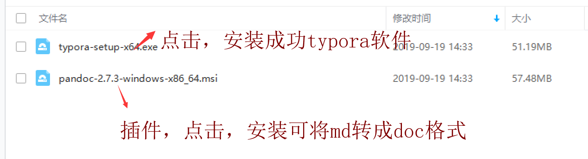


写程序代码  ``` 然后按回车

```html
<html>
    <head>
        <title></title>
    </head>
    <body>
        
    </body>
</html>
```

java代码

```java
public class Student{
    public int stuNo;
    public String stuName;
    //构造器 一般方法 
    
}
```

插入图片（重点）

如何设置路径

加粗

**字体加粗**文本内容

**字体加粗**


| q'q  | q'q  |      |
| ---- | ---- | ---- |
| q'q  |      |      |
| q'q  |      |      |
|      |      |      |


1. 一
2. 二
3. 三

官网

https://www.typora.io/


### 2 下载并安装Idea软件

**观看视频**

链接：https://pan.baidu.com/s/1FutK2Hqi77sjxHlYMLmNHQ 
提取码：mhat

链接：https://pan.baidu.com/s/1VrWChW8vrBmOBBR-dGQ2iw 
提取码：4c0j

**编程软件的介绍**

myeclipse   教学 学校使用 企业不用

eclipse   很多企业，尤其传统企业在使用，比较稳定，比较笨重

​				修改或者编辑代码之后，需要保存ctrl+s

idea   大型企业，最近比较流行，智能化的提示，支持丰富的插件，可以进行前端开发和后端开发

​			最近几年非常受到程序员的追捧的软件。缺点：不是太稳定

​            修改或者编辑代码之后，不需要按ctrl+s进行保存，它自动保存		

**课后作业**（不用上交）

​	比较eclipse和idea的优缺点？


**安装包和破解方法 下载路径**

链接：https://pan.baidu.com/s/1o-hwgJnsAEIVaZDT1ZuRSQ 
提取码：6vak 
复制这段内容后打开百度网盘手机App，操作更方便哦

**目的**

用于Java编程的软件

**安装过程**

参考文档

https://jingyan.baidu.com/article/a24b33cd3a981119fe002b96.html

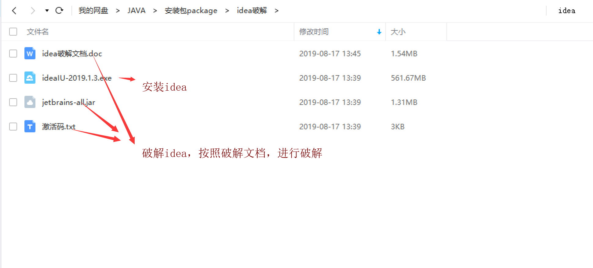


**破解过程**

云盘链接中提供《破解文档》，按照文档步骤操作

## 框架概述

**观看视频**

链接：https://pan.baidu.com/s/1RJYLjG_krIPHNJmV4M1URQ 
提取码：nhuz

### **知识准备**

1、java基础和html 、css  js jquery 

2、jsp servlet tomcat  等web方面的知识

​		使用jsp、servlet、jdbc等技术实现web项目（非框架）

3、熟悉mvc思想

m model  模型层，包含dao子层、service子层；

​					dao层进行数据库的访问操作

​					sevice层进行业务逻辑处理												

v view   视图层，jsp技术，用于和用户进行交互

c control  控制层，servlet层实现，对用户的请求进行处理

**优点**（非mvc思想的项目进行比较）

分层：实现分工，很有条理性，便于后期维护

逻辑清晰，定点解决问题

**缺点**

数据库访问层：sql语句和java语言混合在一起，希望它们进行分开（解耦，低耦合）。

前端请求层：一个请求对象一组servlet和servlet-map。

其他缺点，后续补充（和框架项目进行对比）

### 框架初认识

本学期ssm框架

​	1 spring  、springmvc、mybatis框架组成

​	2 该框架也是建立在mvc思想上设计的

​	3  m 模型层：mybatis实现于数据库的交互、和service层进行业务逻辑处理 。

​		v  试图层：jsp技术

​		c  控制层： springmvc框架代替servlet技术，进行对用户请求的处理。

​	4  spring是一个生态，springmvc是它的子模块

## 学习Mybatis

**观看视频**

链接：https://pan.baidu.com/s/1VQaeqxVsulzPFaicpV1SiA 
提取码：tf64

### 概念知识

1、mybatis的前身是ibatis，这个框架是处理和数据库的一个交互行为，这个也是开源的框架。

2、官方网站，里面有大量mybatis的学习资料

​      https://mybatis.org/mybatis-3/

3、核心技术：orm技术，是指对象和映射一一对应的关系

​		数据库中表，一张表对应一个对象，表内的字段对应对象的属性

4、基于sql'语句的，简单易学，同时是sql语句和java代码进行分离，解耦的	作用

### 示例示范

**观看视频（本节课最后一个视频）**

链接：https://pan.baidu.com/s/1XUVJx-W6wN3P78Yt09W-aA 
提取码：3kqk

利用提供的素材（超市管理系统），进行演示。

#### **需求**

​	统计用户表中的记录数

## 实现步骤

##### 1、设计数据库

​	注意每张表之间关系：逻辑外键关联

​	逻辑外键外联：从逻辑上是主从关系，但是并没有在数据库进行设置

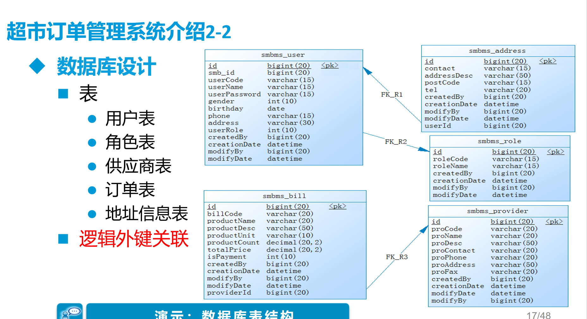

​	

##### 2、根据上述设计在数据库中生成实际表

​		1 将下述sql语句复制到sqlyog中

​		2 每一条sql语句执行运行

​		3 刷新目录（勿忘）

```sql
CREATE DATABASE `smbms` ;

USE `smbms`;

/*Table structure for table `smbms_address` */

DROP TABLE IF EXISTS `smbms_address`;

CREATE TABLE `smbms_address` (
  `id` BIGINT(20) NOT NULL AUTO_INCREMENT COMMENT '主键ID',
  `contact` VARCHAR(15) COLLATE utf8_unicode_ci DEFAULT NULL COMMENT '联系人姓名',
  `addressDesc` VARCHAR(50) COLLATE utf8_unicode_ci DEFAULT NULL COMMENT '收货地址明细',
  `postCode` VARCHAR(15) COLLATE utf8_unicode_ci DEFAULT NULL COMMENT '邮编',
  `tel` VARCHAR(20) COLLATE utf8_unicode_ci DEFAULT NULL COMMENT '联系人电话',
  `createdBy` BIGINT(20) DEFAULT NULL COMMENT '创建者',
  `creationDate` DATETIME DEFAULT NULL COMMENT '创建时间',
  `modifyBy` BIGINT(20) DEFAULT NULL COMMENT '修改者',
  `modifyDate` DATETIME DEFAULT NULL COMMENT '修改时间',
  `userId` BIGINT(20) DEFAULT NULL COMMENT '用户ID',
  PRIMARY KEY (`id`)
) ENGINE=INNODB AUTO_INCREMENT=7 DEFAULT CHARSET=utf8 COLLATE=utf8_unicode_ci;

/*Data for the table `smbms_address` */

INSERT  INTO `smbms_address`(`id`,`contact`,`addressDesc`,`postCode`,`tel`,`createdBy`,`creationDate`,`modifyBy`,`modifyDate`,`userId`) VALUES (1,'王丽','北京市东城区东交民巷44号','100010','13678789999',1,'2016-04-13 00:00:00',NULL,NULL,1),(2,'张红丽','北京市海淀区丹棱街3号','100000','18567672312',1,'2016-04-13 00:00:00',NULL,NULL,1),(3,'任志强','北京市东城区美术馆后街23号','100021','13387906742',1,'2016-04-13 00:00:00',NULL,NULL,1),(4,'曹颖','北京市朝阳区朝阳门南大街14号','100053','13568902323',1,'2016-04-13 00:00:00',NULL,NULL,2),(5,'李慧','北京市西城区三里河路南三巷3号','100032','18032356666',1,'2016-04-13 00:00:00',NULL,NULL,3),(6,'王国强','北京市顺义区高丽营镇金马工业区18号','100061','13787882222',1,'2016-04-13 00:00:00',NULL,NULL,3);

/*Table structure for table `smbms_bill` */

DROP TABLE IF EXISTS `smbms_bill`;

CREATE TABLE `smbms_bill` (
  `id` BIGINT(20) NOT NULL AUTO_INCREMENT COMMENT '主键ID',
  `billCode` VARCHAR(20) COLLATE utf8_unicode_ci DEFAULT NULL COMMENT '账单编码',
  `productName` VARCHAR(20) COLLATE utf8_unicode_ci DEFAULT NULL COMMENT '商品名称',
  `productDesc` VARCHAR(50) COLLATE utf8_unicode_ci DEFAULT NULL COMMENT '商品描述',
  `productUnit` VARCHAR(10) COLLATE utf8_unicode_ci DEFAULT NULL COMMENT '商品单位',
  `productCount` DECIMAL(20,2) DEFAULT NULL COMMENT '商品数量',
  `totalPrice` DECIMAL(20,2) DEFAULT NULL COMMENT '商品总额',
  `isPayment` INT(10) DEFAULT NULL COMMENT '是否支付（1：未支付 2：已支付）',
  `createdBy` BIGINT(20) DEFAULT NULL COMMENT '创建者（userId）',
  `creationDate` DATETIME DEFAULT NULL COMMENT '创建时间',
  `modifyBy` BIGINT(20) DEFAULT NULL COMMENT '更新者（userId）',
  `modifyDate` DATETIME DEFAULT NULL COMMENT '更新时间',
  `providerId` BIGINT(20) DEFAULT NULL COMMENT '供应商ID',
  PRIMARY KEY (`id`)
) ENGINE=INNODB AUTO_INCREMENT=19 DEFAULT CHARSET=utf8 COLLATE=utf8_unicode_ci;

/*Data for the table `smbms_bill` */

INSERT  INTO `smbms_bill`(`id`,`billCode`,`productName`,`productDesc`,`productUnit`,`productCount`,`totalPrice`,`isPayment`,`createdBy`,`creationDate`,`modifyBy`,`modifyDate`,`providerId`) VALUES (1,'BILL2016_001','洗发水、护发素','日用品-洗发、护发','瓶','500.00','25000.00',2,1,'2014-12-14 13:02:03',NULL,NULL,13),(2,'BILL2016_002','香皂、肥皂、药皂','日用品-皂类','块','1000.00','10000.00',2,1,'2016-03-23 04:20:40',NULL,NULL,13),(3,'BILL2016_003','大豆油','食品-食用油','斤','300.00','5890.00',2,1,'2014-12-14 13:02:03',NULL,NULL,6),(4,'BILL2016_004','橄榄油','食品-进口食用油','斤','200.00','9800.00',2,1,'2013-10-10 03:12:13',NULL,NULL,7),(5,'BILL2016_005','洗洁精','日用品-厨房清洁','瓶','500.00','7000.00',2,1,'2014-12-14 13:02:03',NULL,NULL,9),(6,'BILL2016_006','美国大杏仁','食品-坚果','袋','300.00','5000.00',2,1,'2016-04-14 06:08:09',NULL,NULL,4),(7,'BILL2016_007','沐浴液、精油','日用品-沐浴类','瓶','500.00','23000.00',1,1,'2016-07-22 10:10:22',NULL,NULL,14),(8,'BILL2016_008','不锈钢盘碗','日用品-厨房用具','个','600.00','6000.00',2,1,'2016-04-14 05:12:13',NULL,NULL,14),(9,'BILL2016_009','塑料杯','日用品-杯子','个','350.00','1750.00',2,1,'2016-02-04 11:40:20',NULL,NULL,14),(10,'BILL2016_010','豆瓣酱','食品-调料','瓶','200.00','2000.00',2,1,'2013-10-29 05:07:03',NULL,NULL,8),(11,'BILL2016_011','海之蓝','饮料-国酒','瓶','50.00','10000.00',1,1,'2016-04-14 16:16:00',NULL,NULL,1),(12,'BILL2016_012','芝华士','饮料-洋酒','瓶','20.00','6000.00',1,1,'2016-09-09 17:00:00',NULL,NULL,1),(13,'BILL2016_013','长城红葡萄酒','饮料-红酒','瓶','60.00','800.00',2,1,'2016-11-14 15:23:00',NULL,NULL,1),(14,'BILL2016_014','泰国香米','食品-大米','斤','400.00','5000.00',2,1,'2016-10-09 15:20:00',NULL,NULL,3),(15,'BILL2016_015','东北大米','食品-大米','斤','600.00','4000.00',2,1,'2016-11-14 14:00:00',NULL,NULL,3),(16,'BILL2016_016','可口可乐','饮料','瓶','2000.00','6000.00',2,1,'2012-03-27 13:03:01',NULL,NULL,2),(17,'BILL2016_017','脉动','饮料','瓶','1500.00','4500.00',2,1,'2016-05-10 12:00:00',NULL,NULL,2),(18,'BILL2016_018','哇哈哈','饮料','瓶','2000.00','4000.00',2,1,'2015-11-24 15:12:03',NULL,NULL,2);

/*Table structure for table `smbms_provider` */

DROP TABLE IF EXISTS `smbms_provider`;

CREATE TABLE `smbms_provider` (
  `id` BIGINT(20) NOT NULL AUTO_INCREMENT COMMENT '主键ID',
  `proCode` VARCHAR(20) COLLATE utf8_unicode_ci DEFAULT NULL COMMENT '供应商编码',
  `proName` VARCHAR(20) COLLATE utf8_unicode_ci DEFAULT NULL COMMENT '供应商名称',
  `proDesc` VARCHAR(50) COLLATE utf8_unicode_ci DEFAULT NULL COMMENT '供应商详细描述',
  `proContact` VARCHAR(20) COLLATE utf8_unicode_ci DEFAULT NULL COMMENT '供应商联系人',
  `proPhone` VARCHAR(20) COLLATE utf8_unicode_ci DEFAULT NULL COMMENT '联系电话',
  `proAddress` VARCHAR(50) COLLATE utf8_unicode_ci DEFAULT NULL COMMENT '地址',
  `proFax` VARCHAR(20) COLLATE utf8_unicode_ci DEFAULT NULL COMMENT '传真',
  `createdBy` BIGINT(20) DEFAULT NULL COMMENT '创建者（userId）',
  `creationDate` DATETIME DEFAULT NULL COMMENT '创建时间',
  `modifyDate` DATETIME DEFAULT NULL COMMENT '更新时间',
  `modifyBy` BIGINT(20) DEFAULT NULL COMMENT '更新者（userId）',
  PRIMARY KEY (`id`)
) ENGINE=INNODB AUTO_INCREMENT=16 DEFAULT CHARSET=utf8 COLLATE=utf8_unicode_ci;

/*Data for the table `smbms_provider` */

INSERT  INTO `smbms_provider`(`id`,`proCode`,`proName`,`proDesc`,`proContact`,`proPhone`,`proAddress`,`proFax`,`createdBy`,`creationDate`,`modifyDate`,`modifyBy`) VALUES (1,'BJ_GYS001','北京三木堂商贸有限公司','长期合作伙伴，主营产品:茅台、五粮液、郎酒、酒鬼酒、泸州老窖、赖茅酒、法国红酒等','张国强','13566667777','北京市丰台区育芳园北路','010-58858787',1,'2013-03-21 16:52:07',NULL,NULL),(2,'HB_GYS001','石家庄帅益食品贸易有限公司','长期合作伙伴，主营产品:饮料、水饮料、植物蛋白饮料、休闲食品、果汁饮料、功能饮料等','王军','13309094212','河北省石家庄新华区','0311-67738876',1,'2016-04-13 04:20:40',NULL,NULL),(3,'GZ_GYS001','深圳市泰香米业有限公司','初次合作伙伴，主营产品：良记金轮米,龙轮香米等','郑程瀚','13402013312','广东省深圳市福田区深南大道6006华丰大厦','0755-67776212',1,'2014-03-21 16:56:07',NULL,NULL),(4,'GZ_GYS002','深圳市喜来客商贸有限公司','长期合作伙伴，主营产品：坚果炒货.果脯蜜饯.天然花茶.营养豆豆.特色美食.进口食品.海味零食.肉脯肉','林妮','18599897645','广东省深圳市福龙工业区B2栋3楼西','0755-67772341',1,'2013-03-22 16:52:07',NULL,NULL),(5,'JS_GYS001','兴化佳美调味品厂','长期合作伙伴，主营产品：天然香辛料、鸡精、复合调味料','徐国洋','13754444221','江苏省兴化市林湖工业区','0523-21299098',1,'2015-11-22 16:52:07',NULL,NULL),(6,'BJ_GYS002','北京纳福尔食用油有限公司','长期合作伙伴，主营产品：山茶油、大豆油、花生油、橄榄油等','马莺','13422235678','北京市朝阳区珠江帝景1号楼','010-588634233',1,'2012-03-21 17:52:07',NULL,NULL),(7,'BJ_GYS003','北京国粮食用油有限公司','初次合作伙伴，主营产品：花生油、大豆油、小磨油等','王驰','13344441135','北京大兴青云店开发区','010-588134111',1,'2016-04-13 00:00:00',NULL,NULL),(8,'ZJ_GYS001','慈溪市广和绿色食品厂','长期合作伙伴，主营产品：豆瓣酱、黄豆酱、甜面酱，辣椒，大蒜等农产品','薛圣丹','18099953223','浙江省宁波市慈溪周巷小安村','0574-34449090',1,'2013-11-21 06:02:07',NULL,NULL),(9,'GX_GYS001','优百商贸有限公司','长期合作伙伴，主营产品：日化产品','李立国','13323566543','广西南宁市秀厢大道42-1号','0771-98861134',1,'2013-03-21 19:52:07',NULL,NULL),(10,'JS_GYS002','南京火头军信息技术有限公司','长期合作伙伴，主营产品：不锈钢厨具等','陈女士','13098992113','江苏省南京市浦口区浦口大道1号新城总部大厦A座903室','025-86223345',1,'2013-03-25 16:52:07',NULL,NULL),(11,'GZ_GYS003','广州市白云区美星五金制品厂','长期合作伙伴，主营产品：海绵床垫、坐垫、靠垫、海绵枕头、头枕等','梁天','13562276775','广州市白云区钟落潭镇福龙路20号','020-85542231',1,'2016-12-21 06:12:17',NULL,NULL),(12,'BJ_GYS004','北京隆盛日化科技','长期合作伙伴，主营产品：日化环保清洗剂，家居洗涤专卖、洗涤用品网、墙体除霉剂、墙面霉菌清除剂等','孙欣','13689865678','北京市大兴区旧宫','010-35576786',1,'2014-11-21 12:51:11',NULL,NULL),(13,'SD_GYS001','山东豪克华光联合发展有限公司','长期合作伙伴，主营产品：洗衣皂、洗衣粉、洗衣液、洗洁精、消杀类、香皂等','吴洪转','13245468787','山东济阳济北工业区仁和街21号','0531-53362445',1,'2015-01-28 10:52:07',NULL,NULL),(14,'JS_GYS003','无锡喜源坤商行','长期合作伙伴，主营产品：日化品批销','周一清','18567674532','江苏无锡盛岸西路','0510-32274422',1,'2016-04-23 11:11:11',NULL,NULL),(15,'ZJ_GYS002','乐摆日用品厂','长期合作伙伴，主营产品：各种中、高档塑料杯，塑料乐扣水杯（密封杯）、保鲜杯（保鲜盒）、广告杯、礼品杯','王世杰','13212331567','浙江省金华市义乌市义东路','0579-34452321',1,'2016-08-22 10:01:30',NULL,NULL);

/*Table structure for table `smbms_role` */

DROP TABLE IF EXISTS `smbms_role`;

CREATE TABLE `smbms_role` (
  `id` BIGINT(20) NOT NULL AUTO_INCREMENT COMMENT '主键ID',
  `roleCode` VARCHAR(15) COLLATE utf8_unicode_ci DEFAULT NULL COMMENT '角色编码',
  `roleName` VARCHAR(15) COLLATE utf8_unicode_ci DEFAULT NULL COMMENT '角色名称',
  `createdBy` BIGINT(20) DEFAULT NULL COMMENT '创建者',
  `creationDate` DATETIME DEFAULT NULL COMMENT '创建时间',
  `modifyBy` BIGINT(20) DEFAULT NULL COMMENT '修改者',
  `modifyDate` DATETIME DEFAULT NULL COMMENT '修改时间',
  PRIMARY KEY (`id`)
) ENGINE=INNODB AUTO_INCREMENT=4 DEFAULT CHARSET=utf8 COLLATE=utf8_unicode_ci;

/*Data for the table `smbms_role` */

INSERT  INTO `smbms_role`(`id`,`roleCode`,`roleName`,`createdBy`,`creationDate`,`modifyBy`,`modifyDate`) VALUES (1,'SMBMS_ADMIN','系统管理员',1,'2016-04-13 00:00:00',NULL,NULL),(2,'SMBMS_MANAGER','经理',1,'2016-04-13 00:00:00',NULL,NULL),(3,'SMBMS_EMPLOYEE','普通员工',1,'2016-04-13 00:00:00',NULL,NULL);

/*Table structure for table `smbms_user` */

DROP TABLE IF EXISTS `smbms_user`;

CREATE TABLE `smbms_user` (
  `id` BIGINT(20) NOT NULL AUTO_INCREMENT COMMENT '主键ID',
  `userCode` VARCHAR(15) COLLATE utf8_unicode_ci DEFAULT NULL COMMENT '用户编码',
  `userName` VARCHAR(15) COLLATE utf8_unicode_ci DEFAULT NULL COMMENT '用户名称',
  `userPassword` VARCHAR(15) COLLATE utf8_unicode_ci DEFAULT NULL COMMENT '用户密码',
  `gender` INT(10) DEFAULT NULL COMMENT '性别（1:女、 2:男）',
  `birthday` DATE DEFAULT NULL COMMENT '出生日期',
  `phone` VARCHAR(15) COLLATE utf8_unicode_ci DEFAULT NULL COMMENT '手机',
  `address` VARCHAR(30) COLLATE utf8_unicode_ci DEFAULT NULL COMMENT '地址',
  `userRole` BIGINT(20) DEFAULT NULL COMMENT '用户角色（取自角色表-角色id）',
  `createdBy` BIGINT(20) DEFAULT NULL COMMENT '创建者（userId）',
  `creationDate` DATETIME DEFAULT NULL COMMENT '创建时间',
  `modifyBy` BIGINT(20) DEFAULT NULL COMMENT '更新者（userId）',
  `modifyDate` DATETIME DEFAULT NULL COMMENT '更新时间',
  PRIMARY KEY (`id`)
) ENGINE=INNODB AUTO_INCREMENT=16 DEFAULT CHARSET=utf8 COLLATE=utf8_unicode_ci;

insert  into `smbms_user`(`id`,`userCode`,`userName`,`userPassword`,`gender`,`birthday`,`phone`,`address`,`userRole`,`createdBy`,`creationDate`,`modifyBy`,`modifyDate`) values (1,'admin','系统管理员','1234567',1,'1983-10-10','13688889999','北京市海淀区成府路207号',1,1,'2013-03-21 16:52:07',NULL,NULL),(2,'liming','李明','0000000',2,'1983-12-10','13688884457','北京市东城区前门东大街9号',2,1,'2014-12-31 19:52:09',NULL,NULL),(5,'hanlubiao','韩路彪','0000000',2,'1984-06-05','18567542321','北京市朝阳区北辰中心12号',2,1,'2014-12-31 19:52:09',NULL,NULL),(6,'zhanghua','张华','0000000',1,'1983-06-15','13544561111','北京市海淀区学院路61号',3,1,'2013-02-11 10:51:17',NULL,NULL),(7,'wangyang','王洋','0000000',2,'1982-12-31','13444561124','北京市海淀区西二旗辉煌国际16层',3,1,'2014-06-11 19:09:07',NULL,NULL),(8,'zhaoyan','赵燕','0000000',1,'1986-03-07','18098764545','北京市海淀区回龙观小区10号楼',3,1,'2016-04-21 13:54:07',NULL,NULL),(10,'sunlei','孙磊','0000000',2,'1981-01-04','13387676765','北京市朝阳区管庄新月小区12楼',3,1,'2015-05-06 10:52:07',NULL,NULL),(11,'sunxing','孙兴','0000000',2,'1978-03-12','13367890900','北京市朝阳区建国门南大街10号',3,1,'2016-11-09 16:51:17',NULL,NULL),(12,'zhangchen','张晨','0000000',1,'1986-03-28','18098765434','朝阳区管庄路口北柏林爱乐三期13号楼',3,1,'2016-08-09 05:52:37',1,'2016-04-14 14:15:36'),(13,'dengchao','邓超','0000000',2,'1981-11-04','13689674534','北京市海淀区北航家属院10号楼',3,1,'2016-07-11 08:02:47',NULL,NULL),(14,'yangguo','杨过','0000000',2,'1980-01-01','13388886623','北京市朝阳区北苑家园茉莉园20号楼',3,1,'2015-02-01 03:52:07',NULL,NULL),(15,'zhaomin','赵敏','0000000',1,'1987-12-04','18099897657','北京市昌平区天通苑3区12号楼',2,1,'2015-09-12 12:02:12',NULL,NULL);


```

##### 3、创建web项目，使用mybatis对数据库进行访问


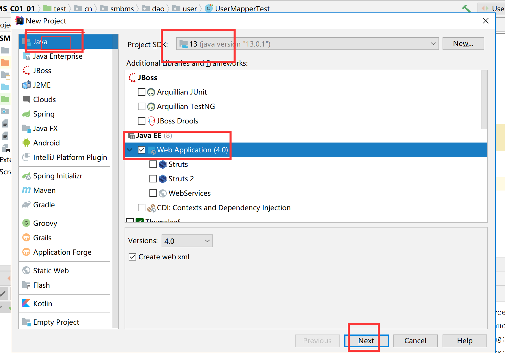

**注意目录结构**

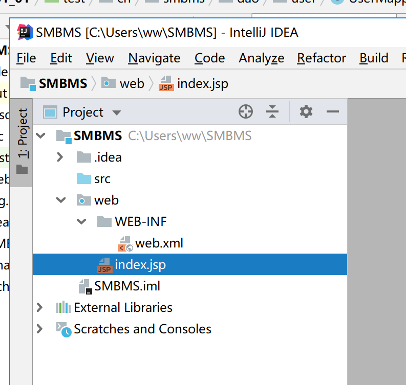

**创建test文件夹，并mark一下**

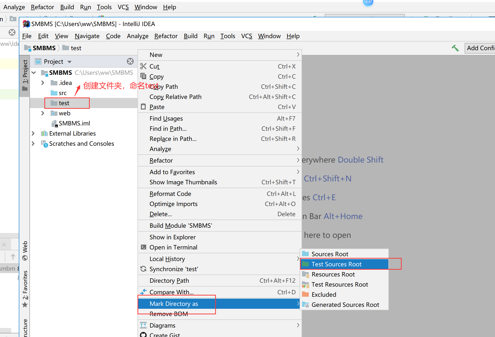

**创建resource文件夹，并mark一下啊**


**创建lib文件夹，并添加jar包**

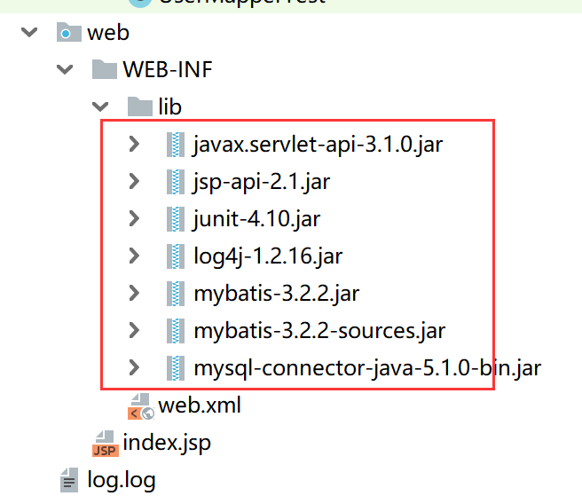

​			servlet-api.jar和jsp-api.jar是支持jsp技术的

​			junit是用于测试的jar包

​			log4j是用于日志生产的jar包

​			mybatis.jar是支持mybatis框架的jar包

​			mysql-connector-java.jar是用于项目和数据库的连接

##### 4、配置tomcat服务器

​	


**启动tomcat服务器**

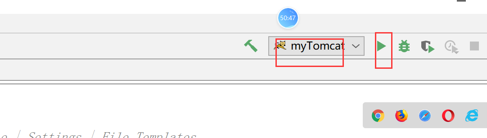

# **第二次课程：观看视频**

链接：https://pan.baidu.com/s/1DQ_FDNSpP8DpbvYrv2x3Ww 
提取码：e9c4 
视频名称：6—mybatis示例

##### 5 、连接数据库的配置

​	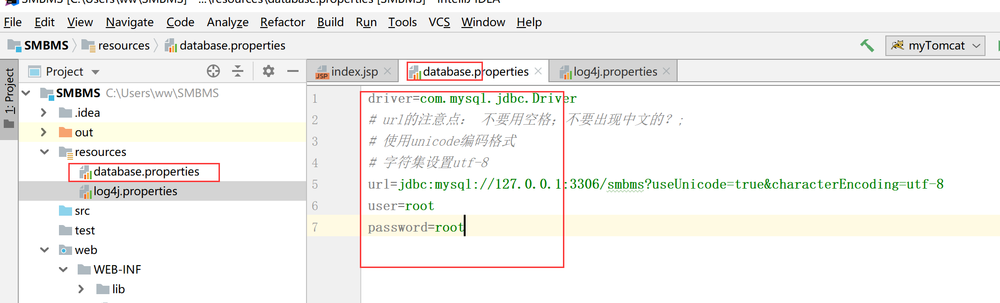

```
driver=com.mysql.jdbc.Driver
# url的注意点： 不要用空格；不要出现中文的？;
# 使用unicode编码格式
# 字符集设置utf-8
url=jdbc:mysql://127.0.0.1:3306/smbms?useUnicode=true&characterEncoding=utf-8
user=root
password=root
```

##### 6、配置log4j的配置文件


```
log4j.rootLogger=DEBUG,CONSOLE,file
#log4j.rootLogger=ERROR,ROLLING_FILE
log4j.logger.cn.smbms.dao=debug
log4j.logger.com.ibatis=debug 
log4j.logger.com.ibatis.common.jdbc.SimpleDataSource=debug 
log4j.logger.com.ibatis.common.jdbc.ScriptRunner=debug 
log4j.logger.com.ibatis.sqlmap.engine.impl.SqlMapClientDelegate=debug 
log4j.logger.java.sql.Connection=debug 
log4j.logger.java.sql.Statement=debug 
log4j.logger.java.sql.PreparedStatement=debug 
log4j.logger.java.sql.ResultSet=debug 
log4j.logger.org.tuckey.web.filters.urlrewrite.UrlRewriteFilter=debug

######################################################################################
# Console Appender  \u65e5\u5fd7\u5728\u63a7\u5236\u8f93\u51fa\u914d\u7f6e
######################################################################################
log4j.appender.CONSOLE=org.apache.log4j.ConsoleAppender
log4j.appender.Threshold=error
log4j.appender.CONSOLE.Target=System.out
log4j.appender.CONSOLE.layout=org.apache.log4j.PatternLayout
log4j.appender.CONSOLE.layout.ConversionPattern= [%p] %d %c - %m%n


######################################################################################
# DailyRolling File  \u6bcf\u5929\u4ea7\u751f\u4e00\u4e2a\u65e5\u5fd7\u6587\u4ef6\uff0c\u6587\u4ef6\u540d\u683c\u5f0f:log2009-09-11
######################################################################################
log4j.appender.file=org.apache.log4j.DailyRollingFileAppender
log4j.appender.file.DatePattern=yyyy-MM-dd
log4j.appender.file.File=log.log
log4j.appender.file.Append=true
log4j.appender.file.Threshold=error
log4j.appender.file.layout=org.apache.log4j.PatternLayout
log4j.appender.file.layout.ConversionPattern=%d{yyyy-M-d HH:mm:ss}%x[%5p](%F:%L) %m%n


log4j.logger.com.opensymphony.xwork2=error  
```

##### 7、配置mybatis的配置文件（重点）

​		**复制头文件**

```
<?xml version="1.0" encoding="UTF-8" ?>
<!DOCTYPE configuration
PUBLIC "-//mybatis.org//DTD Config 3.0//EN"
"http://mybatis.org/dtd/mybatis-3-config.dtd">

```

​	**编写配置文件**

```
<!--通过mybatis配置文件实现与数据库的连接-->
<configuration>
    <!--引入database.properties文件-->
    <properties resource="database.properties"/>
    <!--配置mybatis的log实现log4j-->
    <settings>
        <setting name="logImpl" value="LOG4J"/>
    </settings>
    <environments default="development">
        <environment id="development">
            <!--配置事务管理，采用jdbc的事务管理-->
            <transactionManager type="JDBC"></transactionManager>
            <!--使用mybatis自带的数据源pooled类型-->
            <dataSource type="POOLED">
                <property name="driver" value="${driver1}"/>
                <property name="url" value="${url8}"/>
                <property name="username" value="${user}"/>
                <property name="password" value="${password}"/>
            </dataSource>
        </environment>

    </environments>

    <!--将mapper文件加入到配置文件中，后续补充-->
    <mappers>
        <mapper resource=""/>
    </mappers>
</configuration>
```

##### 8、补充src内的java类

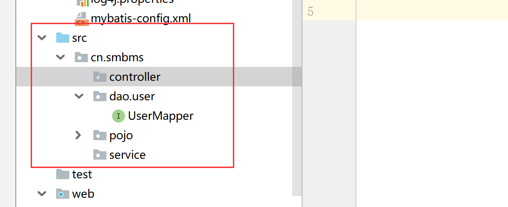

**编写实体类**

建议：

​	实体类的类名可以不和表明一致，但是属性名建议和表中的字段保持一致。

​	同时，设计表字段时，要遵循驼峰命名法

```
package cn.smbms.pojo;

import java.util.Date;

public class User {
    private Integer id; //id 
    private String userCode; //用户编码
    private String userName; //用户名称
    private String userPassword; //用户密码
    private Integer gender;  //性别
    private Date birthday;  //出生日期
    private String phone;   //电话
    private String address; //地址
    private Integer userRole;    //用户角色
    private Integer createdBy;   //创建者
    private Date creationDate; //创建时间
    private Integer modifyBy;     //更新者
    private Date modifyDate;   //更新时间

    public Integer getId() {
        return id;
    }
    public void setId(Integer id) {
        this.id = id;
    }
    public String getUserCode() {
        return userCode;
    }
    public void setUserCode(String userCode) {
        this.userCode = userCode;
    }
    public String getUserName() {
        return userName;
    }
    public void setUserName(String userName) {
        this.userName = userName;
    }
    public String getUserPassword() {
        return userPassword;
    }
    public void setUserPassword(String userPassword) {
        this.userPassword = userPassword;
    }
    public Integer getGender() {
        return gender;
    }
    public void setGender(Integer gender) {
        this.gender = gender;
    }
    public Date getBirthday() {
        return birthday;
    }
    public void setBirthday(Date birthday) {
        this.birthday = birthday;
    }
    public String getPhone() {
        return phone;
    }
    public void setPhone(String phone) {
        this.phone = phone;
    }
    public String getAddress() {
        return address;
    }
    public void setAddress(String address) {
        this.address = address;
    }
    public Integer getUserRole() {
        return userRole;
    }
    public void setUserRole(Integer userRole) {
        this.userRole = userRole;
    }
    public Integer getCreatedBy() {
        return createdBy;
    }
    public void setCreatedBy(Integer createdBy) {
        this.createdBy = createdBy;
    }
    public Date getCreationDate() {
        return creationDate;
    }
    public void setCreationDate(Date creationDate) {
        this.creationDate = creationDate;
    }
    public Integer getModifyBy() {
        return modifyBy;
    }
    public void setModifyBy(Integer modifyBy) {
        this.modifyBy = modifyBy;
    }
    public Date getModifyDate() {
        return modifyDate;
    }
    public void setModifyDate(Date modifyDate) {
        this.modifyDate = modifyDate;
    }
}

```

**编写dao层中接口**

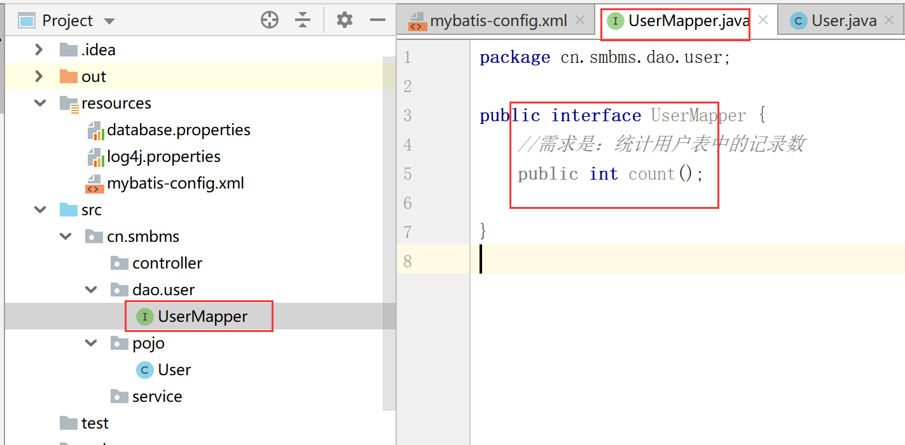

```java
package cn.smbms.dao.user;

public interface UserMapper {
    //需求是：统计用户表中的记录数
    // select count(1) as count from smbms_user ;
    public int count();

}
```

**创建对应UserMapper的mapper文件**

注意点： xml文件的名字和接口的名字要保持一致


添加头文件

```xml
<?xml version="1.0" encoding="UTF-8" ?>
<!DOCTYPE mapper
PUBLIC "-//mybatis.org//DTD Mapper 3.0//EN"
"http://mybatis.org/dtd/mybatis-3-mapper.dtd">

```

##### 9 编写sql语句

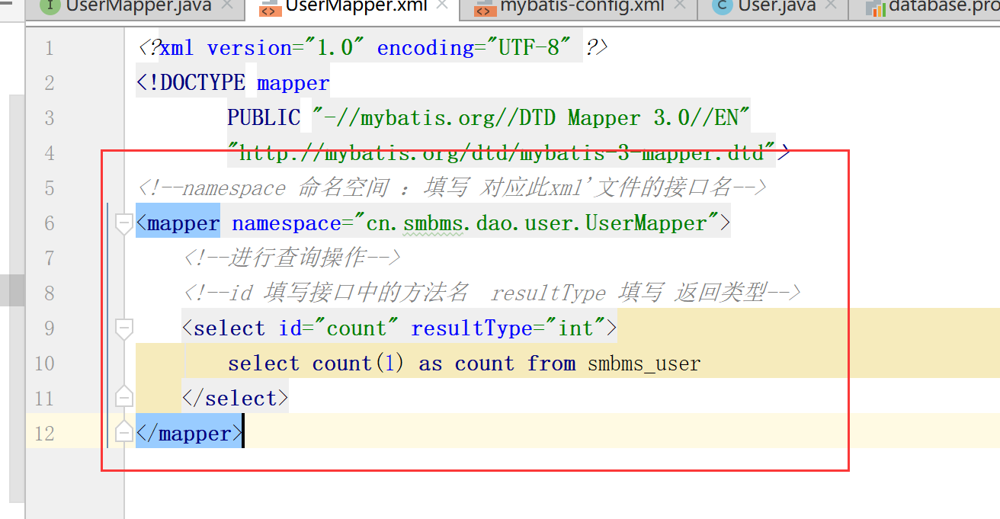

```
<!--namespace 命名空间 ：填写 对应此xml'文件的接口名-->
<mapper namespace="cn.smbms.dao.user.UserMapper">
    <!--进行查询操作-->
    <!--id 填写接口中的方法名  resultType 填写 返回类型-->
    <select id="count" resultType="int">
        select count(1) as count from smbms_user
    </select>
</mapper>
```

##### 10 添加mapper文件路径到mybatis-config.xml中

通过右击UserMapper.xml，选择copy relative path，复制粘贴到mybatis-config.xml中

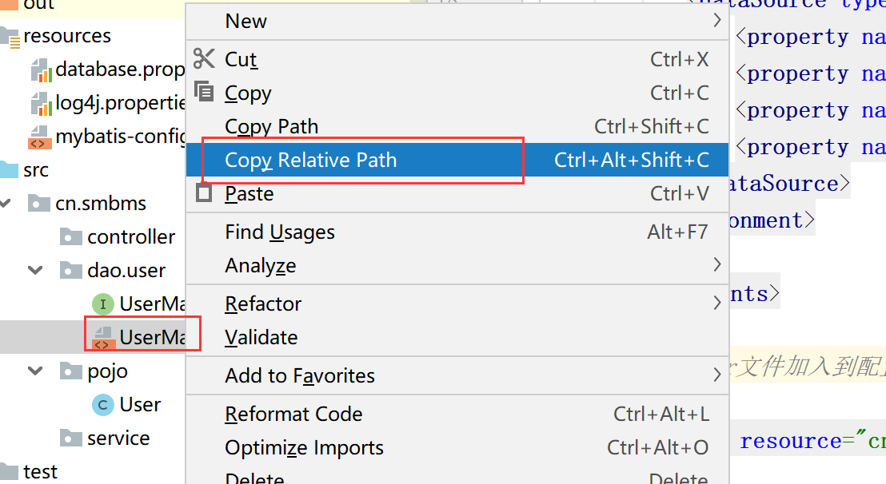


##### 11 编写测试类

**创建测试文件夹**


   **mark测试文件夹**

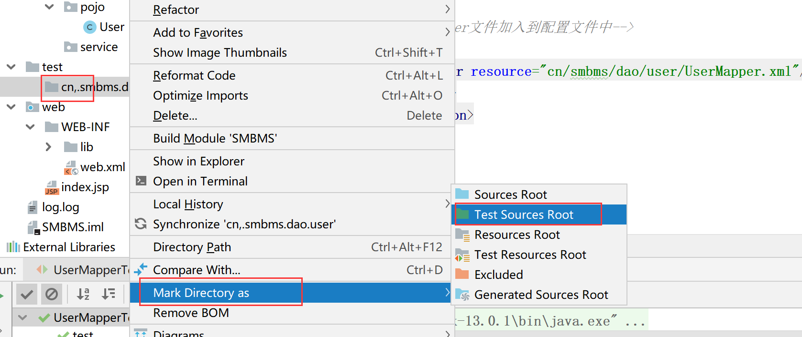

**创建java类文件**


编写具体测试方法

```java
import org.apache.ibatis.io.Resources;
import org.apache.ibatis.session.SqlSession;
import org.apache.ibatis.session.SqlSessionFactory;
import org.apache.ibatis.session.SqlSessionFactoryBuilder;
import org.apache.log4j.Logger;
import org.junit.Test;

import java.io.IOException;
import java.io.InputStream;

public class UserMapperTest {

//创建日志对象
    Logger logger=Logger.getLogger(UserMapperTest.class);

    //测试方法
    @Test
    public void test(){
        SqlSession sqlSession=null;
        try {
            //1 获得mybatis-config.xml文件的输入流
            InputStream inputStream= Resources.getResourceAsStream("mybatis-config.xml");
            //2 创建SqlSessionFactory对象，读取上述流
            SqlSessionFactory sqlSessionFactory=new SqlSessionFactoryBuilder().build(inputStream);
            //3  创建SqlSession对象（Connection）
            sqlSession=sqlSessionFactory.openSession();
            //4 通过sqlSession对象对mapper文件对应的接口进行方法的读取 全路径+方法名
            int count = sqlSession.selectOne("cn.smbms.dao.user.UserMapper.count");
            logger.debug("UserMapperTest test count:"+count);
        } catch (IOException e) {
            e.printStackTrace();
        }finally {
            sqlSession.close();
        }

    }

}
```

##### 12 测试运行


## 作业

=======
# 第一节  ssm框架的学习

## 准备工作

**观看视频**

链接：https://pan.baidu.com/s/1FnWsukDeepfsB2QE1k3oIg 
提取码：ckxd

### 1 下载并安装Typora软件

**下载路径**

链接：https://pan.baidu.com/s/1H7ZS0HhkS0hLry5qmTsotg 
提取码：1nz9

**目的**  ：该软件用于打开md格式的文件

**安装过程**


写程序代码  ``` 然后按回车

```html
<html>
    <head>
        <title></title>
    </head>
    <body>
        
    </body>
</html>
```

java代码

```java
public class Student{
    public int stuNo;
    public String stuName;
    //构造器 一般方法 
    
}
```

插入图片（重点）

如何设置路径

加粗

**字体加粗**文本内容

**字体加粗**


| q'q  | q'q  |      |
| ---- | ---- | ---- |
| q'q  |      |      |
| q'q  |      |      |
|      |      |      |


1. 一
2. 二
3. 三

官网

https://www.typora.io/


### 2 下载并安装Idea软件

**观看视频**

链接：https://pan.baidu.com/s/1FutK2Hqi77sjxHlYMLmNHQ 
提取码：mhat

链接：https://pan.baidu.com/s/1VrWChW8vrBmOBBR-dGQ2iw 
提取码：4c0j

**编程软件的介绍**

myeclipse   教学 学校使用 企业不用

eclipse   很多企业，尤其传统企业在使用，比较稳定，比较笨重

​				修改或者编辑代码之后，需要保存ctrl+s

idea   大型企业，最近比较流行，智能化的提示，支持丰富的插件，可以进行前端开发和后端开发

​			最近几年非常受到程序员的追捧的软件。缺点：不是太稳定

​            修改或者编辑代码之后，不需要按ctrl+s进行保存，它自动保存		

**课后作业**（不用上交）

​	比较eclipse和idea的优缺点？


**安装包和破解方法 下载路径**

链接：https://pan.baidu.com/s/1o-hwgJnsAEIVaZDT1ZuRSQ 
提取码：6vak 
复制这段内容后打开百度网盘手机App，操作更方便哦

**目的**

用于Java编程的软件

**安装过程**

参考文档

https://jingyan.baidu.com/article/a24b33cd3a981119fe002b96.html


**破解过程**

云盘链接中提供《破解文档》，按照文档步骤操作

## 框架概述

**观看视频**

链接：https://pan.baidu.com/s/1RJYLjG_krIPHNJmV4M1URQ 
提取码：nhuz

### **知识准备**

1、java基础和html 、css  js jquery 

2、jsp servlet tomcat  等web方面的知识

​		使用jsp、servlet、jdbc等技术实现web项目（非框架）

3、熟悉mvc思想

m model  模型层，包含dao子层、service子层；

​					dao层进行数据库的访问操作

​					sevice层进行业务逻辑处理												

v view   视图层，jsp技术，用于和用户进行交互

c control  控制层，servlet层实现，对用户的请求进行处理

**优点**（非mvc思想的项目进行比较）

分层：实现分工，很有条理性，便于后期维护

逻辑清晰，定点解决问题

**缺点**

数据库访问层：sql语句和java语言混合在一起，希望它们进行分开（解耦，低耦合）。

前端请求层：一个请求对象一组servlet和servlet-map。

其他缺点，后续补充（和框架项目进行对比）

### 框架初认识

本学期ssm框架

​	1 spring  、springmvc、mybatis框架组成

​	2 该框架也是建立在mvc思想上设计的

​	3  m 模型层：mybatis实现于数据库的交互、和service层进行业务逻辑处理 。

​		v  试图层：jsp技术

​		c  控制层： springmvc框架代替servlet技术，进行对用户请求的处理。

​	4  spring是一个生态，springmvc是它的子模块

## 学习Mybatis

**观看视频**

链接：https://pan.baidu.com/s/1VQaeqxVsulzPFaicpV1SiA 
提取码：tf64

### 概念知识

1、mybatis的前身是ibatis，这个框架是处理和数据库的一个交互行为，这个也是开源的框架。

2、官方网站，里面有大量mybatis的学习资料

​      https://mybatis.org/mybatis-3/

3、核心技术：orm技术，是指对象和映射一一对应的关系

​		数据库中表，一张表对应一个对象，表内的字段对应对象的属性

4、基于sql'语句的，简单易学，同时是sql语句和java代码进行分离，解耦的	作用

### 示例示范

**观看视频（本节课最后一个视频）**

链接：https://pan.baidu.com/s/1XUVJx-W6wN3P78Yt09W-aA 
提取码：3kqk

利用提供的素材（超市管理系统），进行演示。

#### **需求**

​	统计用户表中的记录数

## 实现步骤

##### 1、设计数据库

​	注意每张表之间关系：逻辑外键关联

​	逻辑外键外联：从逻辑上是主从关系，但是并没有在数据库进行设置


​	

##### 2、根据上述设计在数据库中生成实际表

​		1 将下述sql语句复制到sqlyog中

​		2 每一条sql语句执行运行

​		3 刷新目录（勿忘）

```sql
CREATE DATABASE `smbms` ;

USE `smbms`;

/*Table structure for table `smbms_address` */

DROP TABLE IF EXISTS `smbms_address`;

CREATE TABLE `smbms_address` (
  `id` BIGINT(20) NOT NULL AUTO_INCREMENT COMMENT '主键ID',
  `contact` VARCHAR(15) COLLATE utf8_unicode_ci DEFAULT NULL COMMENT '联系人姓名',
  `addressDesc` VARCHAR(50) COLLATE utf8_unicode_ci DEFAULT NULL COMMENT '收货地址明细',
  `postCode` VARCHAR(15) COLLATE utf8_unicode_ci DEFAULT NULL COMMENT '邮编',
  `tel` VARCHAR(20) COLLATE utf8_unicode_ci DEFAULT NULL COMMENT '联系人电话',
  `createdBy` BIGINT(20) DEFAULT NULL COMMENT '创建者',
  `creationDate` DATETIME DEFAULT NULL COMMENT '创建时间',
  `modifyBy` BIGINT(20) DEFAULT NULL COMMENT '修改者',
  `modifyDate` DATETIME DEFAULT NULL COMMENT '修改时间',
  `userId` BIGINT(20) DEFAULT NULL COMMENT '用户ID',
  PRIMARY KEY (`id`)
) ENGINE=INNODB AUTO_INCREMENT=7 DEFAULT CHARSET=utf8 COLLATE=utf8_unicode_ci;

/*Data for the table `smbms_address` */

INSERT  INTO `smbms_address`(`id`,`contact`,`addressDesc`,`postCode`,`tel`,`createdBy`,`creationDate`,`modifyBy`,`modifyDate`,`userId`) VALUES (1,'王丽','北京市东城区东交民巷44号','100010','13678789999',1,'2016-04-13 00:00:00',NULL,NULL,1),(2,'张红丽','北京市海淀区丹棱街3号','100000','18567672312',1,'2016-04-13 00:00:00',NULL,NULL,1),(3,'任志强','北京市东城区美术馆后街23号','100021','13387906742',1,'2016-04-13 00:00:00',NULL,NULL,1),(4,'曹颖','北京市朝阳区朝阳门南大街14号','100053','13568902323',1,'2016-04-13 00:00:00',NULL,NULL,2),(5,'李慧','北京市西城区三里河路南三巷3号','100032','18032356666',1,'2016-04-13 00:00:00',NULL,NULL,3),(6,'王国强','北京市顺义区高丽营镇金马工业区18号','100061','13787882222',1,'2016-04-13 00:00:00',NULL,NULL,3);

/*Table structure for table `smbms_bill` */

DROP TABLE IF EXISTS `smbms_bill`;

CREATE TABLE `smbms_bill` (
  `id` BIGINT(20) NOT NULL AUTO_INCREMENT COMMENT '主键ID',
  `billCode` VARCHAR(20) COLLATE utf8_unicode_ci DEFAULT NULL COMMENT '账单编码',
  `productName` VARCHAR(20) COLLATE utf8_unicode_ci DEFAULT NULL COMMENT '商品名称',
  `productDesc` VARCHAR(50) COLLATE utf8_unicode_ci DEFAULT NULL COMMENT '商品描述',
  `productUnit` VARCHAR(10) COLLATE utf8_unicode_ci DEFAULT NULL COMMENT '商品单位',
  `productCount` DECIMAL(20,2) DEFAULT NULL COMMENT '商品数量',
  `totalPrice` DECIMAL(20,2) DEFAULT NULL COMMENT '商品总额',
  `isPayment` INT(10) DEFAULT NULL COMMENT '是否支付（1：未支付 2：已支付）',
  `createdBy` BIGINT(20) DEFAULT NULL COMMENT '创建者（userId）',
  `creationDate` DATETIME DEFAULT NULL COMMENT '创建时间',
  `modifyBy` BIGINT(20) DEFAULT NULL COMMENT '更新者（userId）',
  `modifyDate` DATETIME DEFAULT NULL COMMENT '更新时间',
  `providerId` BIGINT(20) DEFAULT NULL COMMENT '供应商ID',
  PRIMARY KEY (`id`)
) ENGINE=INNODB AUTO_INCREMENT=19 DEFAULT CHARSET=utf8 COLLATE=utf8_unicode_ci;

/*Data for the table `smbms_bill` */

INSERT  INTO `smbms_bill`(`id`,`billCode`,`productName`,`productDesc`,`productUnit`,`productCount`,`totalPrice`,`isPayment`,`createdBy`,`creationDate`,`modifyBy`,`modifyDate`,`providerId`) VALUES (1,'BILL2016_001','洗发水、护发素','日用品-洗发、护发','瓶','500.00','25000.00',2,1,'2014-12-14 13:02:03',NULL,NULL,13),(2,'BILL2016_002','香皂、肥皂、药皂','日用品-皂类','块','1000.00','10000.00',2,1,'2016-03-23 04:20:40',NULL,NULL,13),(3,'BILL2016_003','大豆油','食品-食用油','斤','300.00','5890.00',2,1,'2014-12-14 13:02:03',NULL,NULL,6),(4,'BILL2016_004','橄榄油','食品-进口食用油','斤','200.00','9800.00',2,1,'2013-10-10 03:12:13',NULL,NULL,7),(5,'BILL2016_005','洗洁精','日用品-厨房清洁','瓶','500.00','7000.00',2,1,'2014-12-14 13:02:03',NULL,NULL,9),(6,'BILL2016_006','美国大杏仁','食品-坚果','袋','300.00','5000.00',2,1,'2016-04-14 06:08:09',NULL,NULL,4),(7,'BILL2016_007','沐浴液、精油','日用品-沐浴类','瓶','500.00','23000.00',1,1,'2016-07-22 10:10:22',NULL,NULL,14),(8,'BILL2016_008','不锈钢盘碗','日用品-厨房用具','个','600.00','6000.00',2,1,'2016-04-14 05:12:13',NULL,NULL,14),(9,'BILL2016_009','塑料杯','日用品-杯子','个','350.00','1750.00',2,1,'2016-02-04 11:40:20',NULL,NULL,14),(10,'BILL2016_010','豆瓣酱','食品-调料','瓶','200.00','2000.00',2,1,'2013-10-29 05:07:03',NULL,NULL,8),(11,'BILL2016_011','海之蓝','饮料-国酒','瓶','50.00','10000.00',1,1,'2016-04-14 16:16:00',NULL,NULL,1),(12,'BILL2016_012','芝华士','饮料-洋酒','瓶','20.00','6000.00',1,1,'2016-09-09 17:00:00',NULL,NULL,1),(13,'BILL2016_013','长城红葡萄酒','饮料-红酒','瓶','60.00','800.00',2,1,'2016-11-14 15:23:00',NULL,NULL,1),(14,'BILL2016_014','泰国香米','食品-大米','斤','400.00','5000.00',2,1,'2016-10-09 15:20:00',NULL,NULL,3),(15,'BILL2016_015','东北大米','食品-大米','斤','600.00','4000.00',2,1,'2016-11-14 14:00:00',NULL,NULL,3),(16,'BILL2016_016','可口可乐','饮料','瓶','2000.00','6000.00',2,1,'2012-03-27 13:03:01',NULL,NULL,2),(17,'BILL2016_017','脉动','饮料','瓶','1500.00','4500.00',2,1,'2016-05-10 12:00:00',NULL,NULL,2),(18,'BILL2016_018','哇哈哈','饮料','瓶','2000.00','4000.00',2,1,'2015-11-24 15:12:03',NULL,NULL,2);

/*Table structure for table `smbms_provider` */

DROP TABLE IF EXISTS `smbms_provider`;

CREATE TABLE `smbms_provider` (
  `id` BIGINT(20) NOT NULL AUTO_INCREMENT COMMENT '主键ID',
  `proCode` VARCHAR(20) COLLATE utf8_unicode_ci DEFAULT NULL COMMENT '供应商编码',
  `proName` VARCHAR(20) COLLATE utf8_unicode_ci DEFAULT NULL COMMENT '供应商名称',
  `proDesc` VARCHAR(50) COLLATE utf8_unicode_ci DEFAULT NULL COMMENT '供应商详细描述',
  `proContact` VARCHAR(20) COLLATE utf8_unicode_ci DEFAULT NULL COMMENT '供应商联系人',
  `proPhone` VARCHAR(20) COLLATE utf8_unicode_ci DEFAULT NULL COMMENT '联系电话',
  `proAddress` VARCHAR(50) COLLATE utf8_unicode_ci DEFAULT NULL COMMENT '地址',
  `proFax` VARCHAR(20) COLLATE utf8_unicode_ci DEFAULT NULL COMMENT '传真',
  `createdBy` BIGINT(20) DEFAULT NULL COMMENT '创建者（userId）',
  `creationDate` DATETIME DEFAULT NULL COMMENT '创建时间',
  `modifyDate` DATETIME DEFAULT NULL COMMENT '更新时间',
  `modifyBy` BIGINT(20) DEFAULT NULL COMMENT '更新者（userId）',
  PRIMARY KEY (`id`)
) ENGINE=INNODB AUTO_INCREMENT=16 DEFAULT CHARSET=utf8 COLLATE=utf8_unicode_ci;

/*Data for the table `smbms_provider` */

INSERT  INTO `smbms_provider`(`id`,`proCode`,`proName`,`proDesc`,`proContact`,`proPhone`,`proAddress`,`proFax`,`createdBy`,`creationDate`,`modifyDate`,`modifyBy`) VALUES (1,'BJ_GYS001','北京三木堂商贸有限公司','长期合作伙伴，主营产品:茅台、五粮液、郎酒、酒鬼酒、泸州老窖、赖茅酒、法国红酒等','张国强','13566667777','北京市丰台区育芳园北路','010-58858787',1,'2013-03-21 16:52:07',NULL,NULL),(2,'HB_GYS001','石家庄帅益食品贸易有限公司','长期合作伙伴，主营产品:饮料、水饮料、植物蛋白饮料、休闲食品、果汁饮料、功能饮料等','王军','13309094212','河北省石家庄新华区','0311-67738876',1,'2016-04-13 04:20:40',NULL,NULL),(3,'GZ_GYS001','深圳市泰香米业有限公司','初次合作伙伴，主营产品：良记金轮米,龙轮香米等','郑程瀚','13402013312','广东省深圳市福田区深南大道6006华丰大厦','0755-67776212',1,'2014-03-21 16:56:07',NULL,NULL),(4,'GZ_GYS002','深圳市喜来客商贸有限公司','长期合作伙伴，主营产品：坚果炒货.果脯蜜饯.天然花茶.营养豆豆.特色美食.进口食品.海味零食.肉脯肉','林妮','18599897645','广东省深圳市福龙工业区B2栋3楼西','0755-67772341',1,'2013-03-22 16:52:07',NULL,NULL),(5,'JS_GYS001','兴化佳美调味品厂','长期合作伙伴，主营产品：天然香辛料、鸡精、复合调味料','徐国洋','13754444221','江苏省兴化市林湖工业区','0523-21299098',1,'2015-11-22 16:52:07',NULL,NULL),(6,'BJ_GYS002','北京纳福尔食用油有限公司','长期合作伙伴，主营产品：山茶油、大豆油、花生油、橄榄油等','马莺','13422235678','北京市朝阳区珠江帝景1号楼','010-588634233',1,'2012-03-21 17:52:07',NULL,NULL),(7,'BJ_GYS003','北京国粮食用油有限公司','初次合作伙伴，主营产品：花生油、大豆油、小磨油等','王驰','13344441135','北京大兴青云店开发区','010-588134111',1,'2016-04-13 00:00:00',NULL,NULL),(8,'ZJ_GYS001','慈溪市广和绿色食品厂','长期合作伙伴，主营产品：豆瓣酱、黄豆酱、甜面酱，辣椒，大蒜等农产品','薛圣丹','18099953223','浙江省宁波市慈溪周巷小安村','0574-34449090',1,'2013-11-21 06:02:07',NULL,NULL),(9,'GX_GYS001','优百商贸有限公司','长期合作伙伴，主营产品：日化产品','李立国','13323566543','广西南宁市秀厢大道42-1号','0771-98861134',1,'2013-03-21 19:52:07',NULL,NULL),(10,'JS_GYS002','南京火头军信息技术有限公司','长期合作伙伴，主营产品：不锈钢厨具等','陈女士','13098992113','江苏省南京市浦口区浦口大道1号新城总部大厦A座903室','025-86223345',1,'2013-03-25 16:52:07',NULL,NULL),(11,'GZ_GYS003','广州市白云区美星五金制品厂','长期合作伙伴，主营产品：海绵床垫、坐垫、靠垫、海绵枕头、头枕等','梁天','13562276775','广州市白云区钟落潭镇福龙路20号','020-85542231',1,'2016-12-21 06:12:17',NULL,NULL),(12,'BJ_GYS004','北京隆盛日化科技','长期合作伙伴，主营产品：日化环保清洗剂，家居洗涤专卖、洗涤用品网、墙体除霉剂、墙面霉菌清除剂等','孙欣','13689865678','北京市大兴区旧宫','010-35576786',1,'2014-11-21 12:51:11',NULL,NULL),(13,'SD_GYS001','山东豪克华光联合发展有限公司','长期合作伙伴，主营产品：洗衣皂、洗衣粉、洗衣液、洗洁精、消杀类、香皂等','吴洪转','13245468787','山东济阳济北工业区仁和街21号','0531-53362445',1,'2015-01-28 10:52:07',NULL,NULL),(14,'JS_GYS003','无锡喜源坤商行','长期合作伙伴，主营产品：日化品批销','周一清','18567674532','江苏无锡盛岸西路','0510-32274422',1,'2016-04-23 11:11:11',NULL,NULL),(15,'ZJ_GYS002','乐摆日用品厂','长期合作伙伴，主营产品：各种中、高档塑料杯，塑料乐扣水杯（密封杯）、保鲜杯（保鲜盒）、广告杯、礼品杯','王世杰','13212331567','浙江省金华市义乌市义东路','0579-34452321',1,'2016-08-22 10:01:30',NULL,NULL);

/*Table structure for table `smbms_role` */

DROP TABLE IF EXISTS `smbms_role`;

CREATE TABLE `smbms_role` (
  `id` BIGINT(20) NOT NULL AUTO_INCREMENT COMMENT '主键ID',
  `roleCode` VARCHAR(15) COLLATE utf8_unicode_ci DEFAULT NULL COMMENT '角色编码',
  `roleName` VARCHAR(15) COLLATE utf8_unicode_ci DEFAULT NULL COMMENT '角色名称',
  `createdBy` BIGINT(20) DEFAULT NULL COMMENT '创建者',
  `creationDate` DATETIME DEFAULT NULL COMMENT '创建时间',
  `modifyBy` BIGINT(20) DEFAULT NULL COMMENT '修改者',
  `modifyDate` DATETIME DEFAULT NULL COMMENT '修改时间',
  PRIMARY KEY (`id`)
) ENGINE=INNODB AUTO_INCREMENT=4 DEFAULT CHARSET=utf8 COLLATE=utf8_unicode_ci;

/*Data for the table `smbms_role` */

INSERT  INTO `smbms_role`(`id`,`roleCode`,`roleName`,`createdBy`,`creationDate`,`modifyBy`,`modifyDate`) VALUES (1,'SMBMS_ADMIN','系统管理员',1,'2016-04-13 00:00:00',NULL,NULL),(2,'SMBMS_MANAGER','经理',1,'2016-04-13 00:00:00',NULL,NULL),(3,'SMBMS_EMPLOYEE','普通员工',1,'2016-04-13 00:00:00',NULL,NULL);

/*Table structure for table `smbms_user` */

DROP TABLE IF EXISTS `smbms_user`;

CREATE TABLE `smbms_user` (
  `id` BIGINT(20) NOT NULL AUTO_INCREMENT COMMENT '主键ID',
  `userCode` VARCHAR(15) COLLATE utf8_unicode_ci DEFAULT NULL COMMENT '用户编码',
  `userName` VARCHAR(15) COLLATE utf8_unicode_ci DEFAULT NULL COMMENT '用户名称',
  `userPassword` VARCHAR(15) COLLATE utf8_unicode_ci DEFAULT NULL COMMENT '用户密码',
  `gender` INT(10) DEFAULT NULL COMMENT '性别（1:女、 2:男）',
  `birthday` DATE DEFAULT NULL COMMENT '出生日期',
  `phone` VARCHAR(15) COLLATE utf8_unicode_ci DEFAULT NULL COMMENT '手机',
  `address` VARCHAR(30) COLLATE utf8_unicode_ci DEFAULT NULL COMMENT '地址',
  `userRole` BIGINT(20) DEFAULT NULL COMMENT '用户角色（取自角色表-角色id）',
  `createdBy` BIGINT(20) DEFAULT NULL COMMENT '创建者（userId）',
  `creationDate` DATETIME DEFAULT NULL COMMENT '创建时间',
  `modifyBy` BIGINT(20) DEFAULT NULL COMMENT '更新者（userId）',
  `modifyDate` DATETIME DEFAULT NULL COMMENT '更新时间',
  PRIMARY KEY (`id`)
) ENGINE=INNODB AUTO_INCREMENT=16 DEFAULT CHARSET=utf8 COLLATE=utf8_unicode_ci;

insert  into `smbms_user`(`id`,`userCode`,`userName`,`userPassword`,`gender`,`birthday`,`phone`,`address`,`userRole`,`createdBy`,`creationDate`,`modifyBy`,`modifyDate`) values (1,'admin','系统管理员','1234567',1,'1983-10-10','13688889999','北京市海淀区成府路207号',1,1,'2013-03-21 16:52:07',NULL,NULL),(2,'liming','李明','0000000',2,'1983-12-10','13688884457','北京市东城区前门东大街9号',2,1,'2014-12-31 19:52:09',NULL,NULL),(5,'hanlubiao','韩路彪','0000000',2,'1984-06-05','18567542321','北京市朝阳区北辰中心12号',2,1,'2014-12-31 19:52:09',NULL,NULL),(6,'zhanghua','张华','0000000',1,'1983-06-15','13544561111','北京市海淀区学院路61号',3,1,'2013-02-11 10:51:17',NULL,NULL),(7,'wangyang','王洋','0000000',2,'1982-12-31','13444561124','北京市海淀区西二旗辉煌国际16层',3,1,'2014-06-11 19:09:07',NULL,NULL),(8,'zhaoyan','赵燕','0000000',1,'1986-03-07','18098764545','北京市海淀区回龙观小区10号楼',3,1,'2016-04-21 13:54:07',NULL,NULL),(10,'sunlei','孙磊','0000000',2,'1981-01-04','13387676765','北京市朝阳区管庄新月小区12楼',3,1,'2015-05-06 10:52:07',NULL,NULL),(11,'sunxing','孙兴','0000000',2,'1978-03-12','13367890900','北京市朝阳区建国门南大街10号',3,1,'2016-11-09 16:51:17',NULL,NULL),(12,'zhangchen','张晨','0000000',1,'1986-03-28','18098765434','朝阳区管庄路口北柏林爱乐三期13号楼',3,1,'2016-08-09 05:52:37',1,'2016-04-14 14:15:36'),(13,'dengchao','邓超','0000000',2,'1981-11-04','13689674534','北京市海淀区北航家属院10号楼',3,1,'2016-07-11 08:02:47',NULL,NULL),(14,'yangguo','杨过','0000000',2,'1980-01-01','13388886623','北京市朝阳区北苑家园茉莉园20号楼',3,1,'2015-02-01 03:52:07',NULL,NULL),(15,'zhaomin','赵敏','0000000',1,'1987-12-04','18099897657','北京市昌平区天通苑3区12号楼',2,1,'2015-09-12 12:02:12',NULL,NULL);


```

##### 3、创建web项目，使用mybatis对数据库进行访问


**注意目录结构**


**创建test文件夹，并mark一下**


**创建resource文件夹，并mark一下啊**


**创建lib文件夹，并添加jar包**


​			servlet-api.jar和jsp-api.jar是支持jsp技术的

​			junit是用于测试的jar包

​			log4j是用于日志生产的jar包

​			mybatis.jar是支持mybatis框架的jar包

​			mysql-connector-java.jar是用于项目和数据库的连接

##### 4、配置tomcat服务器

​	


**启动tomcat服务器**


# **第二次课程：观看视频**

链接：https://pan.baidu.com/s/1DQ_FDNSpP8DpbvYrv2x3Ww 
提取码：e9c4 
视频名称：6—mybatis示例

##### 5 、连接数据库的配置

​	

```
driver=com.mysql.jdbc.Driver
# url的注意点： 不要用空格；不要出现中文的？;
# 使用unicode编码格式
# 字符集设置utf-8
url=jdbc:mysql://127.0.0.1:3306/smbms?useUnicode=true&characterEncoding=utf-8
user=root
password=root
```

##### 6、配置log4j的配置文件


```
log4j.rootLogger=DEBUG,CONSOLE,file
#log4j.rootLogger=ERROR,ROLLING_FILE
log4j.logger.cn.smbms.dao=debug
log4j.logger.com.ibatis=debug 
log4j.logger.com.ibatis.common.jdbc.SimpleDataSource=debug 
log4j.logger.com.ibatis.common.jdbc.ScriptRunner=debug 
log4j.logger.com.ibatis.sqlmap.engine.impl.SqlMapClientDelegate=debug 
log4j.logger.java.sql.Connection=debug 
log4j.logger.java.sql.Statement=debug 
log4j.logger.java.sql.PreparedStatement=debug 
log4j.logger.java.sql.ResultSet=debug 
log4j.logger.org.tuckey.web.filters.urlrewrite.UrlRewriteFilter=debug

######################################################################################
# Console Appender  \u65e5\u5fd7\u5728\u63a7\u5236\u8f93\u51fa\u914d\u7f6e
######################################################################################
log4j.appender.CONSOLE=org.apache.log4j.ConsoleAppender
log4j.appender.Threshold=error
log4j.appender.CONSOLE.Target=System.out
log4j.appender.CONSOLE.layout=org.apache.log4j.PatternLayout
log4j.appender.CONSOLE.layout.ConversionPattern= [%p] %d %c - %m%n


######################################################################################
# DailyRolling File  \u6bcf\u5929\u4ea7\u751f\u4e00\u4e2a\u65e5\u5fd7\u6587\u4ef6\uff0c\u6587\u4ef6\u540d\u683c\u5f0f:log2009-09-11
######################################################################################
log4j.appender.file=org.apache.log4j.DailyRollingFileAppender
log4j.appender.file.DatePattern=yyyy-MM-dd
log4j.appender.file.File=log.log
log4j.appender.file.Append=true
log4j.appender.file.Threshold=error
log4j.appender.file.layout=org.apache.log4j.PatternLayout
log4j.appender.file.layout.ConversionPattern=%d{yyyy-M-d HH:mm:ss}%x[%5p](%F:%L) %m%n


log4j.logger.com.opensymphony.xwork2=error  
```

##### 7、配置mybatis的配置文件（重点）

​		**复制头文件**

```
<?xml version="1.0" encoding="UTF-8" ?>
<!DOCTYPE configuration
PUBLIC "-//mybatis.org//DTD Config 3.0//EN"
"http://mybatis.org/dtd/mybatis-3-config.dtd">

```

​	**编写配置文件**

```
<!--通过mybatis配置文件实现与数据库的连接-->
<configuration>
    <!--引入database.properties文件-->
    <properties resource="database.properties"/>
    <!--配置mybatis的log实现log4j-->
    <settings>
        <setting name="logImpl" value="LOG4J"/>
    </settings>
    <environments default="development">
        <environment id="development">
            <!--配置事务管理，采用jdbc的事务管理-->
            <transactionManager type="JDBC"></transactionManager>
            <!--使用mybatis自带的数据源pooled类型-->
            <dataSource type="POOLED">
                <property name="driver" value="${driver1}"/>
                <property name="url" value="${url8}"/>
                <property name="username" value="${user}"/>
                <property name="password" value="${password}"/>
            </dataSource>
        </environment>

    </environments>

    <!--将mapper文件加入到配置文件中，后续补充-->
    <mappers>
        <mapper resource=""/>
    </mappers>
</configuration>
```

##### 8、补充src内的java类


**编写实体类**

建议：

​	实体类的类名可以不和表明一致，但是属性名建议和表中的字段保持一致。

​	同时，设计表字段时，要遵循驼峰命名法

```
package cn.smbms.pojo;

import java.util.Date;

public class User {
    private Integer id; //id 
    private String userCode; //用户编码
    private String userName; //用户名称
    private String userPassword; //用户密码
    private Integer gender;  //性别
    private Date birthday;  //出生日期
    private String phone;   //电话
    private String address; //地址
    private Integer userRole;    //用户角色
    private Integer createdBy;   //创建者
    private Date creationDate; //创建时间
    private Integer modifyBy;     //更新者
    private Date modifyDate;   //更新时间

    public Integer getId() {
        return id;
    }
    public void setId(Integer id) {
        this.id = id;
    }
    public String getUserCode() {
        return userCode;
    }
    public void setUserCode(String userCode) {
        this.userCode = userCode;
    }
    public String getUserName() {
        return userName;
    }
    public void setUserName(String userName) {
        this.userName = userName;
    }
    public String getUserPassword() {
        return userPassword;
    }
    public void setUserPassword(String userPassword) {
        this.userPassword = userPassword;
    }
    public Integer getGender() {
        return gender;
    }
    public void setGender(Integer gender) {
        this.gender = gender;
    }
    public Date getBirthday() {
        return birthday;
    }
    public void setBirthday(Date birthday) {
        this.birthday = birthday;
    }
    public String getPhone() {
        return phone;
    }
    public void setPhone(String phone) {
        this.phone = phone;
    }
    public String getAddress() {
        return address;
    }
    public void setAddress(String address) {
        this.address = address;
    }
    public Integer getUserRole() {
        return userRole;
    }
    public void setUserRole(Integer userRole) {
        this.userRole = userRole;
    }
    public Integer getCreatedBy() {
        return createdBy;
    }
    public void setCreatedBy(Integer createdBy) {
        this.createdBy = createdBy;
    }
    public Date getCreationDate() {
        return creationDate;
    }
    public void setCreationDate(Date creationDate) {
        this.creationDate = creationDate;
    }
    public Integer getModifyBy() {
        return modifyBy;
    }
    public void setModifyBy(Integer modifyBy) {
        this.modifyBy = modifyBy;
    }
    public Date getModifyDate() {
        return modifyDate;
    }
    public void setModifyDate(Date modifyDate) {
        this.modifyDate = modifyDate;
    }
}

```

**编写dao层中接口**


```java
package cn.smbms.dao.user;

public interface UserMapper {
    //需求是：统计用户表中的记录数
    // select count(1) as count from smbms_user ;
    public int count();

}
```

**创建对应UserMapper的mapper文件**

注意点： xml文件的名字和接口的名字要保持一致


添加头文件

```xml
<?xml version="1.0" encoding="UTF-8" ?>
<!DOCTYPE mapper
PUBLIC "-//mybatis.org//DTD Mapper 3.0//EN"
"http://mybatis.org/dtd/mybatis-3-mapper.dtd">

```

##### 9 编写sql语句


```
<!--namespace 命名空间 ：填写 对应此xml'文件的接口名-->
<mapper namespace="cn.smbms.dao.user.UserMapper">
    <!--进行查询操作-->
    <!--id 填写接口中的方法名  resultType 填写 返回类型-->
    <select id="count" resultType="int">
        select count(1) as count from smbms_user
    </select>
</mapper>
```

##### 10 添加mapper文件路径到mybatis-config.xml中

通过右击UserMapper.xml，选择copy relative path，复制粘贴到mybatis-config.xml中


##### 11 编写测试类

**创建测试文件夹**


   **mark测试文件夹**


**创建java类文件**


编写具体测试方法

```java
import org.apache.ibatis.io.Resources;
import org.apache.ibatis.session.SqlSession;
import org.apache.ibatis.session.SqlSessionFactory;
import org.apache.ibatis.session.SqlSessionFactoryBuilder;
import org.apache.log4j.Logger;
import org.junit.Test;

import java.io.IOException;
import java.io.InputStream;

public class UserMapperTest {

//创建日志对象
    Logger logger=Logger.getLogger(UserMapperTest.class);

    //测试方法
    @Test
    public void test(){
        SqlSession sqlSession=null;
        try {
            //1 获得mybatis-config.xml文件的输入流
            InputStream inputStream= Resources.getResourceAsStream("mybatis-config.xml");
            //2 创建SqlSessionFactory对象，读取上述流
            SqlSessionFactory sqlSessionFactory=new SqlSessionFactoryBuilder().build(inputStream);
            //3  创建SqlSession对象（Connection）
            sqlSession=sqlSessionFactory.openSession();
            //4 通过sqlSession对象对mapper文件对应的接口进行方法的读取 全路径+方法名
            int count = sqlSession.selectOne("cn.smbms.dao.user.UserMapper.count");
            logger.debug("UserMapperTest test count:"+count);
        } catch (IOException e) {
            e.printStackTrace();
        }finally {
            sqlSession.close();
        }

    }

}
```

##### 12 测试运行


## 作业

>>>>>>> 5b59f4413bc2d18fb470cd3bbcf9569b05060783
编写程序，查询订单表中的记录数，并能够成功运行。